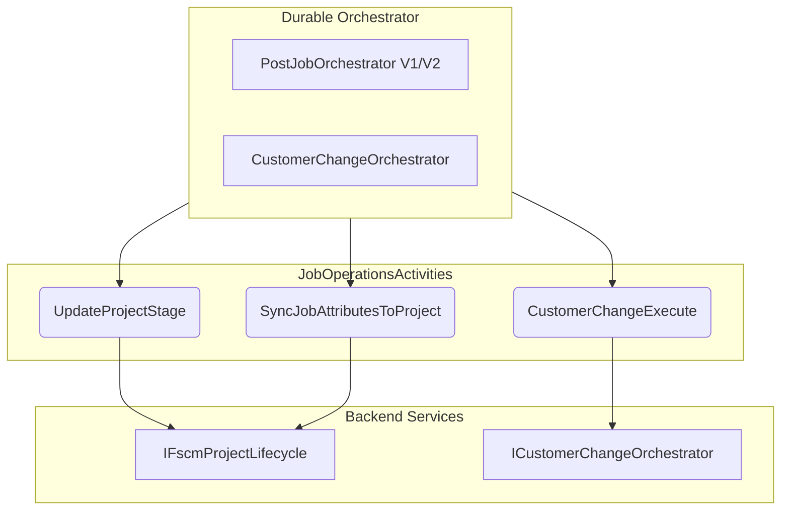
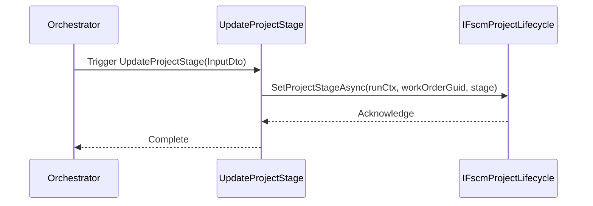
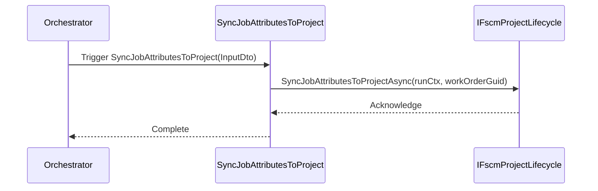
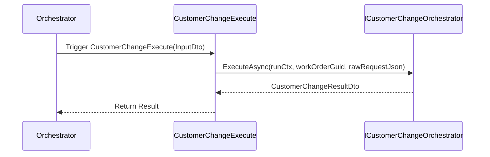

# Job Operations Activities Feature Documentation

## Overview

This feature provides **durable activities** for job operations within the accrual orchestrator. It enables:

- **Project lifecycle management** by updating project stages and syncing job attributes.
- **Customer change workflows** by delegating end-to-end processing to a customer-change orchestrator service.

These activities run reliably under Azure Durable Functions, ensuring traceable execution and integration with FSCM backend services.

## Architecture Overview



## Component Structure

### Durable Activities

#### **JobOperationsActivities** (`src/Rpc.AIS.Accrual.Orchestrator.Functions/Durable/Activities/JobOperationsActivities.cs`)

- **Purpose**: Implements Azure Functions Worker **activities** for job operations.
- **Constructor**:- Injects- `ILogger<JobOperationsActivities>`
- `IFscmProjectLifecycle`
- `ICustomerChangeOrchestrator`
- **Activities**:1. **UpdateProjectStage**: Advances an FSCM project to a new stage.
2. **SyncJobAttributesToProject**: Synchronizes attributes from FS accrual data into the FSCM project.
3. **CustomerChangeExecute**: Executes the customer-change business process end-to-end.

## Data Models (Input DTOs)

### UpdateProjectStageInputDto

| Property | Type | Description |
| --- | --- | --- |
| RunId | string | Execution run identifier |
| CorrelationId | string | Request correlation identifier |
| SourceSystem | string? | Originating system header value |
| WorkOrderGuid | Guid | Unique ID of the work order |
| stage | string | Target stage for the project |
| DurableInstanceId | string? | Orchestration instance identifier |


### SyncJobAttributesInputDto

| Property | Type | Description |
| --- | --- | --- |
| RunId | string | Execution run identifier |
| CorrelationId | string | Request correlation identifier |
| SourceSystem | string? | Originating system header value |
| WorkOrderGuid | Guid | Unique ID of the work order |
| DurableInstanceId | string? | Orchestration instance identifier |


### CustomerChangeInputDto

| Property | Type | Description |
| --- | --- | --- |
| RunId | string | Execution run identifier |
| CorrelationId | string | Request correlation identifier |
| SourceSystem | string? | Originating system header value |
| WorkOrderGuid | Guid | Unique ID of the work order |
| RawRequestJson | string? | Original JSON payload for customer change |
| DurableInstanceId | string? | Orchestration instance identifier |


### CustomerChangeResultDto

| Property | Type | Description |
| --- | --- | --- |
| *(Defined in Core)* | ... | Result of the customer-change operation |


## Service Facades

| Service | Method Signature | Returns |
| --- | --- | --- |
| **IFscmProjectLifecycle** | `Task SetProjectStageAsync(RunContext runCtx, Guid workOrderGuid, string stage, CancellationToken ct)` | `Task` |
| `Task SyncJobAttributesToProjectAsync(RunContext runCtx, Guid workOrderGuid, CancellationToken ct)` | `Task` |
| **ICustomerChangeOrchestrator** | `Task<CustomerChangeResultDto> ExecuteAsync(RunContext runCtx, Guid workOrderGuid, string rawJson, CancellationToken ct)` | `Task<CustomerChangeResultDto>` |


## Feature Flows

### ✅ Project Stage Update



### 🔄 Job Attributes Sync



### 🔄 Customer Change Execution



## Integration Points

- **IFscmProjectLifecycle**: Handles FSCM project-stage updates and attribute synchronization.
- **ICustomerChangeOrchestrator**: Drives the customer-change business workflow.
- **RunContext**: Encapsulates RunId, timestamp, trigger type, correlation, and source system.
- **LogScopes**: Creates structured log scopes for traceability.

## Error Handling

- Activities rely on **Durable Functions** retry and error policies.
- Exceptions from service calls propagate back to the orchestrator for retry or failure.
- Each activity logs start and end events for observability.

```csharp
await _projectLifecycle.SetProjectStageAsync(...);
```

## Dependencies

- Microsoft.Azure.Functions.Worker
- Microsoft.Extensions.Logging
- Rpc.AIS.Accrual.Orchestrator.Core.Domain
- Rpc.AIS.Accrual.Orchestrator.Functions.Services
- Rpc.AIS.Accrual.Orchestrator.Infrastructure.Logging

## Key Classes Reference

| Class | Location | Responsibility |
| --- | --- | --- |
| **JobOperationsActivities** | `Durable/Activities/JobOperationsActivities.cs` | Defines durable activities for job operations |
| UpdateProjectStageInputDto | Nested in `JobOperationsActivities` | Input DTO for `UpdateProjectStage` activity |
| SyncJobAttributesInputDto | Nested in `JobOperationsActivities` | Input DTO for `SyncJobAttributesToProject` activity |
| CustomerChangeInputDto | Nested in `JobOperationsActivities` | Input DTO for `CustomerChangeExecute` activity |
| CustomerChangeResultDto | Defined in `Rpc.AIS.Accrual.Orchestrator.Core.Domain` | Represents the result of customer change execution |


## Testing Considerations

- **Mock** `IFscmProjectLifecycle` and `ICustomerChangeOrchestrator` to verify calls.
- **Validate** that `LogScopes` are invoked with correct context values.
- **Ensure** exceptions propagate as expected under error conditions.