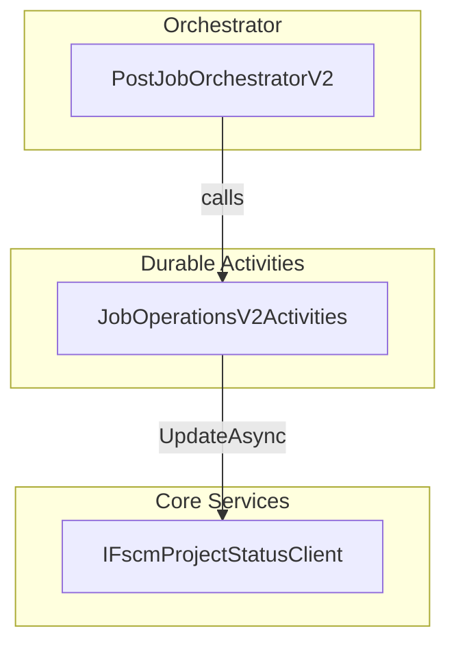
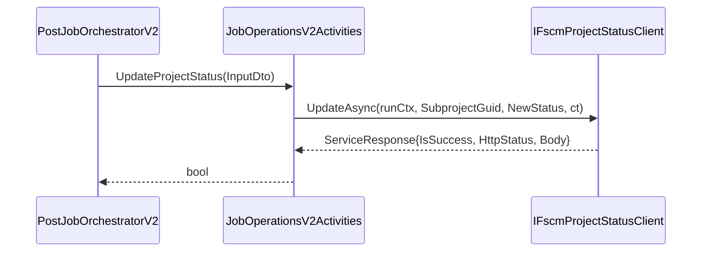

# Job Operations V2 Activities Feature Documentation

## Overview

Job Operations V2 Activities extend the existing durable orchestration pipeline by introducing V2-specific tasks for invoice attribute handling and project status updates. These activities are invoked exclusively by the PostJobOrchestratorV2 and CustomerChangeOrchestrator flows, leaving V1 functionality untouched.

By encapsulating project status updates and JSON parsing helpers, this feature ensures that subproject statuses in FSCM are kept in sync and that FS-specific attributes can be extracted in a deterministic, reliable manner.

## Architecture Overview

## Component Structure

### 1. Durable Activities

#### **JobOperationsV2Activities** (`src/Rpc.AIS.Accrual.Orchestrator.Functions/Durable/Activities/JobOperationsV2Activities.cs`)

- **Purpose**

Implements additive V2 activities for Durable Functions orchestrations, focusing on project status updates and JSON parsing utilities.

- **Dependencies**- `ILogger<JobOperationsV2Activities>`: structured logging
- `IFscmInvoiceAttributesClient` (declared, currently unused)
- `IFscmProjectStatusClient`: client to update subproject status in FSCM
- **Nested DTO**- `UpdateProjectStatusInputDto`
- **Key Methods**- `Task<bool> UpdateProjectStatus(UpdateProjectStatusInputDto input, FunctionContext ctx)`

Updates a subproject’s status via FSCM API and returns success flag.

- **Helper Methods**- `Dictionary<string, string?> TryReadFsAttributes(string rawJson)`

Parses an `fsAttributes` JSON object into a dictionary.

- `bool TryExtractHeaderContext(string rawJson, out string company, out string subProjectId, out string workOrderId)`

Extracts header fields (`Company`, `SubProjectId`, `WorkOrderID`/`WONumber`) from FS request payload.

#### **UpdateProjectStatusInputDto** (nested `record`)

| Property | Type | Description |
| --- | --- | --- |
| RunId | string | Unique orchestration run identifier. |
| CorrelationId | string | Correlation ID for distributed tracing. |
| SourceSystem | string? | Originating system name. |
| WorkOrderGuid | Guid | Parent work order identifier. |
| SubprojectGuid | Guid | Subproject identifier to update. |
| NewStatus | string | Target status value (e.g. “Invoiced”). |
| DurableInstanceId | string? | Durable Function instance ID (optional). |

### 2. Core Services Integration

- **IFscmProjectStatusClient**

Exposes `UpdateAsync(RunContext, Guid, string, CancellationToken)` to set project status in FSCM.

- **IFscmInvoiceAttributesClient**

Declared for future invoice-attribute operations; not invoked in current methods.

### 3. Utilities

- **JSON Parsing Helpers**- `TryReadFsAttributes` handles extraction of `fsAttributes` object.
- `TryExtractHeaderContext` locates FS-specific header fields in a `_request.WOList[0]` JSON structure.

## Integration Points

- Invoked by **PostJobOrchestratorV2** and **CustomerChangeOrchestrator** via `CallActivityAsync`.
- Relies on FSCM service clients from the Core Services layer.

## Feature Flows

### Update Project Status Flow

1. **Orchestrator** invokes `UpdateProjectStatus` with contextual DTO.
2. Activity creates a logging scope and `RunContext`.
3. Calls `IFscmProjectStatusClient.UpdateAsync`.
4. Logs warning on failure, info on success.
5. Returns a boolean flag to the orchestrator.

## Error Handling

- **Retryable Logic**

Durable retry policies are configured on orchestrator side.

- **Activity-Level**- Checks `res.IsSuccess`; logs warning with trimmed response body.
- Returns `false` to indicate failure—orchestrator may choose retry or compensate.
- **Parsing Helpers**- Wrap JSON parsing in `try/catch`; swallow exceptions and return defaults (best-effort).

## Dependencies

- Microsoft.Azure.Functions.Worker
- Microsoft.Extensions.Logging
- System.Text.Json
- Core abstractions and services from `Rpc.AIS.Accrual.Orchestrator.Core.*`
- Infrastructure logging utilities (`LogScopes`, `LogText`)

## Key Classes Reference

| Class | Location | Responsibility |
| --- | --- | --- |
| JobOperationsV2Activities | Durable/Activities/JobOperationsV2Activities.cs | V2-specific activity methods for job operations |
| UpdateProjectStatusInputDto | Nested in JobOperationsV2Activities.cs | DTO for passing context to `UpdateProjectStatus` activity |
| IFscmProjectStatusClient | Core.Services.InvoiceAttributes (injected into activities) | FSCM API client for updating project status |
| JSON Parsing Helpers (`private`) | Inside JobOperationsV2Activities.cs | Deterministic extraction of FS attributes and header context |

## Testing Considerations

- **UpdateProjectStatus**- Mock `IFscmProjectStatusClient` to simulate success/failure.
- Verify that `true` is returned on `IsSuccess == true`; `false` otherwise.
- Assert correct log messages at warning/info levels.
- **TryReadFsAttributes**- Valid JSON with `fsAttributes` object → dictionary of string keys/values.
- Invalid JSON or missing property → empty dictionary, no exception.
- **TryExtractHeaderContext**- Valid `_request.WOList[0]` JSON → correct out parameters and return `true`.
- Malformed JSON or missing fields → return `false`, out parameters empty.