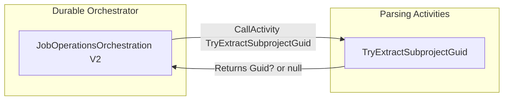

# Job Operations V2 Parsing Activities Feature Documentation

## Overview

This feature provides **deterministic JSON parsing activities** for V2 job operation orchestrations in the Durable Function pipeline. It isolates raw JSON processing into a dedicated activity class to avoid non-deterministic behavior within the orchestrator. By extracting the `subprojectGuid` cleanly, downstream invoice attribute and project status updates rely on accurate context.

These parsing activities enhance reliability and readability. They log scoped context for tracing and gracefully handle malformed or missing JSON, returning `null` when extraction fails. This fits into the broader accrual orchestration as a lightweight utility that feeds into invoice attribute synchronization and project status updates.

## Architecture Overview



## Component Structure

### JobOperationsV2ParsingActivities (`src/Rpc.AIS.Accrual.Orchestrator.Functions/Durable/Activities/JobOperationsV2ParsingActivities.cs`)

- **Purpose:**- Encapsulates JSON parsing logic for the V2 job operation orchestrator.
- Ensures deterministic activity execution by offloading parsing to separate methods.

- **Key Responsibilities:**- Validate raw JSON input.
- Extract `subprojectGuid` if present.
- Log any parsing exceptions as warnings.
- Return a nullable `Guid` to the orchestrator.

#### Constructor

```csharp
public JobOperationsV2ParsingActivities(ILogger<JobOperationsV2ParsingActivities> log)
    => _log = log ?? throw new ArgumentNullException(nameof(log));
```

- Initializes the activity with a typed logger.
- Throws if logger is `null`.

#### Activities

| Method | Trigger | Description | Returns |
| --- | --- | --- | --- |
| TryExtractSubprojectGuid 🎯 | `[ActivityTrigger]` | Parses `subprojectGuid` from the root of the raw JSON. Logs warnings on failure. | `Task<Guid?>` |


##### TryExtractSubprojectGuid

```csharp
[Function(nameof(TryExtractSubprojectGuid))]
public Task<Guid?> TryExtractSubprojectGuid([ActivityTrigger] ExtractSubprojectGuidInputDto input)
{
    using var scope = LogScopes.BeginFunctionScope(_log, new LogScopeContext
    {
        Activity         = nameof(TryExtractSubprojectGuid),
        Operation        = nameof(TryExtractSubprojectGuid),
        Trigger          = "Durable",
        RunId            = input.RunId,
        CorrelationId    = input.CorrelationId,
        SourceSystem     = input.SourceSystem,
        WorkOrderGuid    = input.WorkOrderGuid,
        DurableInstanceId = input.DurableInstanceId
    });

    if (string.IsNullOrWhiteSpace(input.RawRequestJson))
        return Task.FromResult<Guid?>(null);

    try
    {
        using var doc = JsonDocument.Parse(input.RawRequestJson);
        if (doc.RootElement.TryGetProperty("subprojectGuid", out var p))
        {
            var s = p.ValueKind == JsonValueKind.String ? p.GetString() : p.ToString();
            if (Guid.TryParse(s, out var g))
                return Task.FromResult<Guid?>(g);
        }
    }
    catch (Exception ex)
    {
        _log.LogWarning(ex, "Failed to parse subprojectGuid from request JSON.");
    }

    return Task.FromResult<Guid?>(null);
}
```

- **Scope Logging:**- Uses `LogScopes.BeginFunctionScope` to attach context metadata (runId, correlationId, etc.) to logs.
- **Validation:**- Returns `null` immediately if `RawRequestJson` is empty.
- **Parsing Logic:**- Parses JSON document.
- Attempts to read `subprojectGuid` property.
- Converts it to `string` or raw JSON, then tries `Guid.TryParse`.
- **Error Handling:**- Catches any exception, logs a warning, and returns `null`.

### ExtractSubprojectGuidInputDto

A record defining the input payload for the parsing activity.

| Property | Type | Description |
| --- | --- | --- |
| **RunId** | `string` | Unique identifier for this run. |
| **CorrelationId** | `string` | Correlation identifier for distributed tracing. |
| **SourceSystem** | `string?` | Optional name of the initiating system. |
| **WorkOrderGuid** | `Guid` | The GUID of the work order being processed. |
| **RawRequestJson** | `string` | Raw JSON payload from the original FS request. |
| **DurableInstanceId** | `string?` | Optional Durable Function instance ID for scoping logs. |


```csharp
public sealed record ExtractSubprojectGuidInputDto(
    string RunId,
    string CorrelationId,
    string? SourceSystem,
    Guid WorkOrderGuid,
    string RawRequestJson,
    string? DurableInstanceId = null);
```

## Error Handling

- **Graceful Fallback:** Returns `null` when JSON is empty, malformed, or missing the target property.
- **Logging:**- Uses `ILogger` to emit a warning on exceptions with exception details.
- No exception bubbles up, preserving orchestrator determinism.

## Integration Points

- **Consumed by:**- `JobOperationsOrchestration.PostJobOrchestratorV2` via `context.CallActivityAsync<Guid?>`.
- Downstream invoice attribute sync and project status update steps rely on the extracted `subprojectGuid`.

## Key Classes Reference

| Class | Location | Responsibility |
| --- | --- | --- |
| **JobOperationsV2ParsingActivities** | `src/Rpc.AIS.Accrual.Orchestrator.Functions/Durable/Activities/JobOperationsV2ParsingActivities.cs` | Hosts parsing activities for V2 orchestrations. |
| **ExtractSubprojectGuidInputDto** | Nested in `JobOperationsV2ParsingActivities` | Defines input schema for the parsing activity. |


```card
{
    "title": "Stateless Activity",
    "content": "This parsing activity does not modify state or cache data; it only extracts a Guid from JSON."
}
```