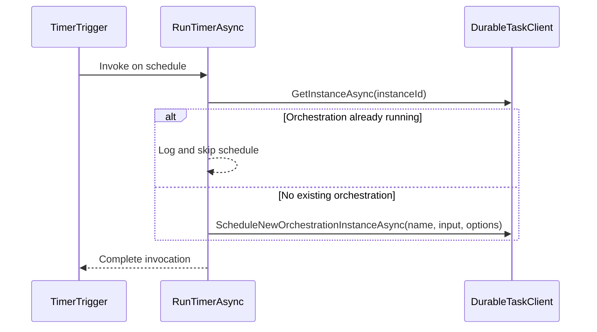
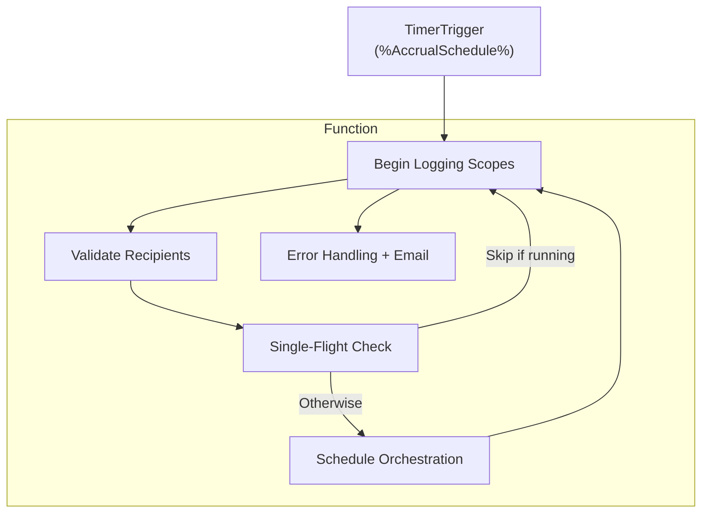

# Accrual Orchestrator Functions

## Overview

The **AccrualOrchestratorFunctions** class implements an Azure Function that runs on a configurable timer. It generates unique run identifiers, enforces a *single-flight* orchestration invocation (so only one orchestration runs per minute), and schedules a durable orchestration to process accrual work orders.

Built-in logging scopes track each stage of the invocation, and any fatal errors trigger an alert email to a configurable distribution list. This ensures reliable, transparent, and self-healing orchestration kickoff for downstream accrual processing.

---

## Dependencies

- **IRunIdGenerator**

Generates unique RunId and CorrelationId values for tracing.

- **ProcessingOptions**

Holds runtime configuration, including the `Mode` (e.g. “Production” or “Test”).

- **NotificationOptions**

Provides the list of email recipients for fatal error alerts.

- **IEmailSender**

Sends HTML email notifications on fatal failures.

- **ILogger\<AccrualOrchestratorFunctions\>**

Logs structured events and errors.

---

## Constructor

```csharp
public AccrualOrchestratorFunctions(
    IRunIdGenerator ids,
    ProcessingOptions processing,
    NotificationOptions notifications,
    IEmailSender emailSender,
    ILogger<AccrualOrchestratorFunctions> logger)
```

- **ids**

Injection of the unique ID generator.

- **processing**

Runtime settings (scheduling mode, etc.).

- **notifications**

Fatal-error notification settings.

- **emailSender**

Email service for alerts.

- **logger**

Structured logger for diagnostics.

All constructor arguments are **required**; an `ArgumentNullException` is thrown if any are missing.

---

## 🕒 RunTimerAsync Function

### Definition

```csharp
[Function("AccrualOrchestrator_Timer")]
public async Task RunTimerAsync(
    [TimerTrigger("%AccrualSchedule%")] TimerInfo timer,
    [DurableClient] DurableTaskClient client,
    FunctionContext ctx)
```

### Parameters

| Name | Type | Description |
| --- | --- | --- |
| `timer` | TimerInfo | The Azure Functions timer trigger, schedule from `%AccrualSchedule%`. |
| `client` | DurableTaskClient | Durable Functions client used to query and start orchestrations. |
| `ctx` | FunctionContext | Provides ambient context, including cancellation token and invocation metadata. |


### Execution Flow

1. **Generate Identifiers**- `runId` via `_ids.NewRunId()`
- `correlationId` via `_ids.NewCorrelationId()`

1. **Begin Logging Scope**- Global function scope with `Function`, `Operation`, `Trigger`, `RunId`, `CorrelationId`, `SourceSystem`.
- Extra scope for `Trigger = "Timer"` and `Mode = _processing.Mode`.

1. **Notification List Validation**- Retrieve recipients via `_notifications.GetRecipients()`.
- Log a warning if the list is empty; otherwise log recipient count.

1. **Single-Flight Scheduling** 🚀- Build deterministic `instanceId` as

`Accrual|Timer|{UTC:yyyyMMddHHmm}`

- Call `client.GetInstanceAsync(instanceId)`.
- If an orchestration with status `Running` or `Pending` exists, **skip** scheduling.

1. **Start New Orchestration**- Prepare `RunInputDto` payload:

```csharp
     new DurableAccrualOrchestration.RunInputDto(
         RunId: runId,
         CorrelationId: correlationId,
         TriggeredBy: "Timer",
         SourceSystem: "AIS",
         WorkOrderGuid: null)
```

- Use `StartOrchestrationOptions { InstanceId = instanceId }`.
- Invoke `client.ScheduleNewOrchestrationInstanceAsync(...)`.

1. **Final Logging**- Log step durations and final status ("Completed (scheduled durable)" or "Skipped (single-flight)").

1. **Error Handling & Notifications** 📧- On exception, log error with `Status = "Failed"`.
- If recipients exist, send a fatal error email with RunId, CorrelationId, and full exception stack.
- Log any email-sending failures.
- Rethrow the original exception to surface failure.

---

## Sequence Diagram



---

## Flowchart Overview



---

## Key Concepts & Patterns

- **Deterministic Instance ID**

Ensures only one orchestration per minute by deriving the instance ID from the UTC timestamp rounded to the minute.

- **Replay-Safe Logging**

All logs occur inside scopes created via `LogScopes.BeginFunctionScope` and `ILogger.BeginScope`, providing consistent correlation across retries.

- **Single-Flight**

Prevents concurrent orchestrations using `GetInstanceAsync` to inspect existing status before scheduling.

- **Resilient Notifications**

Even if scheduling fails, the function attempts to notify a configured distribution list, isolating email failures from bubbling up.

---

## Configuration Settings

| Setting | Purpose |
| --- | --- |
| `AccrualSchedule` | CRON expression for the timer trigger. |
| `Processing:Mode` | Indicates operational mode logged on each run. |
| NotificationOptions | Section defining `ErrorDistributionList` and addresses. |


---

## Classes & DTOs Referenced

| Class | Responsibility |
| --- | --- |
| `IRunIdGenerator` | Generates unique RunId / CorrelationId values. |
| `ProcessingOptions` | Holds runtime processing settings (e.g., Mode). |
| `NotificationOptions` | Provides email recipient list for fatal error alerts. |
| `DurableAccrualOrchestration.RunInputDto` | Payload sent to the durable orchestration entry point. |
| `DurableTaskClient` | Azure Durable Functions client for orchestration control. |
| `IEmailSender` | Abstraction for sending email notifications. |
| `LogScopes` | Utility to create replay-safe logging scopes. |


---

## Error Handling Example

```csharp
try
{
    // scheduling logic...
}
catch (Exception ex)
{
    _logger.LogError(ex, "TimerWO.End Status={Status}", "Failed");
    // attempt email notification...
    throw;
}
```

- Logs full exception details.
- Wraps email-send in its own `try/catch` to avoid masking the original error.

---

## Contact & Support

For questions about the **AccrualOrchestratorFunctions**, reach out to the Cloud Engineering team maintaining the AIS Accrual Orchestrator.