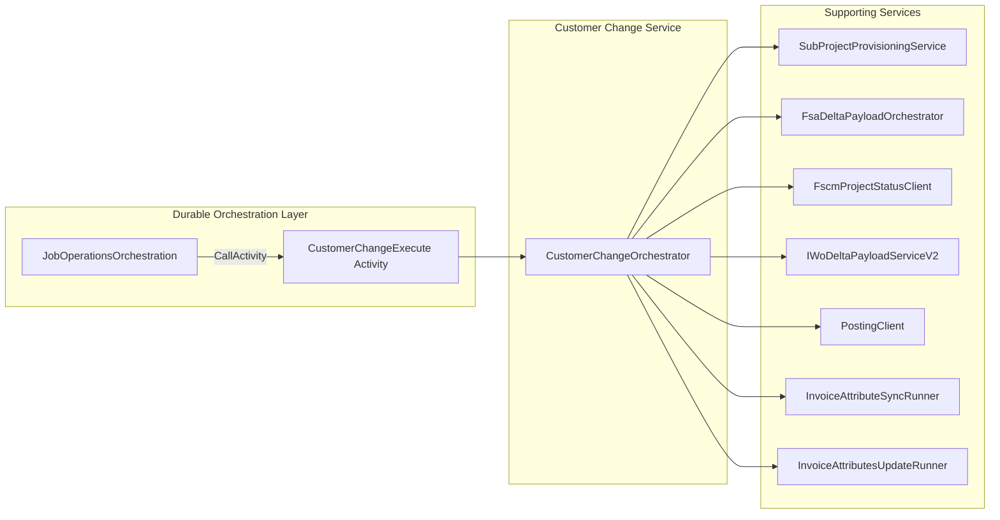
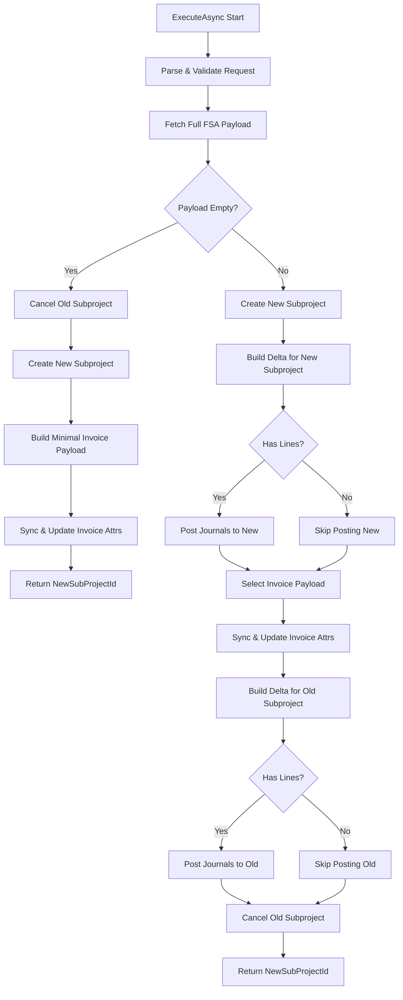

# Customer Change Orchestrator Feature Documentation

## Overview

The **Customer Change Orchestrator** drives the end-to-end business process when a work order’s customer changes. It:

- Cancels the existing subproject.
- Provisions a new subproject.
- Reposts or reverses journal lines.
- Synchronizes invoice attributes on the new subproject.

This ensures data integrity across Field Service (FSA) and FSCM systems when a customer transfer occurs. It fits into the Durable Functions orchestration pipeline by implementing `ICustomerChangeOrchestrator` and is invoked by both HTTP-triggered use cases and durable activities.

## Architecture Overview



## Component Structure

### CustomerChangeOrchestrator (`src/Rpc.AIS.Accrual.Orchestrator.Functions/Durable/Orchestrators/CustomerChangeOrchestrator.cs`)

- **Purpose:** Implements `ICustomerChangeOrchestrator` to coordinate customer-change steps in a durable workflow.
- **Responsibilities:**- Validate and parse incoming request payload.
- Retrieve canonical work order payload from FSA.
- Cancel the old subproject, provision a new one.
- Build and post journal deltas for both new and old subprojects.
- Sync invoice attributes in a best-effort manner.

#### Dependencies

| Service | Interface / Type |
| --- | --- |
| **FSA payload fetch** | `IFsaDeltaPayloadOrchestrator` |
| **Subproject provisioning** | `SubProjectProvisioningService` |
| **Delta build & posting** | `IWoDeltaPayloadServiceV2`, `IPostingClient` |
| **FSCM project status update** | `IFscmProjectStatusClient` |
| **Invoice attribute sync & update** | `InvoiceAttributeSyncRunner`, `InvoiceAttributesUpdateRunner` |
| **FS options (timeouts, flags)** | `FsOptions` via `IOptions<FsOptions>` |
| **Logging** | `ILogger<CustomerChangeOrchestrator>` |


#### Public Method

| Method | Description | Returns |
| --- | --- | --- |
| `ExecuteAsync(RunContext ctx, Guid workOrderGuid, string rawRequestJson, CancellationToken ct)` | Orchestrates the customer change pipeline: parsing, full-fetch, subproject lifecycle, posting, and cleanup. | `Task<CustomerChangeResultDto>` |


#### Internal Helpers

- **CancelOldAsync()**

Updates the old subproject’s status to “Canceled” (6) via FSCM.

- **CreateNewAsync()**

Provisions a new subproject using `SubProjectProvisioningService` and returns its ID.

- **BestEffortInvoiceAttributesAsync(ctx, postingPayloadJson, ct)**

Wraps invoice attribute enrichment/update in a `try/catch` to avoid failing the entire process.

- **BuildMinimalInvoicePayloadJson(...)**

Constructs a minimal posting-envelope JSON when full FSA payload is empty.

### Data Models

#### CustomerChangeRequest

| Property | Type | Description |
| --- | --- | --- |
| WorkOrderGuid | Guid | Identifier of the work order to change. |
| WorkOrderId | string? | Human-readable work order number (optional). |
| OldSubProjectId | string? | Existing subproject to cancel. |
| ParentProjectId | string? | FSCM project under which to create the new subproject. |
| ProjectName | string? | Name for the new subproject; defaulted if missing. |
| IsFsaProject | int? | Flag indicating if this is an FSA project (nullable). |
| ProjectStatus | int? | Initial FSCM project status for the new subproject (default 3). |
| LegalEntity | string? | Company/data area ID parsed from payload; required for all FSCM calls. |


#### CustomerChangeResultDto

| Property | Type | Description |
| --- | --- | --- |
| NewSubProjectId | string | The identifier of the newly created subproject. |


### PayloadReads (private static helpers)

| Method | Description |
| --- | --- |
| `TryReadCompanyAndWorkOrderId(string json, Guid workOrderGuid)` | Extracts the canonical Company and WorkOrderID from a full-fetch payload. |
| `RewriteSubProjectId(string json, string subProjectId)` | Updates all `SubProjectId` entries in the JSON payload. |


## Feature Flow



## Error Handling

- Throws **`InvalidOperationException`** for:- Missing or malformed payload.
- GUID mismatches or required fields absent.
- Any failure from FSCM or delta posting steps.
- Uses structured **`ILogger`** scopes to correlate logs by RunId and CorrelationId.
- Invoice sync is logged as **best-effort**; failures only emit a warning without aborting.

```csharp
try {
    // Sync invoice attributes
}
catch(Exception ex) {
    _log.LogWarning(ex, "InvoiceAttributesUpdate FAILED (best-effort). RunId={RunId}", ctx.RunId);
}
```

## Dependencies & Integration Points

- **Implements**: `ICustomerChangeOrchestrator`
- **Invoked by**:- `JobOperationsActivities.CustomerChangeExecute` (Durable Functions activity)
- `CustomerChangeUseCase` (HTTP-triggered Azure Function)
- **Relies on**:- `SubProjectProvisioningService`
- `IFsaDeltaPayloadOrchestrator`
- `IWoDeltaPayloadServiceV2` & `IPostingClient`
- `IFscmProjectStatusClient`
- `InvoiceAttributeSyncRunner` & `InvoiceAttributesUpdateRunner`

## Key Classes Reference

| Class | Location | Responsibility |
| --- | --- | --- |
| CustomerChangeOrchestrator | `Functions/Durable/Orchestrators/CustomerChangeOrchestrator.cs` | Orchestrates the customer-change business flow. |
| CustomerChangeRequest |  `CustomerChangeOrchestrator.cs` | Parses and validates raw request JSON. |
| CustomerChangeResultDto | `Composition/JobOperationsServices.cs` | Carries the new subproject ID post-orchestration. |
| PayloadReads |  `CustomerChangeOrchestrator.cs` | JSON helpers for payload inspection and rewriting. |


## Card Block Highlights

```card
{
    "title": "Best-Effort Invoice Sync",
    "content": "Invoice attribute updates run in a try/catch to avoid blocking the main customer-change flow."
}
```

```card
{
    "title": "Minimal Payload Fallback",
    "content": "When no FSA lines exist, a minimal JSON envelope is constructed to drive invoice sync."
}
```