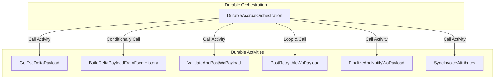
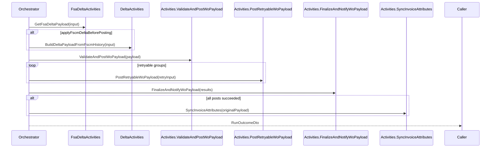

# Durable Accrual Orchestration Feature Documentation

## Overview

The **Durable Accrual Orchestration** coordinates the end-to-end accrual process in a scalable, fault-tolerant manner using Azure Durable Functions. It performs the following high-level steps:

- **Fetch** work-order payloads from the FSA (Dataverse) change-tracking or full-fetch pipeline.
- **Optionally compute** FSCM-only deltas when configured.
- **Validate and post** journal entries to FSCM.
- **Retry** transient failures for retryable journal types.
- **Finalize and notify** downstream systems of the run outcome.
- **Best-effort sync** of invoice attributes for enrichment.

This orchestration decouples complex business logic into discrete activities, enabling retries, parallelism, and observability via structured logging. It fits into the broader **Accrual Orchestrator** Functions project, which exposes timer- and ad-hoc triggers to start this durable orchestration.

---

## Architecture Overview



---

## Component Structure

### 1. Orchestration Layer

#### **DurableAccrualOrchestration** (`src/Rpc.AIS.Accrual.Orchestrator.Functions/Durable/Orchestrators/DurableAccrualOrchestration.cs`)

- **Purpose**

Coordinates the accrual workflow as a single Durable Functions orchestration.

- **Dependencies**- `ILogger<DurableAccrualOrchestration>`
- `IOptions<FsOptions>` (optional feature flag)

- **Key Fields**- `_logger` (logging)
- `_applyFscmDeltaBeforePosting` (feature toggle)

- **Key Methods**- `Task<RunOutcomeDto> AccrualOrchestrator(TaskOrchestrationContext context)`
- `static Task<List<PostResult>> RetryRetryableGroupsAsync(...)`

```csharp
[Function(nameof(AccrualOrchestrator))]
public async Task<RunOutcomeDto> AccrualOrchestrator(
    [OrchestrationTrigger] TaskOrchestrationContext context)
{ /* ... */ }

private static async Task<List<PostResult>> RetryRetryableGroupsAsync(
    TaskOrchestrationContext context,
    string runId,
    string correlationId,
    string instanceId,
    List<PostResult> postResults)
{ /* ... */ }
```

---

### 2. Activity Layer

The orchestration invokes these Durable Activity functions:

| Activity Function | Input DTO | Returns |
| --- | --- | --- |
| `FsaDeltaActivities.GetFsaDeltaPayload` | `GetFsaDeltaPayloadInputDto` | `GetFsaDeltaPayloadResultDto` |
| `DeltaActivities.BuildDeltaPayloadFromFscmHistory` | `BuildDeltaPayloadFromFscmHistoryInputDto` | `BuildDeltaPayloadFromFscmHistoryResultDto` |
| `Activities.ValidateAndPostWoPayload` | `WoPayloadPostingInputDto` | `List<PostResult>` |
| `Activities.PostRetryableWoPayload` | `RetryableWoPayloadPostingInputDto` | `PostResult` |
| `Activities.FinalizeAndNotifyWoPayload` | `FinalizeWoPayloadInputDto` | `RunOutcomeDto` |
| `Activities.SyncInvoiceAttributes` | `InvoiceAttributesSyncInputDto` | `InvoiceAttributesSyncResultDto` |


---

### 3. Data Models

#### DTO Definitions

| DTO | Properties | Description |
| --- | --- | --- |
| **RunInputDto** | `RunId: string`<br/>`CorrelationId: string`<br/>`TriggeredBy: string`<br/>`SourceSystem?: string`<br/>`WorkOrderGuid?: string` | Carries orchestration start parameters. |
| **WoPayloadPostingInputDto** | `RunId: string`<br/>`CorrelationId: string`<br/>`WoPayloadJson: string`<br/>`DurableInstanceId?: string` | Payload for full journal validation and posting. |
| **RetryableWoPayloadPostingInputDto** | `RunId: string`<br/>`CorrelationId: string`<br/>`WoPayloadJson: string`<br/>`JournalType: JournalType`<br/>`Attempt: int`<br/>`DurableInstanceId?: string` | Payload for retrying only transient journal groups. |
| **FinalizeWoPayloadInputDto** | `RunId: string`<br/>`CorrelationId: string`<br/>`WoPayloadJson: string`<br/>`PostResults: List<PostResult>`<br/>`GeneralErrors?: string[]`<br/>`DurableInstanceId?: string` | Aggregates post results for final notification. |
| **SingleWoPostingInputDto** | `RunId: string`<br/>`CorrelationId: string`<br/>`TriggeredBy: string`<br/>`RawJsonBody: string`<br/>`DurableInstanceId?: string` | (Reserved) Single work order posting. |
| **WorkOrderStatusUpdateInputDto** | `RunId: string`<br/>`CorrelationId: string`<br/>`TriggeredBy: string`<br/>`RawJsonBody: string`<br/>`DurableInstanceId?: string` | (Reserved) Work order status update. |
| **InvoiceAttributesSyncInputDto** | `RunId: string`<br/>`CorrelationId: string`<br/>`WoPayloadJson: string`<br/>`DurableInstanceId?: string` | Best-effort enrichment input. |
| **InvoiceAttributesSyncResultDto** | `Attempted: bool`<br/>`Success: bool`<br/>`WorkOrdersWithInvoiceAttributes: int`<br/>`TotalAttributePairs: int`<br/>`Note: string`<br/>`UpdateSuccessCount: int`<br/>`UpdateFailureCount: int` | Outcome of invoice attributes sync. |
| **RunOutcomeDto** | `RunId: string`<br/>`CorrelationId: string`<br/>`WorkOrdersConsidered: int`<br/>`WorkOrdersValid: int`<br/>`WorkOrdersInvalid: int`<br/>`PostFailureGroups: int`<br/>`HasAnyErrors: bool`<br/>`GeneralErrors: List<string>` | Final orchestration outcome. |


---

### 4. Orchestration Flow



---

## Error Handling

- Throws `InvalidOperationException` if orchestration input is missing.
- Logging scopes ensure replay-safe logging in Durable context.
- Hard-coded `MaxAttempts = 1` to prevent duplicate POST side effects.

---

## Configuration & Feature Flags

- **FsOptions.ApplyFscmDeltaBeforePosting**

Toggles comparison against FSCM journal history. Default is `false` unless injected via `IOptions<FsOptions>`.

---

## Dependencies

- Azure Functions Worker (`Microsoft.Azure.Functions.Worker`)
- Durable Task Client (`Microsoft.DurableTask`)
- Logging (`Microsoft.Extensions.Logging`)
- Options Pattern (`Microsoft.Extensions.Options`)
- Core Domain Models (`GetFsaDeltaPayloadResultDto`, `PostResult`, etc.)
- Infrastructure Options (`FsOptions`)

---

## Key Classes Reference

| Class | Location | Responsibility |
| --- | --- | --- |
| DurableAccrualOrchestration | `.../DurableAccrualOrchestration.cs` | Orchestrates accrual process via Durable Functions. |
| RunInputDto | Same file | Input parameters for orchestration run. |
| WoPayloadPostingInputDto | Same file | Input for full payload validation and posting activity. |
| RetryableWoPayloadPostingInputDto | Same file | Input for retryable payload posting activity. |
| FinalizeWoPayloadInputDto | Same file | Input for finalization and notification activity. |
| InvoiceAttributesSyncInputDto | Same file | Input for best-effort invoice attribute sync activity. |
| InvoiceAttributesSyncResultDto | Same file | Output of invoice attributes sync. |
| RunOutcomeDto | Same file | Aggregated outcome returned by the orchestrator. |


---

## Testing Considerations

- The orchestration can be unit-tested with a **mock** or **in-memory** `DurableTaskClient`.
- Inject custom `IOptions<FsOptions>` to exercise both delta-on and delta-off flows.
- Replay-safe logging ensures idempotent test recordings.