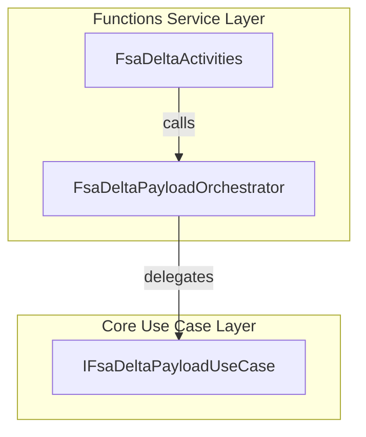
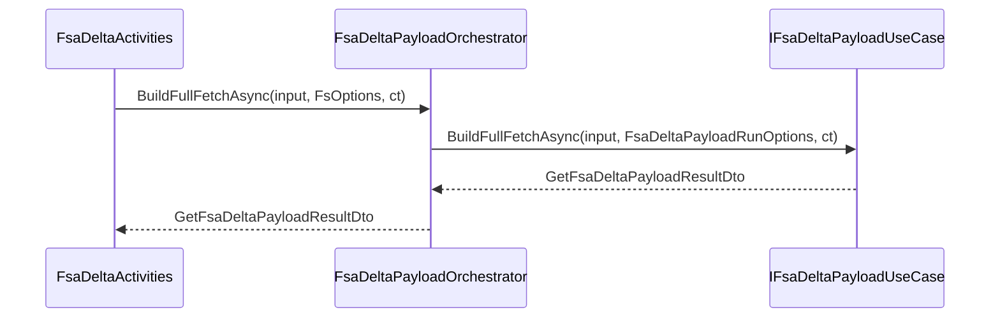

# FSA Delta Payload Orchestrator Service Documentation

## Overview

The **FsaDeltaPayloadOrchestrator** resides in the Azure Functions **Durable** worker under the Functions Service layer. It acts as a thin adapter, delegating all business logic to the Core Use Case layer. By mapping infrastructure-level settings (`FsOptions`) into minimal run-time options (`FsaDeltaPayloadRunOptions`), it cleanly separates orchestration concerns from the delta payload building logic. This design promotes maintainability and testability by isolating function-specific plumbing from domain orchestration.

## Architecture Overview



## Component Structure

### Business Layer

#### IFsaDeltaPayloadOrchestrator (`src/Rpc.AIS.Accrual.Orchestrator.Functions/Durable/Orchestrators/FsaDeltaPayloadOrchestrator.cs`)

Defines the contract for orchestrating FSA delta payload builds at the Functions boundary.

| Method | Description | Returns |
| --- | --- | --- |
| BuildFullFetchAsync(input, opt, ct) | Build payload for all open work orders, using a filter from infrastructure settings. | Task<GetFsaDeltaPayloadResultDto> |
| BuildSingleWorkOrderAnyStatusAsync(input, opt, ct) | Build payload for one Work Order GUID, regardless of status, for job-operation flows. | Task<GetFsaDeltaPayloadResultDto> |


#### FsaDeltaPayloadOrchestrator (`src/Rpc.AIS.Accrual.Orchestrator.Functions/Durable/Orchestrators/FsaDeltaPayloadOrchestrator.cs`)

Implements `IFsaDeltaPayloadOrchestrator`. It:

- Injects an `IFsaDeltaPayloadUseCase` via constructor.
- Maps `FsOptions.WorkOrderFilter` into `FsaDeltaPayloadRunOptions.WorkOrderFilter`.
- Delegates calls to the core use case methods.

```csharp
public sealed class FsaDeltaPayloadOrchestrator : IFsaDeltaPayloadOrchestrator
{
    private readonly IFsaDeltaPayloadUseCase _useCase;

    public FsaDeltaPayloadOrchestrator(IFsaDeltaPayloadUseCase useCase) =>
        _useCase = useCase ?? throw new ArgumentNullException(nameof(useCase));

    public Task<GetFsaDeltaPayloadResultDto> BuildFullFetchAsync(
        GetFsaDeltaPayloadInputDto input,
        FsOptions opt,
        CancellationToken ct)
    {
        var runOpt = new FsaDeltaPayloadRunOptions
        {
            WorkOrderFilter = opt?.WorkOrderFilter
        };
        return _useCase.BuildFullFetchAsync(input, runOpt, ct);
    }

    public Task<GetFsaDeltaPayloadResultDto> BuildSingleWorkOrderAnyStatusAsync(
        GetFsaDeltaPayloadInputDto input,
        FsOptions opt,
        CancellationToken ct)
    {
        // WorkOrderFilter is not required for single-any-status.
        var runOpt = new FsaDeltaPayloadRunOptions
        {
            WorkOrderFilter = opt?.WorkOrderFilter
        };
        return _useCase.BuildSingleWorkOrderAnyStatusAsync(input, runOpt, ct);
    }
}
```

## Sequence Flow



## Data Models

### GetFsaDeltaPayloadInputDto

| Property | Type | Description |
| --- | --- | --- |
| RunId | string | Unique identifier for this orchestration. |
| CorrelationId | string | Tracing correlation across services. |
| TriggeredBy | string | Source trigger (e.g., “FullFetch”). |
| WorkOrderGuid | string? | Optional single Work Order GUID. |
| DurableInstanceId | string? | Durable Functions instance identifier. |


### GetFsaDeltaPayloadResultDto

| Property | Type | Description |
| --- | --- | --- |
| PayloadJson | string | Final JSON payload for FSCM posting. |
| ProductDeltaLinkAfter | string? | Next‐page link for product delta (if paged). |
| ServiceDeltaLinkAfter | string? | Next‐page link for service delta. |
| WorkOrderNumbers | IReadOnlyList<string> | Distinct work order numbers contained in the payload. |


(Data model definitions: )

### FsaDeltaPayloadRunOptions

| Property | Type | Description |
| --- | --- | --- |
| WorkOrderFilter | string? | Filter expression for open work orders (from FsOptions). |


(Options class: )

## Dependencies

- **Rpc.AIS.Accrual.Orchestrator.Core.UseCases.FsaDeltaPayload.IFsaDeltaPayloadUseCase**
- **Rpc.AIS.Accrual.Orchestrator.Infrastructure.Options.FsOptions**
- **Rpc.AIS.Accrual.Orchestrator.Core.Options.FsaDeltaPayloadRunOptions**
- Domain DTOs under `Rpc.AIS.Accrual.Orchestrator.Core.Domain`

## Patterns & Architecture

- **Adapter Pattern**: The Functions layer remains a thin adapter, minimizing logic at the boundary.
- **Dependency Injection**: Constructor injection of the Core Use Case ensures testability and loose coupling.

```card
{
    "title": "Thin Adapter",
    "content": "This service layer delegates orchestration logic to the Core.UseCases, preserving separation of concerns."
}
```

## Key Classes Reference

| Class | Location | Responsibility |
| --- | --- | --- |
| IFsaDeltaPayloadOrchestrator | src/.../FsaDeltaPayloadOrchestrator.cs | Defines the orchestration facade at the Functions boundary. |
| FsaDeltaPayloadOrchestrator | src/.../FsaDeltaPayloadOrchestrator.cs | Implements the facade, mapping options and delegating calls. |


## Error Handling

- **Null Checks**: The constructor throws `ArgumentNullException` if the use case dependency is missing.
- **Propagation**: All exceptions from the core use case bubble up to the Durable Activity for logging/retry.

## Testing Considerations

- **Unit Tests** should verify that:- `FsaDeltaPayloadOrchestrator` maps `FsOptions.WorkOrderFilter` correctly into `FsaDeltaPayloadRunOptions`.
- Calls to `BuildFullFetchAsync` and `BuildSingleWorkOrderAnyStatusAsync` delegate with expected parameters.

---

*End of FSA Delta Payload Orchestrator Service Documentation*