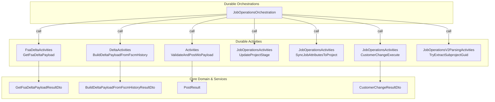

# Job Operations Orchestration Feature Documentation

## Overview

This feature implements durable orchestrations for **job operations** such as posting journals and performing customer-change workflows. It leverages Azure Durable Functions to manage long-running, reliable pipelines that:

- Fetch full work order data from the FSA system
- Optionally compute deltas against FSCM history
- Validate and post journal payloads
- Execute operation-specific FSCM lifecycle steps

By centralizing these steps in orchestrations, the system gains resilience against transient failures, improved observability, and clear separation of business logic into discrete activities .

## Architecture Overview

## Component Structure

### 1. Orchestration Layer

#### **JobOperationsOrchestration** (`src/Rpc.AIS.Accrual.Orchestrator.Functions/Durable/Orchestrators/JobOperationsOrchestration.cs`)

- **Purpose:** Coordinates the end-to-end job operation pipelines for posting and customer change.
- **Constructor Dependencies:**- `IOptions<FsOptions>` to read `ApplyFscmDeltaBeforePosting` flag .
- **Key Methods:**- `PostJobOrchestrator` – orchestrates a **Post** workflow, then updates project stage and attributes .
- `PostJobOrchestratorV2` – additive V2 flow that also extracts a subproject GUID and can run invoice attribute logic .
- `CustomerChangeOrchestrator` – full **Customer Change** workflow combining subproject creation, journaling, reversal, and cancellation .
- `RunAccrualPipelineForSingleWoAsync` – shared helper invoking FSA fetch, optional FSCM-delta, and journal-post activities .

### 2. Data Transfer Objects

#### **JobOperationInputDto**

Represents the orchestration’s inbound payload .

| Property | Type | Description |
| --- | --- | --- |
| RunId | string | Unique identifier for this run |
| CorrelationId | string | Correlation header for cross-service tracing |
| TriggeredBy | string | Indicates which trigger (e.g. “PostJob”) |
| SourceSystem | string? | Optional source system identifier |
| WorkOrderGuid | Guid | The target work order’s GUID |
| RawRequestJson | string? | Original request JSON (for parsing in V2 flows) |

#### **JobOperationOutcomeDto**

Encapsulates orchestration results returned to callers .

| Property | Type | Description |
| --- | --- | --- |
| IsSuccess | bool | True if all steps succeeded |
| RunId | string | Propagated RunId |
| CorrelationId | string | Propagated CorrelationId |
| TriggeredBy | string | Echo of the trigger name |
| SourceSystem | string? | Echo of the source system |
| WorkOrderGuid | Guid | Echo of the work order GUID |
| DurableInstanceId | string? | The generated orchestration instance identifier |
| Notes | string? | Human-readable summary of completed steps |

### 3. Activity Layer

This layer implements discrete tasks invoked by the orchestrator.

| Activity | Input DTO | Output | Responsibility |
| --- | --- | --- | --- |
| FsaDeltaActivities.GetFsaDeltaPayload | `GetFsaDeltaPayloadInputDto` | `GetFsaDeltaPayloadResultDto` | Fetch full FS payload from Dataverse |
| DeltaActivities.BuildDeltaPayloadFromFscmHistory | `BuildDeltaPayloadFromFscmHistoryInputDto` | `BuildDeltaPayloadFromFscmHistoryResultDto` | Compute delta by comparing FS vs FSCM history |
| Activities.ValidateAndPostWoPayload | `WoPayloadPostingInputDto` | `List<PostResult>` | Validate and post journal payloads |
| JobOperationsActivities.UpdateProjectStage | `UpdateProjectStageInputDto` | `void` | Set project stage in FSCM |
| JobOperationsActivities.SyncJobAttributesToProject | `SyncJobAttributesInputDto` | `void` | Sync invoice attributes to FSCM |
| JobOperationsActivities.CustomerChangeExecute | `CustomerChangeInputDto` | `CustomerChangeResultDto` | Execute customer-change process |
| JobOperationsV2ParsingActivities.TryExtractSubprojectGuid | `ExtractSubprojectGuidInputDto` | `Guid?` | Parse subproject GUID from raw request payload |

### 4. Internal Pipeline Flow

The helper `RunAccrualPipelineForSingleWoAsync` executes three main stages:

1. **Fetch** – calls `GetFsaDeltaPayload` to retrieve the full work-order JSON.
2. **Delta**  – when `ApplyFscmDeltaBeforePosting` is true, calls `BuildDeltaPayloadFromFscmHistory` to reduce payload to incremental changes.
3. **Post** – invokes `ValidateAndPostWoPayload` to perform journal validation and posting.

Logging surrounds each step for observability and replay safety .

## Integration Points

- **Azure Functions Worker**- `[Function(...)]` attributes mark orchestrator entry points.
- `[OrchestrationTrigger]` on `TaskOrchestrationContext` binds to Durable orchestration events.
- **Durable Task Framework**- `TaskOrchestrationContext` schedules and awaits activities.
- `CreateReplaySafeLogger` ensures idempotent logging across replays.
- **Configuration**- `FsOptions.ApplyFscmDeltaBeforePosting` toggles delta steps.

## Key Classes Reference

| Class | Location | Responsibility |
| --- | --- | --- |
| JobOperationsOrchestration | `Durable/Orchestrators/JobOperationsOrchestration.cs` | Orchestrates job-operation workflows |
| JobOperationInputDto | Same as above | Defines orchestration input shape |
| JobOperationOutcomeDto | Same as above | Defines orchestration output shape |
| RunAccrualPipelineForSingleWoAsync | Private method in `JobOperationsOrchestration` | Implements shared pipeline logic |

## Error Handling

- All orchestrator methods validate existence of input and throw `InvalidOperationException` if missing.
- Activities report failures via returned DTOs or exceptions; orchestrator methods log warnings but return a success outcome when business-fault scenarios occur (e.g. missing subproject GUID in V2).

## Dependencies

- Microsoft.Azure.Functions.Worker
- Microsoft.DurableTask
- Microsoft.Extensions.Logging
- Microsoft.Extensions.Options
- Rpc.AIS.Accrual.Orchestrator.Core.Domain
- Rpc.AIS.Accrual.Orchestrator.Functions.Services

## Testing Considerations

- **Happy Paths:** Verify that each orchestrator (`PostJobOrchestrator`, `PostJobOrchestratorV2`, `CustomerChangeOrchestrator`) returns a success DTO when all activities complete without error.
- **Branching Logic:**- When `ApplyFscmDeltaBeforePosting` is `false`, ensure delta activity is skipped.
- In V2 flow, test behavior when `TryExtractSubprojectGuid` returns `null` or `Guid.Empty`.
- **Activity Failures:** Simulate activity exceptions to confirm orchestrator surfaces errors or compensates as designed.