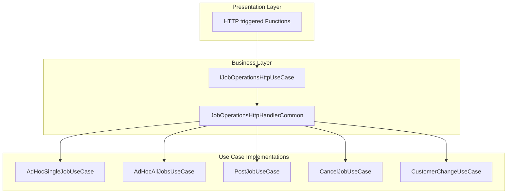

# Job Operations HTTP Use Case Feature Documentation 🔧

## Overview

This feature defines an abstraction layer for HTTP-triggered job operations in Azure Functions. It keeps function adapters thin by specifying a contract that all job operation handlers must implement.

By decoupling HTTP triggers from business logic, it enables substitutable implementations, improves testability, and preserves backward compatibility with existing endpoint adapters.

## Architecture Overview



## Component Structure

### Business Layer

#### **IJobOperationsHttpUseCase** (`src/Rpc.AIS.Accrual.Orchestrator.Functions/Endpoints/IJobOperationsHttpUseCase.cs`)

- **Purpose**: Contract for job operation HTTP endpoints use cases.
- **Responsibilities**:- Define method signatures for all job operation endpoints.
- Allow Function adapters to remain thin and interchangeable.

| Method | Description | Returns |
| --- | --- | --- |
| AdHocSingleJobSyncAsync | Handle single ad-hoc batch job request | Task<HttpResponseData> |
| AdHocAllJobsAsync | Handle ad-hoc all-jobs batch request | Task<HttpResponseData> |
| PostJobSyncAsync | Handle synchronous post-job request | Task<HttpResponseData> |
| CancelJobSyncAsync | Handle job cancellation request | Task<HttpResponseData> |
| CustomerChangeSyncAsync | Handle customer change request | Task<HttpResponseData> |


```csharp
using System.Threading.Tasks;
using Microsoft.Azure.Functions.Worker;
using Microsoft.Azure.Functions.Worker.Http;

namespace Rpc.AIS.Accrual.Orchestrator.Functions.Functions
{
    /// <summary>
    /// Function-layer use case for job operation HTTP endpoints.
    /// Keeps Function adapters thin and enables substitutable implementations.
    /// </summary>
    public interface IJobOperationsHttpUseCase
    {
        Task<HttpResponseData> AdHocSingleJobSyncAsync(HttpRequestData req, FunctionContext ctx);
        Task<HttpResponseData> AdHocAllJobsAsync(HttpRequestData req, FunctionContext ctx);
        Task<HttpResponseData> PostJobSyncAsync(HttpRequestData req, FunctionContext ctx);
        Task<HttpResponseData> CancelJobSyncAsync(HttpRequestData req, FunctionContext ctx);
        Task<HttpResponseData> CustomerChangeSyncAsync(HttpRequestData req, FunctionContext ctx);
    }
}
```

#### **JobOperationsHttpHandlerCommon** (`src/Rpc.AIS.Accrual.Orchestrator.Functions/Endpoints/JobOperationsHttpFunctions.cs`)

- **Purpose**: A backward-compatible façade implementing IJobOperationsHttpUseCase.
- **Responsibilities**:- Route each interface method to the appropriate use case implementation.
- Return a BadRequest response for unsupported operations.

| Method | Delegate |
| --- | --- |
| AdHocSingleJobSyncAsync | IAdHocSingleJobUseCase.ExecuteAsync |
| AdHocAllJobsAsync | Returns fixed BadRequest with explanatory message |
| PostJobSyncAsync | IPostJobUseCase.ExecuteAsync |
| CancelJobSyncAsync | ICancelJobUseCase.ExecuteAsync |
| CustomerChangeSyncAsync | ICustomerChangeUseCase.ExecuteAsync |


```csharp
public sealed class JobOperationsHttpHandlerCommon : IJobOperationsHttpUseCase
{
    private readonly IAdHocSingleJobUseCase _adHocSingle;
    private readonly IPostJobUseCase _postJob;
    private readonly ICancelJobUseCase _cancelJob;
    private readonly ICustomerChangeUseCase _customerChange;

    public JobOperationsHttpHandlerCommon(
        IAdHocSingleJobUseCase adHocSingle,
        IPostJobUseCase postJob,
        ICancelJobUseCase cancelJob,
        ICustomerChangeUseCase customerChange)
    {
        _adHocSingle = adHocSingle ?? throw new ArgumentNullException(nameof(adHocSingle));
        _postJob = postJob ?? throw new ArgumentNullException(nameof(postJob));
        _cancelJob = cancelJob ?? throw new ArgumentNullException(nameof(cancelJob));
        _customerChange = customerChange ?? throw new ArgumentNullException(nameof(customerChange));
    }

    public Task<HttpResponseData> AdHocSingleJobSyncAsync(HttpRequestData req, FunctionContext ctx)
        => _adHocSingle.ExecuteAsync(req, ctx);

    public async Task<HttpResponseData> AdHocAllJobsAsync(HttpRequestData req, FunctionContext ctx)
    {
        var resp = req.CreateResponse(HttpStatusCode.BadRequest);
        resp.Headers.Add("Content-Type", "application/json; charset=utf-8");
        await resp.WriteStringAsync(JsonSerializer.Serialize(new
        {
            message = "AdHocBatch_AllJobs is handled by the dedicated endpoint adapter (AdHocBatchAllJobsFunction) and IAdHocAllJobsUseCase."
        }));
        return resp;
    }

    public Task<HttpResponseData> PostJobSyncAsync(HttpRequestData req, FunctionContext ctx)
        => _postJob.ExecuteAsync(req, ctx);

    public Task<HttpResponseData> CancelJobSyncAsync(HttpRequestData req, FunctionContext ctx)
        => _cancelJob.ExecuteAsync(req, ctx);

    public Task<HttpResponseData> CustomerChangeSyncAsync(HttpRequestData req, FunctionContext ctx)
        => _customerChange.ExecuteAsync(req, ctx);
}
```

## Integration Points

- **Azure Functions Adapters**:- `AdHocBatchSingleJobFunction`
- `AdHocBatchAllJobsFunction`
- `PostJobFunction`
- `CancelJobFunction`
- `CustomerChangeFunction`
- Each adapter binds an HTTP trigger and delegates to its use case via IJobOperationsHttpUseCase.

## Key Classes Reference

| Class | Location | Responsibility |
| --- | --- | --- |
| IJobOperationsHttpUseCase | `Endpoints/IJobOperationsHttpUseCase.cs` | Defines the contract for job operation HTTP use cases |
| JobOperationsHttpHandlerCommon | `Endpoints/JobOperationsHttpFunctions.cs` | Implements the contract, routing to specific use cases |


## Dependencies

- **Framework**:- System.Threading.Tasks
- Microsoft.Azure.Functions.Worker
- Microsoft.Azure.Functions.Worker.Http