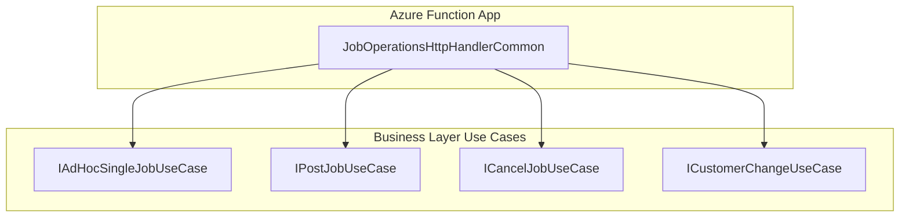

# Job Operations HTTP Handler Common Feature Documentation

## Overview

The **JobOperationsHttpHandlerCommon** class provides a backward-compatible façade for HTTP-triggered job operations. It delegates incoming requests to specialized use cases, keeping function adapters thin and preserving existing endpoint behavior. This refactor aligns with SOLID principles by moving endpoint logic into endpoint-specific use cases.

By centralizing shared logic in this handler, the application maintains legacy contracts while enabling independent development of each operation. It ensures that HTTP-triggered workloads—such as ad-hoc job sync, posting, cancellation, and customer changes—are routed consistently to their respective business logic.

## Architecture Overview



## Component Structure

### **JobOperationsHttpHandlerCommon** (src/Rpc.AIS.Accrual.Orchestrator.Functions/Endpoints/JobOperationsHttpFunctions.cs)

- **Purpose**

Acts as a backward-compatible façade, delegating HTTP requests for job operations to endpoint-specific use cases.

- **Constructor**

```csharp
  public JobOperationsHttpHandlerCommon(
      IAdHocSingleJobUseCase adHocSingle,
      IPostJobUseCase postJob,
      ICancelJobUseCase cancelJob,
      ICustomerChangeUseCase customerChange)
```

- Validates and assigns the injected use cases.
- Throws an `ArgumentNullException` if any dependency is null.

- **Dependencies**- **IAdHocSingleJobUseCase**: Handles ad-hoc single job sync
- **IPostJobUseCase**: Handles job posting
- **ICancelJobUseCase**: Handles job cancellation
- **ICustomerChangeUseCase**: Handles customer change sync

#### Methods

| Method | Signature | Description |
| --- | --- | --- |
| **AdHocSingleJobSyncAsync** | `Task<HttpResponseData> AdHocSingleJobSyncAsync(HttpRequestData req, FunctionContext ctx)` | Delegates to `IAdHocSingleJobUseCase.ExecuteAsync` |
| **AdHocAllJobsAsync** | `Task<HttpResponseData> AdHocAllJobsAsync(HttpRequestData req, FunctionContext ctx)` | Returns `400 Bad Request`; indicates dedicated adapter (`AdHocBatchAllJobsFunction`) should be used |
| **PostJobSyncAsync** | `Task<HttpResponseData> PostJobSyncAsync(HttpRequestData req, FunctionContext ctx)` | Delegates to `IPostJobUseCase.ExecuteAsync` |
| **CancelJobSyncAsync** | `Task<HttpResponseData> CancelJobSyncAsync(HttpRequestData req, FunctionContext ctx)` | Delegates to `ICancelJobUseCase.ExecuteAsync` |
| **CustomerChangeSyncAsync** | `Task<HttpResponseData> CustomerChangeSyncAsync(HttpRequestData req, FunctionContext ctx)` | Delegates to `ICustomerChangeUseCase.ExecuteAsync` |


### Important Note

```card
{
    "title": "AdHocAllJobs Endpoint",
    "content": "AdHocBatch_AllJobs is handled by a dedicated endpoint adapter (AdHocBatchAllJobsFunction) and IAdHocAllJobsUseCase."
}
```

## Method Details

### AdHocSingleJobSyncAsync 📄

- **Signature**

```csharp
  public Task<HttpResponseData> AdHocSingleJobSyncAsync(HttpRequestData req, FunctionContext ctx)
```

- **Behavior**

Forwards the HTTP request to the **AdHocSingleJobUseCase**, preserving HTTP context.

### AdHocAllJobsAsync 🚧

- **Signature**

```csharp
  public async Task<HttpResponseData> AdHocAllJobsAsync(HttpRequestData req, FunctionContext ctx)
```

- **Behavior**

```csharp
  var resp = req.CreateResponse(HttpStatusCode.BadRequest);
  resp.Headers.Add("Content-Type", "application/json; charset=utf-8");
  await resp.WriteStringAsync(JsonSerializer.Serialize(new {
      message = "AdHocBatch_AllJobs is handled by the dedicated endpoint adapter (AdHocBatchAllJobsFunction) and IAdHocAllJobsUseCase."
  }));
  return resp;
```

- **Response**- **Status**: 400 Bad Request
- **Body**: JSON with advisory message

### PostJobSyncAsync 📮

- **Signature**

```csharp
  public Task<HttpResponseData> PostJobSyncAsync(HttpRequestData req, FunctionContext ctx)
```

- **Behavior**

Delegates to the **PostJobUseCase** for synchronous job posting.

### CancelJobSyncAsync ❌

- **Signature**

```csharp
  public Task<HttpResponseData> CancelJobSyncAsync(HttpRequestData req, FunctionContext ctx)
```

- **Behavior**

Delegates to the **CancelJobUseCase** for job cancellation logic.

### CustomerChangeSyncAsync 🔄

- **Signature**

```csharp
  public Task<HttpResponseData> CustomerChangeSyncAsync(HttpRequestData req, FunctionContext ctx)
```

- **Behavior**

Delegates to the **CustomerChangeUseCase** for handling customer change synchronization.

## Integration Points

- **Endpoint Adapters**- `PostJobFunction`, `AdHocBatchSingleJobFunction`, etc., decorate Azure Function HTTP triggers and invoke this handler for shared operations.
- **Business Layer Use Cases**

Each method calls into a specific use case implementation under `Rpc.AIS.Accrual.Orchestrator.Functions.Functions`.

## Dependencies

- **Azure Functions Worker**- `Microsoft.Azure.Functions.Worker`
- `Microsoft.Azure.Functions.Worker.Http`
- **JSON Serialization**- `System.Text.Json`

## Testing Considerations

- **Delegation Verification**

Ensure each handler method calls the correct use case interface exactly once.

- **AdHocAllJobs Response**

Confirm `AdHocAllJobsAsync` returns HTTP 400 with the expected advisory message.