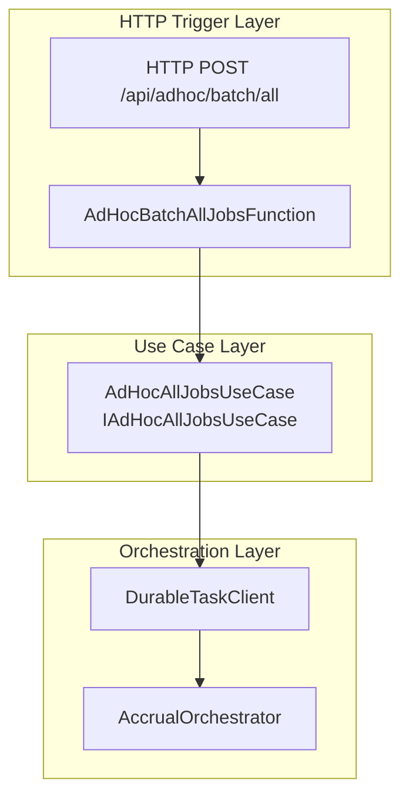
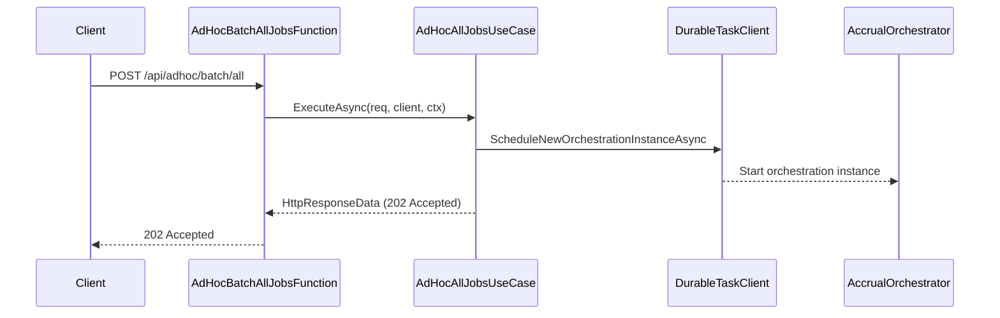

# AdHoc Batch All Jobs Feature Documentation

## Overview

The **AdHoc Batch All Jobs** feature provides an HTTP endpoint that allows clients to trigger a batch processing of **all** work orders on demand. It leverages Azure Durable Functions to schedule a long-running orchestration, ensuring reliable execution and built-in retry capabilities. This endpoint is typically used for ad-hoc maintenance, backfills, or recovery scenarios where a full batch run is required outside of the regular schedule.

From a business perspective, this feature:

- Enables manual initiation of a complete accrual processing cycle.
- Provides traceability via run and correlation identifiers.
- Integrates seamlessly with existing job operation endpoints in the orchestrator.

## Architecture Overview



## Component Structure

### 1. Endpoints Layer

#### **AdHocBatchAllJobsFunction** (`src/Rpc.AIS.Accrual.Orchestrator.Functions/Endpoints/Split/AdHocBatchAllJobsFunction.cs`)

- **Purpose:** Serves as the HTTP entry point for ad-hoc batch execution of all jobs.
- **Responsibilities:**- Validates constructor dependencies.
- Maps HTTP POST requests to the use case.
- **Key Method:**- `RunAsync(HttpRequestData req, DurableTaskClient client, FunctionContext ctx)`

Delegates request handling to the `IAdHocAllJobsUseCase` implementation.

### 2. Use Case Layer

#### **IAdHocAllJobsUseCase** (`src/Rpc.AIS.Accrual.Orchestrator.Functions/Endpoints/UseCases/IAdHocAllJobsUseCase.cs`)

- **Purpose:** Defines the contract for scheduling an ad-hoc batch of all jobs.
- **Key Method:**

| Method | Description | Returns |
| --- | --- | --- |
| `ExecuteAsync(HttpRequestData req, DurableTaskClient client, FunctionContext ctx)` | Schedules the durable orchestration for all jobs. | `Task<HttpResponseData>` |


#### **AdHocAllJobsUseCase** (`src/Rpc.AIS.Accrual.Orchestrator.Functions/Endpoints/UseCases/AdHocAllJobsUseCase.cs`)

- **Purpose:** Implements scheduling logic for the `AdHocBatch_AllJobs` orchestration.
- **Dependencies:**- `ILogger<AdHocAllJobsUseCase>`
- `IAisLogger`
- `IAisDiagnosticsOptions`
- **Key Responsibilities:**- **Context Extraction:** Reads `x-run-id`, `x-correlation-id`, and `x-source-system` headers.
- **Logging Scopes:** Begins structured logging scopes for function and scheduling steps.
- **Orchestration:** Constructs a unique instance ID and invokes `ScheduleNewOrchestrationInstanceAsync` on `DurableTaskClient`.
- **Response:** Returns an HTTP 202 (Accepted) with orchestration details.

## Key Classes Reference

| Class | Location | Responsibility |
| --- | --- | --- |
| **AdHocBatchAllJobsFunction** | `src/.../Endpoints/Split/AdHocBatchAllJobsFunction.cs` | HTTP trigger adapter delegating to use case |
| **IAdHocAllJobsUseCase** | `src/.../Endpoints/UseCases/IAdHocAllJobsUseCase.cs` | Contract for all-jobs scheduling use case |
| **AdHocAllJobsUseCase** | `src/.../Endpoints/UseCases/AdHocAllJobsUseCase.cs` | Implements orchestration scheduling logic |


## API Integration

### POST /adhoc/batch/all

```api
{
    "title": "AdHoc Batch All Jobs",
    "description": "Schedules an ad hoc batch run for all work orders via Azure Durable Orchestrator.",
    "method": "POST",
    "baseUrl": "https://{function_app_host}/api",
    "endpoint": "/adhoc/batch/all",
    "headers": [
        {
            "key": "x-run-id",
            "value": "Unique identifier for this run",
            "required": false
        },
        {
            "key": "x-correlation-id",
            "value": "Correlation identifier for distributed tracing",
            "required": false
        },
        {
            "key": "x-source-system",
            "value": "Identifier of the calling system",
            "required": false
        }
    ],
    "queryParams": [],
    "pathParams": [],
    "bodyType": "none",
    "requestBody": "",
    "formData": [],
    "rawBody": "",
    "responses": {
        "202": {
            "description": "Accepted \u2013 orchestration has been scheduled",
            "body": "{\n  \"instanceId\": \"<generated-instance-id>\",\n  \"runId\": \"<run-id>\",\n  \"correlationId\": \"<corr-id>\",\n  \"sourceSystem\": \"<source>\",\n  \"trigger\": \"AdHocAll\"\n}"
        },
        "400": {
            "description": "Bad Request \u2013 missing or invalid headers",
            "body": "{\n  \"message\": \"Invalid request context or headers.\"  \n}"
        }
    }
}
```

## Feature Flow

### AdHoc Batch All Jobs Scheduling



## Error Handling

- **400 Bad Request:** Returned when required context headers are missing or malformed.
- **500 Internal Server Error:** Propagated by Azure Functions runtime if scheduling fails unexpectedly.

## Dependencies

- Microsoft.Azure.Functions.Worker
- Microsoft.Azure.Functions.Worker.Http
- Microsoft.DurableTask.Client
- Rpc.AIS.Accrual.Orchestrator.Core.Abstractions
- Rpc.AIS.Accrual.Orchestrator.Infrastructure.Logging

## Testing Considerations

- **Function Adapter Test:** Mock `IAdHocAllJobsUseCase` to verify that `RunAsync` delegates correctly.
- **Use Case Test:** Mock `DurableTaskClient` to assert that `ScheduleNewOrchestrationInstanceAsync` is called with the expected instance ID and `RunInputDto`.
- **Integration Test:** Verify HTTP 202 response contains the correct JSON payload and headers when orchestration scheduling succeeds.