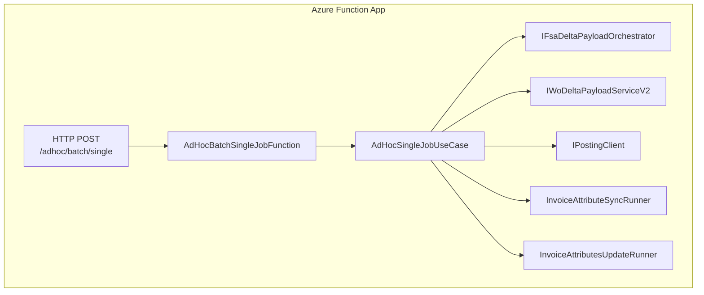
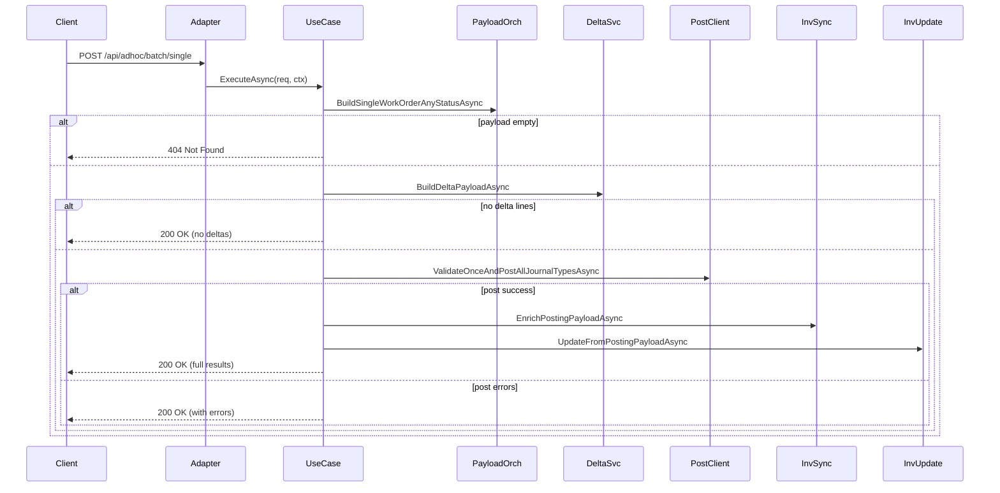

# AdHocBatch_SingleJob Feature Documentation

## Overview

The **AdHocBatch_SingleJob** feature enables on-demand processing of a single work order through the accrual orchestration pipeline. By sending an HTTP POST request to this endpoint, consumers can trigger a synchronous fetch of FSA data, compute deltas against FSCM history, post journal entries, and update invoice attributes—all within one operation.

This feature delivers:

- 🎯 **Immediate business value** by allowing targeted reprocessing of individual work orders.
- 🔄 **Consistency** with the normal accrual pipeline, reusing core services.
- 🔗 **Low coupling** via a thin HTTP adapter that delegates logic to a dedicated use case.

## Architecture Overview



## Component Structure

### 1. HTTP Adapter

#### **AdHocBatchSingleJobFunction** (src/Rpc.AIS.Accrual.Orchestrator.Functions/Endpoints/Split/AdHocBatchSingleJobFunction.cs)

- **Purpose:** Entry point for the ad-hoc single-job HTTP API.
- **Responsibilities:**- Receives HTTP POST at `/adhoc/batch/single`.
- Delegates request handling to the use case.
- **Key Property:**- `IAdHocSingleJobUseCase _useCase`
- **Key Method:**- `RunAsync(HttpRequestData req, FunctionContext ctx)`

```csharp
[Function("AdHocBatch_SingleJob")]
public async Task<HttpResponseData> RunAsync(
    [HttpTrigger(AuthorizationLevel.Function, "post", Route = "adhoc/batch/single")] HttpRequestData req,
    FunctionContext ctx)
{
    return await _useCase.ExecuteAsync(req, ctx);
}
```

---

### 2. Business Layer

#### **AdHocSingleJobUseCase** (src/Rpc.AIS.Accrual.Orchestrator.Functions/Endpoints/UseCases/AdHocSingleJobUseCase.cs)

- **Purpose:** Implements the full ad-hoc single work order pipeline.
- **Dependencies:**- `IFsaDeltaPayloadOrchestrator _payloadOrch`
- `FsOptions _fsOpt`
- `IPostingClient _posting`
- `IWoDeltaPayloadServiceV2 _deltaV2`
- `InvoiceAttributeSyncRunner _invoiceSync`
- `InvoiceAttributesUpdateRunner _invoiceUpdate`
- **ExecuteAsync Flow:**1. **Context & Logging**

Read headers (`x-run-id`, `x-correlation-id`, `x-source-system`) and start a log scope.

1. **Payload Ingestion**

Read and log the request body; return **400 Bad Request** if empty or invalid.

1. **FSA Fetch**

Build the FSA payload for the specified work order GUID. Return **404 Not Found** if no data.

1. **Delta Computation**

Extract `Company` and `SubProjectId`; compute delta payload via `_deltaV2`.

1. **Posting**

If any delta lines exist, validate and post journal entries.

1. **Invoice Attributes**

On successful post, enrich and update invoice attributes.

1. **Response**

Return **200 OK** with detailed results or business messages.

---

### 3. Common Utilities

#### **JobOperationsUseCaseBase** (src/Rpc.AIS.Accrual.Orchestrator.Functions/Endpoints/UseCases/JobOperationsUseCaseBase.cs)

- **Responsibilities:**- Header extraction (`ReadContext`)
- Request body reading (`ReadBodyAsync`)
- FS job operation request parsing (`TryParseFsJobOpsRequest`)
- Standardized HTTP responses: `OkAsync`, `BadRequestAsync`, `NotFoundAsync`

---

## API Integration

### POST AdHocBatch Single Job

```api
{
    "title": "AdHocBatch Single Job",
    "description": "Triggers a synchronous accrual pipeline for a single work order GUID.",
    "method": "POST",
    "baseUrl": "https://<your-function-app>.azurewebsites.net/api",
    "endpoint": "/adhoc/batch/single",
    "headers": [
        {
            "key": "Content-Type",
            "value": "application/json",
            "required": true
        },
        {
            "key": "x-run-id",
            "value": "Run identifier for logging",
            "required": false
        },
        {
            "key": "x-correlation-id",
            "value": "Correlation identifier",
            "required": false
        },
        {
            "key": "x-source-system",
            "value": "Originating system name",
            "required": false
        }
    ],
    "queryParams": [],
    "pathParams": [],
    "bodyType": "json",
    "requestBody": "{\n  \"_request\": {\n    \"WorkOrderGuid\": \"00000000-0000-0000-0000-000000000000\"\n  }\n}",
    "formData": [],
    "rawBody": "",
    "responses": {
        "200": {
            "description": "Processing succeeded (with or without delta).",
            "body": "{\n  \"runId\": \"...\",\n  \"correlationId\": \"...\",\n  \"sourceSystem\": \"...\",\n  \"workOrderGuid\": \"...\",\n  \"workOrderNumbers\": [\"WO123\"],\n  \"delta\": {\n    \"WorkOrdersInInput\": 1,\n    \"WorkOrdersInOutput\": 1,\n    \"TotalDeltaLines\": 5,\n    \"TotalReverseLines\": 0,\n    \"TotalRecreateLines\": 0\n  },\n  \"postResults\": [\n    { \"journalType\": \"Item\", \"success\": true, \"posted\": 5, \"errors\": 0 }\n  ],\n  \"invoiceAttributesUpdate\": {\n    \"attempted\": true,\n    \"success\": true,\n    \"workOrdersWithInvoiceAttributes\": 1,\n    \"totalAttributePairs\": 2,\n    \"note\": \"...\",\n    \"update\": {\n      \"WorkOrdersConsidered\": 1,\n      \"WorkOrdersWithUpdates\": 1,\n      \"UpdatePairs\": 1,\n      \"SuccessCount\": 1,\n      \"FailureCount\": 0\n    }\n  }\n}"
        },
        "400": {
            "description": "Invalid request payload.",
            "body": "{\n  \"message\": \"Request body is required and must contain workOrderGuid.\"\n}"
        },
        "404": {
            "description": "Work order not in the open set.",
            "body": "{\n  \"runId\": \"...\",\n  \"correlationId\": \"...\",\n  \"sourceSystem\": \"...\",\n  \"workOrderGuid\": \"...\",\n  \"message\": \"Work order not found in OPEN set (or was skipped due to missing SubProject).\"\n}"
        }
    }
}
```

---

## Feature Flow

### AdHocBatch Single Job Processing



---

## Key Classes Reference

| Class | Location | Responsibility |
| --- | --- | --- |
| **AdHocBatchSingleJobFunction** | src/Rpc.AIS.Accrual.Orchestrator.Functions/Endpoints/Split/AdHocBatchSingleJobFunction.cs | HTTP trigger adapter for single-job processing. |
| **IAdHocSingleJobUseCase** | src/Rpc.AIS.Accrual.Orchestrator.Functions/Endpoints/UseCases/IAdHocSingleJobUseCase.cs | Contract for single-job use case. |
| **AdHocSingleJobUseCase** | src/Rpc.AIS.Accrual.Orchestrator.Functions/Endpoints/UseCases/AdHocSingleJobUseCase.cs | Implements ad-hoc single work order pipeline. |
| **JobOperationsUseCaseBase** | src/Rpc.AIS.Accrual.Orchestrator.Functions/Endpoints/UseCases/JobOperationsUseCaseBase.cs | Base for request parsing & standardized responses. |
| **IFsaDeltaPayloadOrchestrator** | Core services (injected) | Orchestrates FSA payload building. |
| **IPostingClient** | Infrastructure/Clients/Posting | Validates and posts journal entries. |
| **IWoDeltaPayloadServiceV2** | Infrastructure/Clients | Computes delta payload from FSCM history. |
| **InvoiceAttributeSyncRunner** | Functions/Services | Enriches posting payload with invoice attributes. |
| **InvoiceAttributesUpdateRunner** | Functions/Services | Updates invoice attributes in the target system. |
