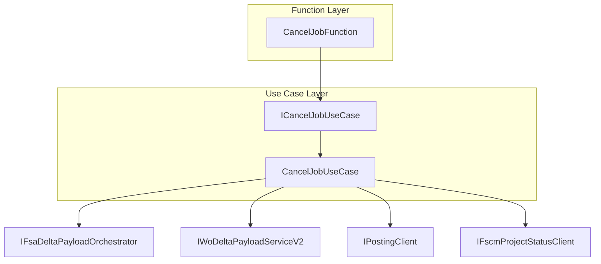
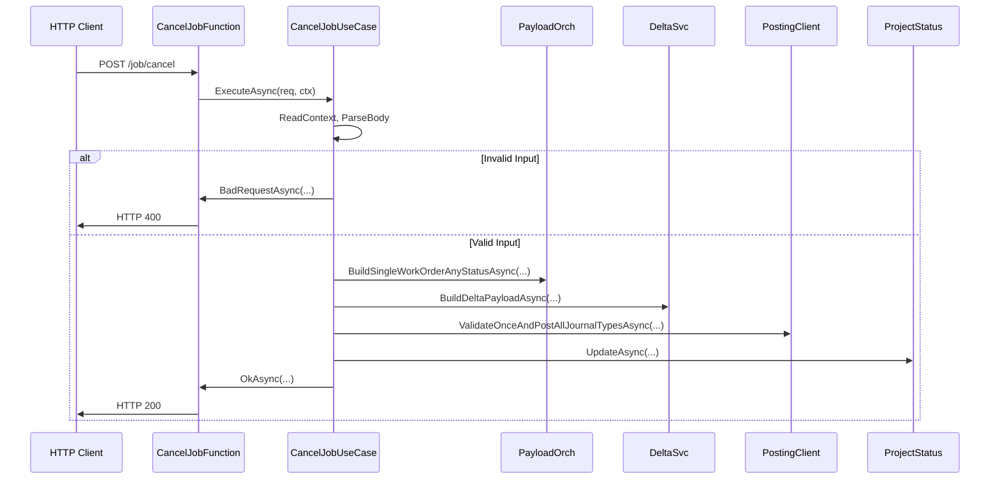

# Cancel Job Feature Documentation

## Overview

This feature provides an HTTP endpoint to **cancel an existing work order** by its GUID. It offers a thin Azure Function adapter that delegates core cancellation logic to a dedicated use case, ensuring clean separation of concerns. Clients send a JSON payload with the work order identifier; the system validates input, orchestrates delta payload generation, posts reversal journals, updates FSCM project status, and returns detailed results.

## Architecture Overview



## Component Structure

### 1. Presentation Layer

#### **CancelJobFunction** (`src/Rpc.AIS.Accrual.Orchestrator.Functions/Endpoints/Split/CancelJobFunction.cs` )

- **Purpose:** Azure Function HTTP trigger for the `CancelJob` endpoint.
- **Dependencies:**- `_useCase` – injected `ICancelJobUseCase`
- **Key Method:**

```csharp
  [Function("CancelJob")]
  public async Task<HttpResponseData> RunAsync(
      [HttpTrigger(AuthorizationLevel.Function, "post", Route = "job/cancel")] HttpRequestData req,
      FunctionContext ctx)
  {
      return await _useCase.ExecuteAsync(req, ctx);
  }
```

### 2. Business Layer

#### **ICancelJobUseCase** (`src/Rpc.AIS.Accrual.Orchestrator.Functions/Endpoints/UseCases/ICancelJobUseCase.cs` )

- **Purpose:** Contract for executing the job cancellation use case.
- **Method:**

| Method | Description | Returns |
| --- | --- | --- |
| `ExecuteAsync(HttpRequestData, FunctionContext)` | Processes cancellation request and builds HTTP response | `Task<HttpResponseData>` |


#### **CancelJobUseCase** (`src/Rpc.AIS.Accrual.Orchestrator.Functions/Endpoints/UseCases/CancelJobUseCase.cs`)

- **Purpose:** Implements cancellation flow:- Reads context (RunId, CorrelationId, SourceSystem)
- Parses and validates request body
- Builds FSA payload snapshot
- Generates delta payload for cancellation
- Posts reversal journals
- Updates FSCM project status to “Cancelled”
- Returns structured JSON response
- **Dependencies:**

| Dependency | Responsibility |
| --- | --- |
| `IFsaDeltaPayloadOrchestrator` | Fetches FSA work order snapshot |
| `IWoDeltaPayloadServiceV2` | Builds delta payload for cancellation |
| `IPostingClient` | Validates and posts journals to FSCM |
| `IFscmProjectStatusClient` | Updates project status in FSCM |
| `FsOptions` | Configuration for file system clients |


## API Integration

### Cancel Job Endpoint

```api
{
    "title": "Cancel Job",
    "description": "Cancels an existing work order by GUID.",
    "method": "POST",
    "baseUrl": "https://<functionapp>.azurewebsites.net",
    "endpoint": "/job/cancel",
    "headers": [
        {
            "key": "Content-Type",
            "value": "application/json",
            "required": true
        }
    ],
    "queryParams": [],
    "pathParams": [],
    "bodyType": "json",
    "requestBody": "{\n  \"_request\": {\n    \"WorkOrderGuid\": \"11111111-1111-1111-1111-111111111111\",\n    \"Company\": \"ABC_Corp\",\n    \"SubProjectId\": \"SP123\"\n  }\n}",
    "formData": [],
    "rawBody": "",
    "responses": {
        "200": {
            "description": "Cancellation processed successfully.",
            "body": "{\n  \"runId\": \"<run-guid>\",\n  \"correlationId\": \"<corr-guid>\",\n  \"sourceSystem\": \"<source-system>\",\n  \"operation\": \"CancelJob\",\n  \"workOrderGuid\": \"11111111-1111-1111-1111-111111111111\",\n  \"message\": \"Delta payload is empty; nothing to post.\",\n  \"projectStatusUpdate\": {\n    \"success\": true,\n    \"httpStatus\": 200\n  }\n}"
        },
        "400": {
            "description": "Invalid request payload.",
            "body": "{\n  \"message\": \"Request body is required and must contain workOrderGuid.\"\n}"
        }
    }
}
```

## Feature Flows

### 1. Cancellation Request Flow



## Key Classes Reference

| Class | Location | Responsibility |
| --- | --- | --- |
| CancelJobFunction | `Endpoints/Split/CancelJobFunction.cs` | HTTP adapter for Cancel Job |
| ICancelJobUseCase | `Endpoints/UseCases/ICancelJobUseCase.cs` | Contract for cancellation use case |
| CancelJobUseCase | `Endpoints/UseCases/CancelJobUseCase.cs` | Business logic for job cancellation |


## Error Handling

- **Constructor Guard:** Throws `ArgumentNullException` if `ICancelJobUseCase` is not provided.
- **Bad Request:** Returns HTTP 400 when request body is missing or cannot be parsed .

## Dependencies

- Microsoft.Azure.Functions.Worker
- Microsoft.Azure.Functions.Worker.Http
- Microsoft.DurableTask.Client
- Core abstractions and services from Rpc.AIS.Accrual.Orchestrator.*
- `IFsaDeltaPayloadOrchestrator`, `IWoDeltaPayloadServiceV2`, `IPostingClient`, `IFscmProjectStatusClient`

## Testing Considerations

- Validate 400 response for empty or malformed JSON.
- Mock `ICancelJobUseCase` to ensure `CancelJobFunction` delegates correctly.
- Simulate successful and failure paths in `CancelJobUseCase` to verify response payload structure.