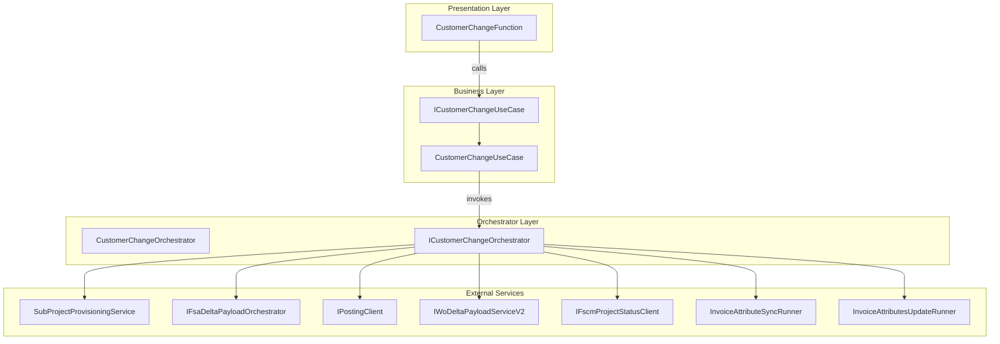
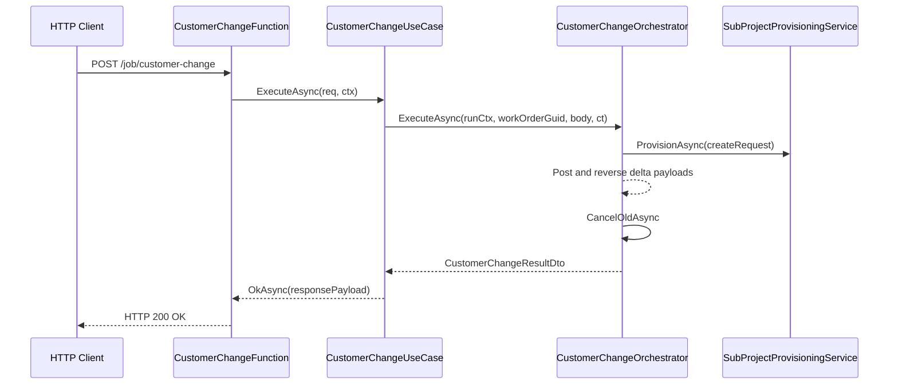

# Customer Change Function Feature Documentation

## Overview

The Customer Change Function exposes an HTTP endpoint that initiates the Customer Change business process for a given work order. On receiving a POST request, it delegates request handling to a dedicated use-case component, ensuring separation of concerns between transport, validation, orchestration, and external service calls. This feature enables creation of a new subproject, migration of accrual lines, reversal of old lines, and cancellation of the old subproject, all within a single HTTP-triggered operation.

In the broader application, this function serves as the entry point for synchronous Customer Change operations. It integrates with Azure Functions, Durable Task, and a suite of backend services to achieve end-to-end orchestration of financial accrual adjustments.

## Architecture Overview



## Component Structure

### 1. Presentation Layer

#### **CustomerChangeFunction** (`src/Rpc.AIS.Accrual.Orchestrator.Functions/Endpoints/Split/CustomerChangeFunction.cs`)

- **Purpose and responsibilities**- Listens for HTTP POST requests at `/job/customer-change`.
- Delegates raw request handling to the `ICustomerChangeUseCase` implementation.
- **Key Methods**- `RunAsync(HttpRequestData req, FunctionContext ctx)`: Triggered by Azure Functions; returns the HTTP response from the use-case.

```csharp
[Function("CustomerChange")]
public async Task<HttpResponseData> RunAsync(
    [HttpTrigger(AuthorizationLevel.Function, "post", Route = "job/customer-change")] HttpRequestData req,
    FunctionContext ctx)
{
    return await _useCase.ExecuteAsync(req, ctx);
}
```

### 2. Business Layer

#### **ICustomerChangeUseCase** (`src/Rpc.AIS.Accrual.Orchestrator.Functions/Endpoints/UseCases/ICustomerChangeUseCase.cs`)

- **Purpose**- Defines the contract for handling Customer Change HTTP requests.

| Method | Description | Returns |
| --- | --- | --- |
| `Task<HttpResponseData> ExecuteAsync(HttpRequestData req, FunctionContext ctx)` | Processes the HTTP request and produces a response indicating success or failure of the Customer Change operation. | `HttpResponseData` |


#### **CustomerChangeUseCase** (`src/Rpc.AIS.Accrual.Orchestrator.Functions/Endpoints/UseCases/CustomerChangeUseCase.cs`)

- **Purpose**- Validates and parses the incoming HTTP payload.
- Logs request context and payload.
- Calls `ICustomerChangeOrchestrator.ExecuteAsync` to perform the core business logic.
- Formats success or error HTTP responses.

| Method | Description | Returns |
| --- | --- | --- |
| `Task<HttpResponseData> ExecuteAsync(HttpRequestData req, FunctionContext ctx)` | Orchestrates request parsing, logging, validation, error handling, and response creation for Customer Change. | `HttpResponseData` |


### 3. Orchestrator Layer

#### **ICustomerChangeOrchestrator** (`src/Rpc.AIS.Accrual.Orchestrator.Functions/Composition/JobOperationsServices.cs`)

- **Purpose**- Abstracts the full Customer Change business workflow behind a simple interface.

| Method | Description | Returns |
| --- | --- | --- |
| `Task<CustomerChangeResultDto> ExecuteAsync(RunContext ctx, Guid workOrderGuid, string rawRequestJson, CancellationToken ct)` | Executes the end-to-end Customer Change process and returns the new subproject identifier. | `CustomerChangeResultDto` |


#### **CustomerChangeOrchestrator** (`src/Rpc.AIS.Accrual.Orchestrator.Functions/Durable/Orchestrators/CustomerChangeOrchestrator.cs`)

- **Purpose**- Implements the Customer Change workflow:1. Fetch full WorkOrder payload from Field Service
2. Create new subproject in FSCM
3. Post existing accrual lines into the new subproject
4. Reverse old lines to zero
5. Cancel the old subproject
6. Synchronize invoice attributes as a best-effort
- Relies on injected services to handle each step.

| Method | Description | Returns |
| --- | --- | --- |
| `Task<CustomerChangeResultDto> ExecuteAsync(RunContext ctx, Guid workOrderGuid, string rawRequestJson, CancellationToken ct)` | Runs the complete Customer Change orchestration and returns subproject details. | `CustomerChangeResultDto` |


### 4. Data Models

#### **CustomerChangeResultDto** (`src/Rpc.AIS.Accrual.Orchestrator.Functions/Composition/JobOperationsServices.cs`)

| Property | Type | Description |
| --- | --- | --- |
| `NewSubProjectId` | string | Identifier of the newly created subproject. |


#### **Customer Change HTTP Request Model**

The function expects a JSON body following the Field Service envelope:

```json
{
  "_request": {
    "WOList": [
      {
        "WorkOrderGuid": "{GUID}",
        "OldSubProjectId": "{ExistingSubProjectId}"
      }
    ]
  }
}
```

| Property | Type | Description |
| --- | --- | --- |
| `_request` | object | Envelope containing request details. |
| `WOList` | array | List of work orders to process (only the first item is used). |
| `WorkOrderGuid` | string | GUID of the work order being migrated. |
| `OldSubProjectId` | string | Identifier of the existing subproject to cancel. |


### 5. API Integration

#### POST /job/customer-change

```api
{
    "title": "Customer Change",
    "description": "Initiates the Customer Change process for a specified work order.",
    "method": "POST",
    "baseUrl": "https://{functionapp}.azurewebsites.net",
    "endpoint": "/job/customer-change",
    "headers": [
        {
            "key": "Content-Type",
            "value": "application/json",
            "required": true
        }
    ],
    "queryParams": [],
    "pathParams": [],
    "bodyType": "json",
    "requestBody": "{\n  \"_request\": {\n    \"WOList\": [\n      {\n        \"WorkOrderGuid\": \"{GUID}\",\n        \"OldSubProjectId\": \"{ExistingSubProjectId}\"\n      }\n    ]\n  }\n}",
    "formData": [],
    "rawBody": "",
    "responses": {
        "200": {
            "description": "Success; returns orchestration context and new subproject identifier.",
            "body": "{\n  \"runId\": \"{string}\",\n  \"correlationId\": \"{string}\",\n  \"sourceSystem\": \"{string}\",\n  \"operation\": \"CustomerChange\",\n  \"workOrderGuid\": \"{GUID}\",\n  \"newSubProjectId\": \"{string}\"\n}"
        },
        "400": {
            "description": "Bad Request; missing or invalid payload.",
            "body": "{\n  \"error\": \"Request body is required and must contain workOrderGuid and oldSubProjectId.\"\n}"
        },
        "500": {
            "description": "Server Error; Customer Change orchestration failed.",
            "body": "{\n  \"error\": \"CustomerChange failed.\"\n}"
        }
    }
}
```

## Feature Flows

### Customer Change Execution Flow



## Error Handling

- **400 Bad Request** when the request body is null, empty, or fails JSON parsing.
- **500 Server Error** when any exception occurs during orchestration.
- Exceptions are logged with RunId, CorrelationId, and WorkOrderGuid to facilitate diagnostics.

## Dependencies

- Azure Functions Worker (`Microsoft.Azure.Functions.Worker`)
- Durable Task Client (`Microsoft.DurableTask.Client`)
- `ICustomerChangeUseCase` (injected)
- `ICustomerChangeOrchestrator` (injected into use case)
- Backend services:- `SubProjectProvisioningService`
- `IFsaDeltaPayloadOrchestrator`
- `IPostingClient`
- `IWoDeltaPayloadServiceV2`
- `IFscmProjectStatusClient`
- `InvoiceAttributeSyncRunner`
- `InvoiceAttributesUpdateRunner`

## Testing Considerations

- Verify that missing body results in a 400 response.
- Validate correct JSON schema yields a 200 response with expected fields.
- Simulate orchestrator failures to ensure a 500 response is returned.
- Mock backend services to isolate the function’s behavior.

## Key Classes Reference

| Class | Location | Responsibility |
| --- | --- | --- |
| `CustomerChangeFunction` | src/Rpc.AIS.Accrual.Orchestrator.Functions/Endpoints/Split/CustomerChangeFunction.cs | HTTP adapter for Customer Change requests. |
| `ICustomerChangeUseCase` | src/Rpc.AIS.Accrual.Orchestrator.Functions/Endpoints/UseCases/ICustomerChangeUseCase.cs | Defines the contract for Customer Change handling. |
| `CustomerChangeUseCase` | src/Rpc.AIS.Accrual.Orchestrator.Functions/Endpoints/UseCases/CustomerChangeUseCase.cs | Implements HTTP request parsing, logging, and response logic. |
| `ICustomerChangeOrchestrator` | src/Rpc.AIS.Accrual.Orchestrator.Functions/Composition/JobOperationsServices.cs | Orchestration contract for Customer Change workflow. |
| `CustomerChangeOrchestrator` | src/Rpc.AIS.Accrual.Orchestrator.Functions/Durable/Orchestrators/CustomerChangeOrchestrator.cs | Executes the multi-step Customer Change process. |
| `CustomerChangeResultDto` | src/Rpc.AIS.Accrual.Orchestrator.Functions/Composition/JobOperationsServices.cs | DTO containing the new subproject identifier. |
