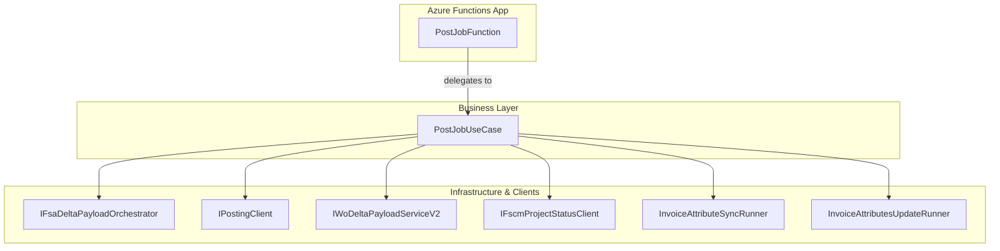

# PostJob Function Feature Documentation

## Overview

🚀 The **PostJobFunction** exposes an HTTP POST endpoint (`/job/post`) as part of the Accrual Orchestrator Azure Functions. It serves as the entry point for submitting a single work‐order to the accrual processing pipeline. Internally, it delegates request handling to the `IPostJobUseCase`, enforcing a clean separation between transport and business logic.

By offloading orchestration details to a use‐case implementation, this thin adapter ensures the function remains focused on HTTP concerns—routing, header extraction, and response composition—while complex accrual workflows live in dedicated services.

---

## Architecture Overview



---

## Component Structure

### 1. Function Adapter Layer

#### **PostJobFunction** (`src/Rpc.AIS.Accrual.Orchestrator.Functions/Endpoints/Split/PostJobFunction.cs`)

- **Purpose**

Acts as the HTTP‐triggered Azure Function for the **PostJob** operation. It receives incoming HTTP requests and invokes the business use‐case.

- **Dependencies**- `IPostJobUseCase`
- **Key Method**- `RunAsync(HttpRequestData req, FunctionContext ctx)`- Triggers on `POST /job/post`.
- Calls `_useCase.ExecuteAsync(req, ctx)` to process the request.
- **Error Handling**

Any exceptions or validation failures are surfaced by the use‐case, which returns appropriate `HttpResponseData` (e.g., 400 Bad Request or 500 Internal Server Error).

---

## API Integration

### PostJob Endpoint (POST)

```api
{
    "title": "PostJob",
    "description": "Submits a work\u2010order for accrual processing.",
    "method": "POST",
    "baseUrl": "https://{functionApp}.azurewebsites.net/api",
    "endpoint": "/job/post",
    "headers": [
        {
            "key": "Content-Type",
            "value": "application/json",
            "required": true
        },
        {
            "key": "x-functions-key",
            "value": "Function authorization key",
            "required": true
        },
        {
            "key": "x-run-id",
            "value": "Optional trace run identifier",
            "required": false
        },
        {
            "key": "x-correlation-id",
            "value": "Optional correlation identifier",
            "required": false
        },
        {
            "key": "x-source-system",
            "value": "Optional source system name",
            "required": false
        }
    ],
    "queryParams": [],
    "pathParams": [],
    "bodyType": "json",
    "requestBody": "{\n  \"_request\": {\n    \"WorkOrderGuid\": \"<GUID>\",\n    \"Company\": \"<string>\",\n    \"SubProjectId\": \"<string>\"\n  }\n}",
    "formData": [],
    "rawBody": "",
    "responses": {
        "200": {
            "description": "Job posted successfully",
            "body": "{\n  \"runId\": \"...\",\n  \"correlationId\": \"...\",\n  \"workOrderGuid\": \"...\",\n  \"workOrderNumbers\": [ \"...\" ],\n  /* additional payload details */\n}"
        },
        "400": {
            "description": "Bad request due to missing or invalid payload",
            "body": "{\n  \"error\": \"Request body is required and must contain workOrderGuid.\"\n}"
        },
        "500": {
            "description": "Internal server error",
            "body": "{\n  \"error\": \"An unexpected error occurred.\"\n}"
        }
    }
}
```

---

## Key Classes Reference

| Class | Location | Responsibility |
| --- | --- | --- |
| **PostJobFunction** | `src/Rpc.AIS.Accrual.Orchestrator.Functions/Endpoints/Split/PostJobFunction.cs` | HTTP adapter for the PostJob endpoint. |
| **IPostJobUseCase** | `src/Rpc.AIS.Accrual.Orchestrator.Functions/Endpoints/UseCases/IPostJobUseCase.cs` | Defines contract for the PostJob business logic implementation. |
| **PostJobUseCase** | `src/Rpc.AIS.Accrual.Orchestrator.Functions/Endpoints/UseCases/PostJobUseCase.cs` | Performs full accrual orchestration: payload fetch, delta build, posting, invoice sync, status update. |


---

## Integration Points

- **IFsaDeltaPayloadOrchestrator**: Builds FSA fetch payloads.
- **IPostingClient**: Validates and posts journal entries.
- **IWoDeltaPayloadServiceV2**: Constructs delta payloads from FSA vs. FSCM data.
- **IFscmProjectStatusClient**: Updates project status in SCM.
- **InvoiceAttributeSyncRunner** & **InvoiceAttributesUpdateRunner**: Sync and apply invoice attribute updates.

---

## Dependencies

- Azure Functions Worker SDK (`Microsoft.Azure.Functions.Worker`)
- Durable Task Client (`Microsoft.DurableTask.Client`)
- .NET Logging abstractions (`Microsoft.Extensions.Logging`)
- Orchestrator core abstractions and infrastructure clients (provided by the repository)

---

## Testing Considerations

- **Unit Tests**- Mock `IPostJobUseCase` to verify that `PostJobFunction.RunAsync` forwards the request correctly.
- **Integration Tests**- Deploy to a staging Function App and exercise `POST /job/post` with valid and invalid bodies.
- Validate HTTP status codes and response payload structure.