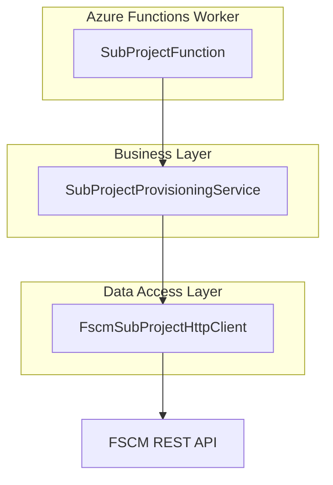
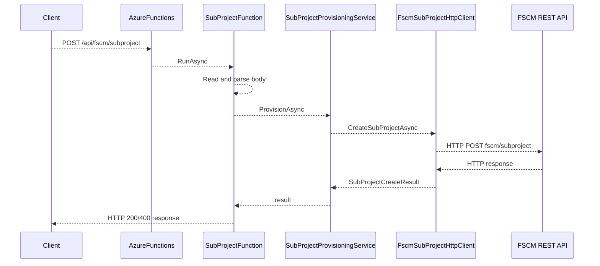

# FSCM SubProject Creation Endpoint Documentation

## Overview

This feature exposes an HTTP function to create subprojects in the FSCM system. It accepts JSON payloads in a new envelope format or a legacy schema. The function generates tracing IDs, logs detailed telemetry, validates and normalizes input, and delegates subproject provisioning to the business layer. It returns structured JSON responses indicating success or failure.

## Architecture Overview



## Component Structure

### SubProjectFunction (`src/Rpc.AIS.Accrual.Orchestrator.Functions/Endpoints/SubProjectFunction.cs`)

- **Purpose**

Handles HTTP requests for subproject creation and orchestrates validation, provisioning, and response formatting .

- **Dependencies**- `SubProjectProvisioningService _service`
- `IRunIdGenerator _runIds`
- `IAisLogger _ais`
- `ILogger<SubProjectFunction> _log`

- **Key Methods**

| Method | Description | Returns |
| --- | --- | --- |
| `RunAsync` | Entry point. Extracts headers, reads body, parses payload, calls provisioning service, and writes HTTP response. | `Task<HttpResponseData>` |


### Data Models

#### SubProjectEnvelope

- **Definition**

Wraps the canonical request under `_request`.

```csharp
public sealed record SubProjectEnvelope(SubProjectCreateRequest? _request);
```

- **Properties**

| Property | Type | Description |
| --- | --- | --- |
| `_request` | `SubProjectCreateRequest?` | Inner FSCM contract envelope object |


#### LegacySubProjectRequest

- **Definition**

Legacy schema for backward compatibility.

```csharp
public sealed record LegacySubProjectRequest(
    string LegalEntity,
    string ParentProjectId,
    string WorkOrderId,
    string? Name);
```

- **Properties**

| Property | Type | Description |
| --- | --- | --- |
| `LegalEntity` | `string` | Data area ID (legal entity) |
| `ParentProjectId` | `string` | ID of the existing parent project |
| `WorkOrderId` | `string` | Work order identifier |
| `Name` | `string?` | Optional custom project name |


#### SubProjectCreateRequest

- **Definition**

Canonical model for FSCM subproject creation contract .

- **Constructor Parameters**

| Property | Type | Description |
| --- | --- | --- |
| `DataAreaId` | `string` | Legal entity identifier |
| `ParentProjectId` | `string` | Parent project ID |
| `ProjectName` | `string` | Desired name for the new subproject |
| `CustomerReference` | `string?` | Optional customer reference |
| `InvoiceNotes` | `string?` | Optional notes for invoicing |
| `ActualStartDate` | `string?` | Optional actual start date (ISO format) |
| `ActualEndDate` | `string?` | Optional actual end date (ISO format) |
| `AddressName` | `string?` | Optional address name |
| `Street` | `string?` | Optional street |
| `City` | `string?` | Optional city |
| `State` | `string?` | Optional state |
| `County` | `string?` | Optional county |
| `CountryRegionId` | `string?` | Optional country or region code |
| `WellLocale` | `string?` | Optional locale for well |
| `WellName` | `string?` | Optional well name |
| `WellNumber` | `string?` | Optional well number |
| `ProjectStatus` | `int?` | Optional initial status code |


- **Init-only Properties**

| Property | Type | Description |
| --- | --- | --- |
| `WorkOrderGuid` | `string?` | Optional work order GUID (`WorkOrderGUID` in FSCM envelope) |
| `IsFsaProject` | `int?` | Optional FSA project flag (`IsFSAProject` in FSCM envelope) |
| `ProjectStatus` | `int?` | Optional status override (`ProjectStatus` in FSCM envelope) |
| `LegalEntity` | `object?` | Internal representation of `DataAreaId` |


#### SubProjectCreateResult

- **Definition**

Response from provisioning service .

- **Properties**

| Property | Type | Description |
| --- | --- | --- |
| `IsSuccess` | `bool` | Indicates overall success |
| `parmSubProjectId` | `string?` | Created subproject identifier |
| `Message` | `string?` | Informational or error message |
| `Errors` | `IReadOnlyList<SubProjectError>` | List of validation or service errors |


#### SubProjectError

- **Definition**

Represents a single error in creation .

- **Properties**

| Property | Type | Description |
| --- | --- | --- |
| `Code` | `string` | Error code |
| `Message` | `string` | Human-readable error message |


### Utility Methods

- **Sha256Hex**

Computes SHA256 hash in lowercase hex.

- **PayloadInfo**

Returns an object with byte count and SHA256 of the raw JSON.

## API Integration

### Create SubProject (POST /api/fscm/subproject)

```api
{
    "title": "Create SubProject",
    "description": "Creates a new subproject in FSCM using provided payload.",
    "method": "POST",
    "baseUrl": "https://<function-app>.azurewebsites.net",
    "endpoint": "/api/fscm/subproject",
    "headers": [
        {
            "key": "Content-Type",
            "value": "application/json",
            "required": true
        },
        {
            "key": "x-correlation-id",
            "value": "Optional correlation ID for tracing",
            "required": false
        },
        {
            "key": "x-run-id",
            "value": "Optional run ID for tracing",
            "required": false
        }
    ],
    "queryParams": [],
    "pathParams": [],
    "bodyType": "json",
    "requestBody": "{\n  \"_request\": {\n    \"DataAreaId\": \"string\",\n    \"ParentProjectId\": \"string\",\n    \"ProjectName\": \"string\"\n    // optional fields omitted for brevity\n  }\n}",
    "formData": [],
    "rawBody": "",
    "responses": {
        "200": {
            "description": "Subproject created successfully.",
            "body": "{\n  \"status\": \"Success\",\n  \"subProjectId\": \"string\",\n  \"message\": \"string\"\n}"
        },
        "400": {
            "description": "Invalid payload or creation failure.",
            "body": "{\n  \"status\": \"Error\",\n  \"message\": \"string\",\n  \"errors\": [ { \"Code\": \"string\", \"Message\": \"string\" } ]\n}"
        }
    }
}
```

## Feature Flow



## Error Handling

- **Invalid JSON**

Catches `JsonException`, logs a warning, returns **400 Bad Request** with details .

- **Missing Payload**

Detects null request, logs a warning, returns **400** with “Payload is missing.” .

- **Provisioning Failures**

Delegates error details from `SubProjectCreateResult.Errors` into the **400** response.

## Key Classes Reference

| Class | Location | Responsibility |
| --- | --- | --- |
| `SubProjectFunction` | `Functions/Endpoints/SubProjectFunction.cs` | HTTP handler for subproject creation |
| `SubProjectEnvelope` | `Functions/Endpoints/SubProjectFunction.cs` | Wraps the canonical request payload |
| `LegacySubProjectRequest` | `Functions/Endpoints/SubProjectFunction.cs` | Supports legacy request schema |
| `SubProjectCreateRequest` | `Core/Domain/SubProjectModels.cs` | Defines FSCM subproject creation contract |
| `SubProjectCreateResult` | `Core/Domain/SubProjectModels.cs` | Carries success flag, ID, message, and errors |
| `SubProjectError` | `Core/Domain/SubProjectModels.cs` | Represents individual subproject errors |
| `SubProjectProvisioningService` | `Application/Deprecated/Services/SubProjectProvisioningService.cs` | Validates and calls FSCM client to provision subproject |
| `FscmSubProjectHttpClient` | `Infrastructure/Adapters/Fscm/Clients/FscmSubProjectHttpClient.cs` | HTTP client that calls the external FSCM REST API |
| `IAisLogger` | `Core/Abstractions/IAisLogger.cs` | Telemetry logger interface |
| `IRunIdGenerator` | `Core/Abstractions/IRunIdGenerator.cs` | Generates unique run IDs |


## Dependencies

- Azure Functions Worker SDK
- `Rpc.AIS.Accrual.Orchestrator.Core.Services.SubProjectProvisioningService`
- `Rpc.AIS.Accrual.Orchestrator.Core.Abstractions.IRunIdGenerator`
- `Rpc.AIS.Accrual.Orchestrator.Core.Abstractions.IAisLogger`
- `Microsoft.Extensions.Logging`