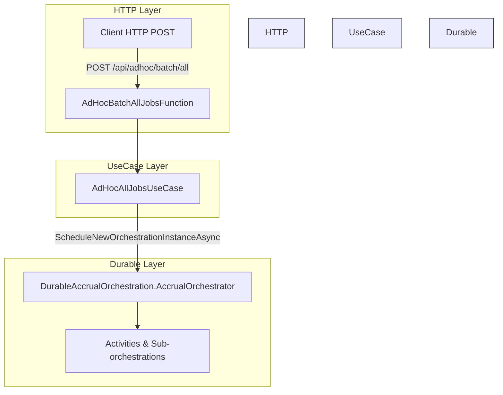

# AdHoc Batch - All Jobs Feature Documentation

## Overview

The **AdHoc Batch – All Jobs** use case allows operators to trigger a full accrual process on demand, without waiting for scheduled timers. Upon receiving an HTTP POST, it schedules a Durable Function orchestration that processes all work orders in the system. This enables manual runs for scenarios such as backfills, testing, or emergency recovery. Internally, it leverages the Durable Task framework to ensure reliability and visibility into long-running accrual pipelines.

## Architecture Overview



## Component Structure

### **AdHocAllJobsUseCase** (`src/Rpc.AIS.Accrual.Orchestrator.Functions/Endpoints/UseCases/AdHocAllJobsUseCase.cs`)

- **Inherits:** `JobOperationsUseCaseBase`
- **Implements:** `IAdHocAllJobsUseCase`
- **Responsibility:**- Read request headers for tracing (`x-run-id`, `x-correlation-id`, `x-source-system`)
- Log entry and scheduling scopes for telemetry
- Create a `RunInputDto` with `TriggeredBy="AdHocAll"`
- Schedule a new Durable Orchestrator instance with a deterministic `instanceId`
- Return HTTP 202 Accepted with orchestration details

#### Constructor

| Parameter | Type | Description |
| --- | --- | --- |
| `log` | `ILogger<AdHocAllJobsUseCase>` | Function-level logger |
| `aisLogger` | `IAisLogger` | Structured payload logger |
| `diag` | `IAisDiagnosticsOptions` | Diagnostics configuration |


#### ExecuteAsync

```csharp
public async Task<HttpResponseData> ExecuteAsync(
    HttpRequestData req,
    DurableTaskClient client,
    FunctionContext ctx)
```

- **Steps:**1. Extract `runId`, `correlationId`, `sourceSystem` via `ReadContext`
2. Begin a function‐wide log scope (`AdHocBatch_AllJobs`)
3. Compute `instanceId = $"{runId}-adhoc-all"`
4. Begin a scheduling log scope (`Step="ScheduleDurableOrchestrator"`)
5. Build `RunInputDto` and call

`client.ScheduleNewOrchestrationInstanceAsync(nameof(DurableAccrualOrchestration.AccrualOrchestrator), input, new StartOrchestrationOptions { InstanceId = instanceId }, ctx.CancellationToken)`

1. Log successful scheduling and return `AcceptedAsync` with payload `{ instanceId, runId, correlationId, sourceSystem, trigger = "AdHocAll" }`

| Return Type | Description |
| --- | --- |
| `HttpResponseData` | HTTP 202 Accepted with JSON body |


## Data Models

### `DurableAccrualOrchestration.RunInputDto`

| Property | Type | Description |
| --- | --- | --- |
| `RunId` | `string` | Unique identifier for this execution |
| `CorrelationId` | `string` | Traces related operations across systems |
| `TriggeredBy` | `string` | Originator tag (`"AdHocAll"`) |
| `SourceSystem` | `string?` | Upstream system identifier |
| `WorkOrderGuid` | `string?` | Optional single-work-order GUID (null for all jobs) |


## API Integration

### POST /api/adhoc/batch/all

```api
{
    "title": "Trigger AdHoc Batch All Jobs",
    "description": "Schedules a durable accrual orchestration to process all work orders immediately.",
    "method": "POST",
    "baseUrl": "https://<your-function-app>.azurewebsites.net",
    "endpoint": "/api/adhoc/batch/all",
    "headers": [
        {
            "key": "x-run-id",
            "value": "Optional unique run identifier",
            "required": false
        },
        {
            "key": "x-correlation-id",
            "value": "Optional correlation identifier",
            "required": false
        },
        {
            "key": "x-source-system",
            "value": "Originating system name",
            "required": false
        }
    ],
    "queryParams": [],
    "pathParams": [],
    "bodyType": "none",
    "requestBody": "",
    "formData": [],
    "rawBody": "",
    "responses": {
        "202": {
            "description": "Orchestration scheduled successfully",
            "body": "{\n  \"instanceId\": \"<runId>-adhoc-all\",\n  \"runId\": \"<runId>\",\n  \"correlationId\": \"<correlationId>\",\n  \"sourceSystem\": \"<sourceSystem>\",\n  \"trigger\": \"AdHocAll\"\n}"
        }
    }
}
```

## Dependencies

> **Note:** This endpoint is exposed by the **AdHocBatchAllJobsFunction** HTTP adapter, which delegates to `AdHocAllJobsUseCase` .

- **JobOperationsUseCaseBase**: common helpers for reading request context and standard HTTP responses
- **ILogger\<T>**, **IAisLogger**, **IAisDiagnosticsOptions**: logging and diagnostics abstractions
- **Microsoft.DurableTask.Client.DurableTaskClient**: schedules orchestrations
- **DurableAccrualOrchestration.AccrualOrchestrator**: durable function entrypoint

## Logging & Tracing

- **LogScopes**: enriches Application Insights customDimensions with function, operation, trigger, runId, correlationId, sourceSystem, and DurableInstanceId
- **AcceptedAsync** stamps `x-run-id` and `x-correlation-id` in the HTTP response

---

This documentation covers the core responsibilities and integrations of the **AdHocAllJobsUseCase** feature, showing how ad-hoc batch runs are initiated and how tracing flows through the system.