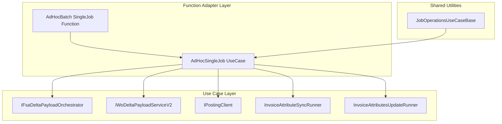
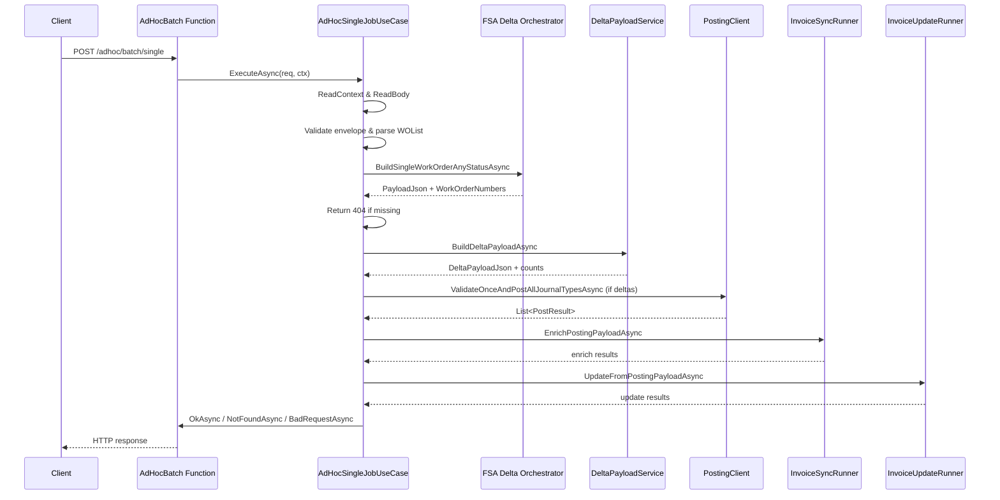

# AdHoc Batch - Single Job Feature Documentation

## Overview 📋

The **AdHoc Batch - Single Job** feature enables on-demand processing of a single work order outside of the regular batch schedule.

It builds a fresh snapshot of a specified work order from FSA, computes the delta against FSCM history, posts any journal entries, and synchronizes invoice attributes.

This use case ensures business users can trigger targeted accrual updates for one work order with a simple HTTP POST.

## Architecture Overview



## Component Structure

### 1. Function Adapter

#### **AdHocBatchSingleJobFunction**

*Path:* `src/Rpc.AIS.Accrual.Orchestrator.Functions/Endpoints/Split/AdHocBatchSingleJobFunction.cs`

- **Purpose:** Thin Azure Functions HTTP adapter.
- **Key Method:**- `RunAsync(HttpRequestData req, FunctionContext ctx)`- Trigger: `POST /adhoc/batch/single`
- Delegates to `IAdHocSingleJobUseCase.ExecuteAsync`.

### 2. Use Case Layer

#### **IAdHocSingleJobUseCase**

*Path:* `src/Rpc.AIS.Accrual.Orchestrator.Functions/Endpoints/UseCases/IAdHocSingleJobUseCase.cs`

- **Contract:** Defines `ExecuteAsync(HttpRequestData req, FunctionContext ctx)` for single-job operations.

#### **AdHocSingleJobUseCase** ⚙️

*Path:* `src/Rpc.AIS.Accrual.Orchestrator.Functions/Endpoints/UseCases/AdHocSingleJobUseCase.cs`

- **Purpose:** Implements the end-to-end flow for a single work order:- Validates and parses the request envelope.
- Builds FSA payload for the specified work order.
- Computes the delta against FSCM history.
- Posts any required journal entries.
- Updates invoice attributes synchronously.
- Returns appropriate HTTP responses.
- **Dependencies:**

| Dependency | Interface / Type |
| --- | --- |
| FSA payload orchestrator | `IFsaDeltaPayloadOrchestrator` |
| FSA configuration options | `FsOptions` |
| Posting client | `IPostingClient` |
| Delta payload service (V2) | `IWoDeltaPayloadServiceV2` |
| Invoice attribute sync runner | `InvoiceAttributeSyncRunner` |
| Invoice attribute update runner | `InvoiceAttributesUpdateRunner` |


- **Key Methods:**

| Method | Description | Returns |
| --- | --- | --- |
| `Task<HttpResponseData> ExecuteAsync(HttpRequestData, ...)` | Main entry point. Validates headers/body, orchestrates payload building, delta, posting, invoice sync, and crafts HTTP response. | `HttpResponseData` |
| `static bool TryExtractCompanyAndSubProjectIdString(...)` | Parses the FSA payload JSON to extract `Company` and `SubProjectId` fields from the `_request.WOList`. | `bool` |


### 3. Shared Utilities

#### **JobOperationsUseCaseBase**

*Path:* `src/Rpc.AIS.Accrual.Orchestrator.Functions/Endpoints/UseCases/JobOperationsUseCaseBase.cs`

- **Provides:**- **Context readers:** `ReadContext` (headers), `ReadBodyAsync` (payload).
- **Request parser:** `TryParseFsJobOpsRequest` for envelope shape.
- **Logging scopes:** Standardized function and step scopes.
- **HTTP responders:** `BadRequestAsync`, `NotFoundAsync`, `OkAsync`, etc.

- **Selected Helpers:**

| Helper | Purpose |
| --- | --- |
| `ReadContext(HttpRequestData)` | Extracts `x-run-id`, `x-correlation-id`, `x-source-system`. |
| `ReadBodyAsync(HttpRequestData)` | Reads raw request body as string. |
| `TryParseFsJobOpsRequest(string…)` | Parses `_request` envelope into `ParsedFsJobOpsRequest`. |
| `OkAsync(...)`, `BadRequestAsync(...)`, `NotFoundAsync(...)` | Crafts standardized JSON HTTP responses. |


## Data Models & DTOs

- **ParsedFsJobOpsRequest** (internal record): holds `RunId`, `CorrelationId`, `Company`, `WorkOrderGuid`, `SubProjectId`.
- **GetFsaDeltaPayloadInputDto**: input for FSA payload orchestration (`runId`, `correlationId`, `trigger`, `workOrderGuid`).
- **RunContext**: contextual metadata for downstream services (`runId`, `timestamp`, `operation`, `correlationId`, `sourceSystem`, `company`).
- **WoDeltaBuildOptions**: configuration for delta computation (`BaselineSubProjectId`, `TargetMode`).
- **WoDeltaTargetMode** (enum): modes for delta targets (e.g., `Normal`).
- **PostResult**: result of posting operation (`JournalType`, `IsSuccess`, `WorkOrdersPosted`, `Errors`).

## API Integration

### AdHocBatch_SingleJob Endpoint

```api
{
    "title": "AdHocBatch Single Job",
    "description": "Process a single work order on demand: build FSA payload, compute delta, post journals, update invoices.",
    "method": "POST",
    "baseUrl": "https://{your-functions-host}",
    "endpoint": "/adhoc/batch/single",
    "headers": [
        {
            "key": "Content-Type",
            "value": "application/json",
            "required": true
        },
        {
            "key": "x-run-id",
            "value": "Optional run identifier",
            "required": false
        },
        {
            "key": "x-correlation-id",
            "value": "Optional correlation identifier",
            "required": false
        },
        {
            "key": "x-source-system",
            "value": "Optional source system name",
            "required": false
        }
    ],
    "queryParams": [],
    "pathParams": [],
    "bodyType": "json",
    "requestBody": "{\n  \"_request\": {\n    \"WOList\": [ { \"WorkOrderGuid\": \"{guid}\" } ]\n  }\n}",
    "formData": [],
    "rawBody": "",
    "responses": {
        "200": {
            "description": "Work order processed (with or without deltas).",
            "body": "{\n  \"runId\": \"...\",\n  \"correlationId\": \"...\",\n  \"sourceSystem\": \"...\",\n  \"workOrderGuid\": \"{guid}\",\n  \"workOrderNumbers\": [\"WO123\"],\n  \"delta\": { /* counts */ },\n  \"postResults\": [ /* list of journal results */ ],\n  \"invoiceAttributesUpdate\": { /* sync summary */ }\n}"
        },
        "404": {
            "description": "Work order not found in OPEN set.",
            "body": "{\n  \"runId\": \"...\",\n  \"correlationId\": \"...\",\n  \"sourceSystem\": \"...\",\n  \"workOrderGuid\": \"{guid}\",\n  \"message\": \"Work order not found in OPEN set...\"\n}"
        },
        "400": {
            "description": "Invalid request (missing body, WorkOrderGuid, or SubProjectId).",
            "body": "{\n  \"runId\": \"...\",\n  \"correlationId\": \"...\",\n  \"message\": \"Request body is required and must contain workOrderGuid.\"\n}"
        }
    }
}
```

## Feature Flow

### Single Job Processing Sequence



## Integration Points

- **IFsaDeltaPayloadOrchestrator**: Fetches FSA snapshot for the target work order.
- **IWoDeltaPayloadServiceV2**: Computes journal deltas between snapshots and history.
- **IPostingClient**: Posts journal entries to FSCM in one pass.
- **InvoiceAttributeSyncRunner** & **InvoiceAttributesUpdateRunner**: Synchronize invoice attributes post-posting.

## Key Classes Reference

| Class | Location | Responsibility |
| --- | --- | --- |
| AdHocSingleJobUseCase | `.../UseCases/AdHocSingleJobUseCase.cs` | Encapsulates single-job accrual processing logic. |
| IAdHocSingleJobUseCase | `.../UseCases/IAdHocSingleJobUseCase.cs` | Defines contract for single-job use case. |
| AdHocBatchSingleJobFunction | `.../Split/AdHocBatchSingleJobFunction.cs` | HTTP trigger adapter for single-job endpoint. |
| JobOperationsUseCaseBase | `.../UseCases/JobOperationsUseCaseBase.cs` | Provides shared context parsing, logging, and responses. |


## Error Handling

- **400 Bad Request**:- Empty or malformed JSON body.
- Missing `WorkOrderGuid` or invalid envelope structure.
- Absent `SubProjectId` in FSA payload.
- **404 Not Found** (business result):- FSA payload missing or work order not in the open set.
- **200 OK**:- Always returns a detailed JSON payload, even when no deltas detected.

## Dependencies

- Azure Functions Worker & HTTP packages
- Microsoft.Extensions.Logging
- `Rpc.AIS.Accrual.Orchestrator.Core.Abstractions`
- `Rpc.AIS.Accrual.Orchestrator.Core.Services`
- `Rpc.AIS.Accrual.Orchestrator.Functions.Services`
- `Rpc.AIS.Accrual.Orchestrator.Infrastructure.Clients.Posting`
- `Rpc.AIS.Accrual.Orchestrator.Infrastructure.Options`

## Testing Considerations

- **Early-exit scenarios**- Empty body → 400
- Missing or invalid envelope → 400
- Empty payload from orchestrator → 404
- **Happy path**- Valid request → builds payload, posts journals, updates invoices → 200 with full summary.