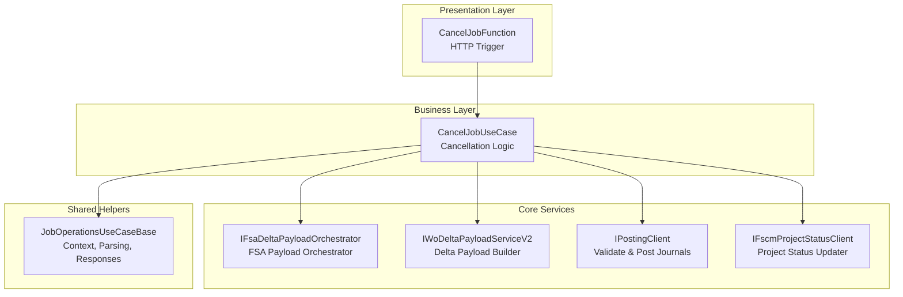
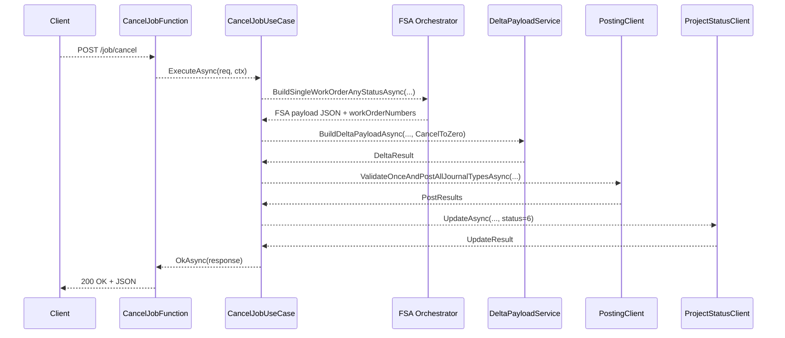
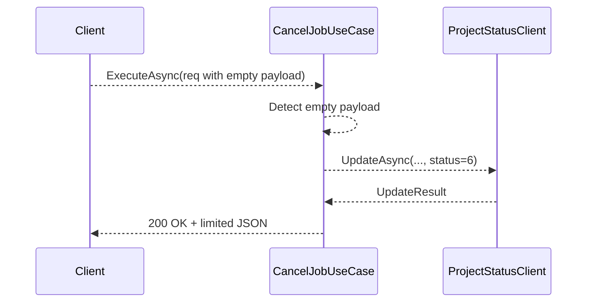

# Cancel Job Feature Documentation

## Overview

The **Cancel Job** feature provides a synchronous HTTP endpoint to cancel an existing accrual work order. It fetches the full FSA payload for the specified work order, computes a “cancel-to-zero” delta, posts any journal reversals, and updates the FSCM project status to “Cancelled.” If no payload lines exist, it still marks the work order as cancelled when a `Company` and `SubProjectId` are supplied in the request envelope. This ensures financial ledgers accurately reflect cancelled work orders and downstream systems receive a consistent status update.

In the broader application, this feature

- Decouples HTTP handling from business logic via a thin function adapter and a dedicated use case
- Leverages shared helpers for context extraction, JSON parsing, logging scopes, and HTTP response formatting
- Integrates with core services (payload orchestrator, delta builder, posting client, project-status client) to fulfill the cancellation workflow

## Architecture Overview



## Component Structure

### 1. Endpoint Adapter

#### **CancelJobFunction** (`src/Rpc.AIS.Accrual.Orchestrator.Functions/Endpoints/Split/CancelJobFunction.cs`)

- **Purpose**: Receives HTTP `POST job/cancel` requests, applies Azure Function bindings, and delegates execution to the use case
- **Key Method**- `RunAsync(HttpRequestData req, FunctionContext ctx)`: Invokes `ICancelJobUseCase.ExecuteAsync`

### 2. Use Case

#### **CancelJobUseCase** (`src/Rpc.AIS.Accrual.Orchestrator.Functions/Endpoints/UseCases/CancelJobUseCase.cs`)

- **Purpose**: Implements end-to-end cancellation logic, from request validation through payload retrieval, delta computation, journal posting, and status update
- **Dependencies**- `IFsaDeltaPayloadOrchestrator`
- `FsOptions`
- `IPostingClient`
- `IWoDeltaPayloadServiceV2`
- `IFscmProjectStatusClient`
- **Constructor Injection**: Validates non-null dependencies at startup
- **Key Method**- `ExecuteAsync(HttpRequestData req, FunctionContext ctx)`:1. Extracts `runId`, `correlationId`, `sourceSystem` and body JSON
2. Validates presence of work order GUID and parses envelope (`TryParseFsJobOpsRequest`)
3. Fetches full FSA payload for the work order (`BuildSingleWorkOrderAnyStatusAsync`)
4. Branches for empty payload versus non-empty:- **Empty**: Requires `Company` & `SubProjectId` in envelope, then updates status to “Cancelled”
- **Non-empty**: Builds a cancel-to-zero delta, stamps journal descriptions, posts reversals, then updates status
5. Returns JSON response with delta details, post results, and status update outcome

### 3. Shared Helpers

#### **JobOperationsUseCaseBase** (`src/Rpc.AIS.Accrual.Orchestrator.Functions/Endpoints/UseCases/JobOperationsUseCaseBase.cs`)

- **Purpose**: Provides common methods for all job-related use cases
- **Key Responsibilities**- Context extraction from headers (`ReadContext`)
- Request body reading (`ReadBodyAsync`)
- Envelope parsing (`TryParseFsJobOpsRequest`)
- HTTP response helpers (`OkAsync`, `BadRequestAsync`, `AcceptedAsync`, etc.)

## Data Models

### Request Envelope

Clients must POST a JSON body containing an `_request` object. The minimum required fields are:

| Property | Type | Description |
| --- | --- | --- |
| `_request.WOList` | Array | List containing one object with work order details |
| `_request.WOList[0].WorkOrderGuid` | GUID | Identifier of the work order to cancel |
| `_request.WOList[0].Company` | string? | (Empty-payload path) FSCM company code |
| `_request.WOList[0].SubProjectId` | string? | (Empty-payload path) FSCM subproject identifier |
| `_request.RunId` | string? | Optional override for run identifier |
| `_request.CorrelationId` | string? | Optional override for correlation identifier |


### Response Payload

On success, the endpoint returns HTTP 200 with a JSON object:

| Property | Type | Description |
| --- | --- | --- |
| `runId` | string | Echoed run identifier |
| `correlationId` | string | Echoed correlation identifier |
| `sourceSystem` | string | Echoed source system header |
| `operation` | string | `"CancelJob"` |
| `workOrderGuid` | GUID | The cancelled work order GUID |
| `workOrderNumbers` | string[] | Work order numbers from FSA payload (empty if none) |
| `subProjectId` | string | SubProjectId used for status update |
| `delta` | object | Summary of delta lines (in/out/reverse/recreate counts) |
| `postResults` | object[] | Results per journal type with success flag and error count |
| `projectStatusUpdate` | object | FSCM status update result: `{ success: bool, httpStatus: int }` |


## API Integration

### Cancel Job Endpoint

```api
{
    "title": "Cancel Job",
    "description": "Cancels an accrual work order by posting a cancel-to-zero delta and updating FSCM status.",
    "method": "POST",
    "baseUrl": "https://{function-host}/api",
    "endpoint": "/job/cancel",
    "headers": [
        {
            "key": "x-functions-key",
            "value": "Function access key",
            "required": true
        },
        {
            "key": "x-run-id",
            "value": "Run identifier",
            "required": false
        },
        {
            "key": "x-correlation-id",
            "value": "Correlation identifier",
            "required": false
        },
        {
            "key": "x-source-system",
            "value": "Source system",
            "required": false
        }
    ],
    "queryParams": [],
    "pathParams": [],
    "bodyType": "json",
    "requestBody": "{\n  \"_request\": {\n    \"WOList\": [\n      { \"WorkOrderGuid\": \"11111111-1111-1111-1111-111111111111\", \"Company\": \"ABC\", \"SubProjectId\": \"SP123\" }\n    ]\n  }\n}",
    "formData": [],
    "rawBody": "",
    "responses": {
        "200": {
            "description": "Cancellation succeeded",
            "body": "{\n  \"runId\": \"...\",\n  \"correlationId\": \"...\",\n  \"operation\": \"CancelJob\",\n  \"workOrderGuid\": \"11111111-1111-1111-1111-111111111111\",\n  \"workOrderNumbers\": [],\n  \"subProjectId\": \"SP123\",\n  \"message\": \"FSA payload was empty...\",\n  \"projectStatusUpdate\": { \"success\": true, \"httpStatus\": 200 }\n}"
        },
        "400": {
            "description": "Bad request (missing or invalid body)",
            "body": "{\n  \"runId\": \"...\",\n  \"correlationId\": \"...\",\n  \"message\": \"Request body is required...\"\n}"
        }
    }
}
```

## Feature Flows

### 1. Cancellation with Delta Posting



### 2. Empty-Payload Fallback



## Error Handling

- **400 Bad Request**- Empty request body
- Envelope parsing failures (`TryParseFsJobOpsRequest`)
- Missing `Company` or `SubProjectId` when payload is empty
- **200 OK** on successful cancellation
- Underlying exceptions bubble up to Azure Functions host for default 500 responses if not explicitly handled

## Dependencies

- Microsoft.Azure.Functions.Worker
- Microsoft.Azure.Functions.Worker.Http
- Microsoft.Extensions.Logging
- Rpc.AIS.Accrual.Orchestrator.Core.Abstractions
- Rpc.AIS.Accrual.Orchestrator.Core.Domain
- Rpc.AIS.Accrual.Orchestrator.Core.Services
- Rpc.AIS.Accrual.Orchestrator.Functions.Services
- Rpc.AIS.Accrual.Orchestrator.Infrastructure.Clients.Posting
- Rpc.AIS.Accrual.Orchestrator.Infrastructure.Logging
- Rpc.AIS.Accrual.Orchestrator.Infrastructure.Options

## Testing Considerations

- Validates that an empty FSA payload without `Company`/`SubProjectId` yields HTTP 400
- Dependency mocks ensure early-exit paths and error scenarios are covered

## Key Classes Reference

| Class | Location | Responsibility |
| --- | --- | --- |
| CancelJobFunction | Endpoints/Split/CancelJobFunction.cs | Adapts HTTP trigger to use case |
| ICancelJobUseCase | Endpoints/UseCases/ICancelJobUseCase.cs | Contracts the cancellation use case |
| CancelJobUseCase | Endpoints/UseCases/CancelJobUseCase.cs | Implements the cancellation workflow |
| JobOperationsUseCaseBase | Endpoints/UseCases/JobOperationsUseCaseBase.cs | Provides shared parsing, context, and response helpers |
| IFsaDeltaPayloadOrchestrator | Core/Abstractions | Fetches FSA work order payload |
| IWoDeltaPayloadServiceV2 | Core/Services | Builds FSCM vs FSA delta payloads |
| IPostingClient | Infrastructure/Clients/Posting | Validates and posts journal deltas |
| IFscmProjectStatusClient | Infrastructure/Clients/Posting | Updates FSCM project status |
| FsOptions | Infrastructure/Options | Configuration for FSA payload orchestrator |
