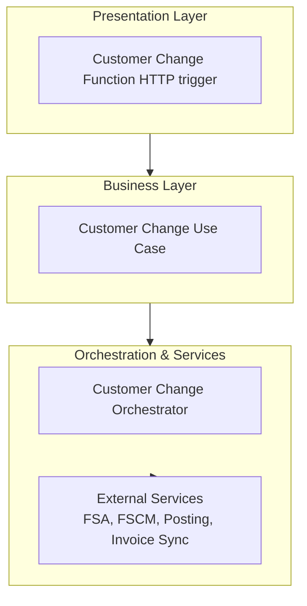
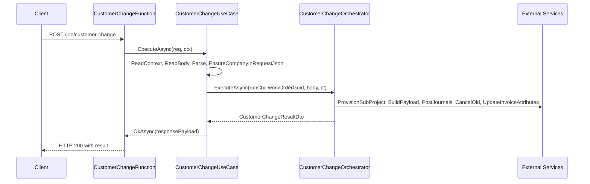

# Customer Change Use Case 🚚

## Overview

The Customer Change feature provides an HTTP endpoint to initiate a subproject migration for an existing work order. Upon invocation, it validates and enriches the incoming payload, then delegates to a durable orchestrator that:

- Creates a new subproject under the specified parent.
- Migrates active fiscal data (journals, deltas) into the new subproject.
- Reverses and cancels the old subproject.
- Synchronizes invoice attributes before and after posting.

This process ensures continuity of financial records during customer or subproject restructuring. It integrates with Field Service payloads, FSCM project status APIs, and posting/delta services.

## Architecture Overview



## Component Structure

### **CustomerChangeUseCase** (`src/Rpc.AIS.Accrual.Orchestrator.Functions/Endpoints/UseCases/CustomerChangeUseCase.cs`)

**Purpose and responsibilities**

- Acts as the HTTP-driven entry point for Customer Change.
- Extracts and enriches request context (runId, correlationId, sourceSystem).
- Validates and patches payload (ensures Company/DataAreaId).
- Delegates core logic to the `ICustomerChangeOrchestrator`.
- Builds standardized HTTP responses (200, 400, 500).

**Constructor Dependencies**

- `ILogger<CustomerChangeUseCase>`
- `IAisLogger`
- `IAisDiagnosticsOptions`
- `ICustomerChangeOrchestrator`

#### Key Methods

| Method | Signature | Description |
| --- | --- | --- |
| ExecuteAsync | `Task<HttpResponseData> ExecuteAsync(HttpRequestData req, FunctionContext ctx)` | Main entry: reads context, logs inbound payload, validates, injects Company, invokes orchestrator, handles exceptions. |
| EnsureCompanyInRequestJson | `string EnsureCompanyInRequestJson(string rawJson, string? parsedCompany)` | Injects a `"Company"` property into the JSON payload if missing at root or inside each WOList item. |


---

### **JobOperationsUseCaseBase** (`src/Rpc.AIS.Accrual.Orchestrator.Functions/Endpoints/UseCases/JobOperationsUseCaseBase.cs`)

**Purpose**

Provides shared helper methods for all job operation use cases, including:

- **Context Extraction** (`ReadContext`)
- **Request Body Reading**
- **Logging Scopes** (`LogScopes.BeginFunctionScope`)
- **Standard HTTP Responses** (`OkAsync`, `BadRequestAsync`, `ServerErrorAsync`, etc.)

---

### **ICustomerChangeUseCase** (`src/Rpc.AIS.Accrual.Orchestrator.Functions/Endpoints/UseCases/ICustomerChangeUseCase.cs`)

Defines the contract for executing a customer change via HTTP:

```csharp
public interface ICustomerChangeUseCase
{
    Task<HttpResponseData> ExecuteAsync(HttpRequestData req, FunctionContext ctx);
}
```

---

## API Integration

### POST /job/customer-change

```api
{
    "title": "Customer Change",
    "description": "Initiates a subproject change for a work order by creating a new subproject, migrating data, and closing the old subproject.",
    "method": "POST",
    "baseUrl": "https://<function-host>/api",
    "endpoint": "/job/customer-change",
    "headers": [
        {
            "key": "x-functions-key",
            "value": "<function_key>",
            "required": true
        },
        {
            "key": "Content-Type",
            "value": "application/json",
            "required": true
        }
    ],
    "queryParams": [],
    "pathParams": [],
    "bodyType": "json",
    "requestBody": "{\n  \"_request\": {\n    \"WOList\": [\n      {\n        \"WorkOrderGUID\": \"{GUID}\",\n        \"OldSubProjectId\": \"{OldSubProjectId}\",\n        \"Company\": \"{DataAreaId}\"\n      }\n    ]\n  }\n}",
    "formData": [],
    "rawBody": "",
    "responses": {
        "200": {
            "description": "Success",
            "body": "{\n  \"runId\": \"<runId>\",\n  \"correlationId\": \"<correlationId>\",\n  \"sourceSystem\": \"<sourceSystem>\",\n  \"operation\": \"CustomerChange\",\n  \"workOrderGuid\": \"{GUID}\",\n  \"newSubProjectId\": \"{NewSubProjectId}\"\n}"
        },
        "400": {
            "description": "Bad Request - missing or invalid payload",
            "body": "{\n  \"error\": \"<message>\"\n}"
        },
        "500": {
            "description": "Internal Server Error",
            "body": "{\n  \"error\": \"CustomerChange failed.\"\n}"
        }
    }
}
```

## Feature Flow

### Customer Change Sequence



## Dependencies

- Microsoft.Azure.Functions.Worker
- Microsoft.Azure.Functions.Worker.Http
- Microsoft.Extensions.Logging
- `Rpc.AIS.Accrual.Orchestrator.Core.Abstractions` (ICustomerChangeOrchestrator)
- `Rpc.AIS.Accrual.Orchestrator.Infrastructure.Logging` (LogScopes)
- `Rpc.AIS.Accrual.Orchestrator.Functions.Services` (RunContext)
- Base class: `JobOperationsUseCaseBase` for common HTTP helpers

## Key Classes Reference

| Class | Location | Responsibility |
| --- | --- | --- |
| CustomerChangeUseCase | `Functions/Endpoints/UseCases/CustomerChangeUseCase.cs` | HTTP adapter: validates/enriches payload, logging, delegates to orchestrator, builds HTTP responses. |
| ICustomerChangeUseCase | `Functions/Endpoints/UseCases/ICustomerChangeUseCase.cs` | Defines contract for customer change HTTP execution. |
| JobOperationsUseCaseBase | `Functions/Endpoints/UseCases/JobOperationsUseCaseBase.cs` | Provides shared context parsing, logging scopes, and HTTP response helpers. |
| ICustomerChangeOrchestrator | `Functions/Durable/Orchestrators/CustomerChangeOrchestrator.cs` | Executes the domain workflow: provisioning, posting, delta operations, cancellation, invoice sync. |


## Error Handling

- **Validation errors** (empty body or parse failure) return **400 Bad Request** with descriptive message.
- **Unhandled exceptions** during orchestration are caught, logged at **Error** level, and return **500 Internal Server Error** with `"CustomerChange failed."`.

## Testing Considerations

- **Missing or blank body** ⇒ 400 response.
- **Malformed JSON** or **missing required fields** ⇒ 400 with parse error.
- **Successful orchestration** ⇒ 200 with new subproject ID.
- **Orchestrator exceptions** ⇒ 500 and error logged.
- **Company injection logic** ensures payload always contains a valid `Company` property.