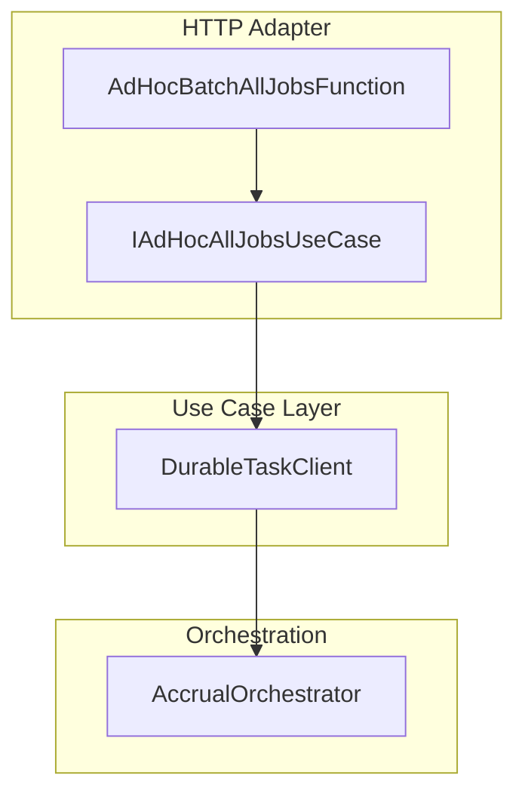
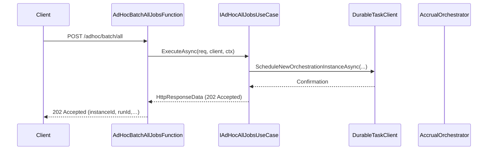

# AdHoc Batch – All Jobs Use Case Feature Documentation

## Overview

The **AdHoc Batch – All Jobs** use case enables on-demand scheduling of a full accrual orchestration for all open jobs. When invoked, it spins up a Durable Functions orchestrator instance named `AccrualOrchestrator`, decoupling HTTP handling from orchestration logic. This separation:

- Provides a clean, testable “use case” surface for scheduling work
- Fits into the Azure Functions layer as a thin HTTP adapter → use case → Durable Task Client → orchestration pipeline

By isolating scheduling logic, teams can maintain, test, and evolve each piece independently.

## Architecture Overview



## Component Structure

### 1. Use Case Interface: IAdHocAllJobsUseCase

- **Location:** `src/Rpc.AIS.Accrual.Orchestrator.Functions/Endpoints/UseCases/IAdHocAllJobsUseCase.cs`
- **Responsibility:** Defines the contract for scheduling the “all jobs” orchestration.
- **Declaration:**

```csharp
  using System.Threading.Tasks;
  using Microsoft.Azure.Functions.Worker;
  using Microsoft.Azure.Functions.Worker.Http;
  using Microsoft.DurableTask.Client;

  namespace Rpc.AIS.Accrual.Orchestrator.Functions.Functions
  {
      /// <summary>
      /// Use case for AdHoc Batch – All Jobs (durable schedule).
      /// </summary>
      public interface IAdHocAllJobsUseCase
      {
          Task<HttpResponseData> ExecuteAsync(HttpRequestData req, DurableTaskClient client, FunctionContext ctx);
      }
  }
```

### 2. HTTP Adapter: AdHocBatchAllJobsFunction

- **Location:** `src/Rpc.AIS.Accrual.Orchestrator.Functions/Endpoints/Split/AdHocBatchAllJobsFunction.cs`
- **Responsibility:** Exposes the HTTP POST endpoint `/adhoc/batch/all` and delegates to the use case.
- **Key Snippet:**

```csharp
  [Function("AdHocBatch_AllJobs")]
  public async Task<HttpResponseData> RunAsync(
      [HttpTrigger(AuthorizationLevel.Function, "post", Route = "adhoc/batch/all")] HttpRequestData req,
      [DurableClient] DurableTaskClient client,
      FunctionContext ctx)
  {
      return await _useCase.ExecuteAsync(req, client, ctx);
  }
```

### 3. Use Case Implementation: AdHocAllJobsUseCase

- **Location:** `src/Rpc.AIS.Accrual.Orchestrator.Functions/Endpoints/UseCases/AdHocAllJobsUseCase.cs`
- **Responsibility:**- Reads headers (`runId`, `correlationId`, `sourceSystem`)
- Begins structured logging scopes
- Schedules a new orchestration instance with a unique `instanceId`
- Returns HTTP 202 Accepted with scheduling details

## Method Summary

| Method | Description | Returns |
| --- | --- | --- |
| ExecuteAsync | Schedule the Durable Functions orchestration. | `Task<HttpResponseData>` |


**Parameters**

- `HttpRequestData req`: the incoming HTTP request
- `DurableTaskClient client`: Durable Functions client for orchestration
- `FunctionContext ctx`: function execution context

## Integration & Workflow



## Dependencies

- **Azure Functions SDK**- `Microsoft.Azure.Functions.Worker`
- `Microsoft.Azure.Functions.Worker.Http`
- **Durable Task**- `Microsoft.DurableTask.Client`
- **Logging & Diagnostics**- `Microsoft.Extensions.Logging`
- Custom `IAisLogger`, `IAisDiagnosticsOptions`

## Key Classes Reference

| Class | Location | Responsibility |
| --- | --- | --- |
| `IAdHocAllJobsUseCase` | `Endpoints/UseCases/IAdHocAllJobsUseCase.cs` | Contract for scheduling “all jobs” orchestration |
| `AdHocBatchAllJobsFunction` | `Endpoints/Split/AdHocBatchAllJobsFunction.cs` | HTTP-triggered adapter exposing `/adhoc/batch/all` |
| `AdHocAllJobsUseCase` | `Endpoints/UseCases/AdHocAllJobsUseCase.cs` | Implements scheduling logic using `DurableTaskClient` |
| `DurableTaskClient` | Injected binding in function signature | Schedules and manages Durable Functions orchestrations |
| `AccrualOrchestrator` | Defined in core orchestrator code (DurableAccrualOrchestration) | Core orchestration handling business workflow for accrual |
