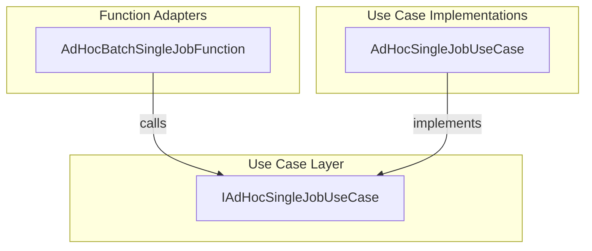

# AdHoc Batch - Single Job Use Case Feature Documentation

## Overview

🚀 The **IAdHocSingleJobUseCase** interface defines a clear contract for handling a single ad-hoc batch job request within Azure Functions.

It abstracts HTTP trigger details away from business logic, enabling a thin adapter layer and promoting the Interface Segregation and Dependency Inversion principles.

## Architecture Overview

## Component Structure

### **IAdHocSingleJobUseCase** (`src/Rpc.AIS.Accrual.Orchestrator.Functions/Endpoints/UseCases/IAdHocSingleJobUseCase.cs`)

- **Purpose**

Defines the operation for executing a single ad-hoc batch job, keeping Function adapters thin and focused.

- **Responsibilities**- Accept an incoming HTTP request and Azure Functions context.
- Return an `HttpResponseData` representing the outcome of the job execution.
- **Method**

| Method Signature | Description |
| --- | --- |
| `Task<HttpResponseData> ExecuteAsync(HttpRequestData req, FunctionContext ctx)` | Executes the single-job use case asynchronously. |

## Integration Points

- **AdHocBatchSingleJobFunction**

An Azure Function (HTTP POST to `adhoc/batch/single`) that delegates request handling to `IAdHocSingleJobUseCase`.

- **AdHocSingleJobUseCase**

Concrete implementation of this interface containing the orchestration, payload generation, delta building, posting, and invoice-attribute sync logic.

## Key Classes Reference

| Class | Location | Responsibility |
| --- | --- | --- |
| **IAdHocSingleJobUseCase** | `Endpoints/UseCases/IAdHocSingleJobUseCase.cs` | Contract for single-job ad-hoc batch use case. |
| **AdHocBatchSingleJobFunction** | `Endpoints/Split/AdHocBatchSingleJobFunction.cs` | HTTP trigger adapter that invokes the use case. |
| **AdHocSingleJobUseCase** | `Endpoints/UseCases/AdHocSingleJobUseCase.cs` | Implements job orchestration and posting logic. |

## Dependencies

- **System.Threading.Tasks**

Provides the `Task` type for asynchronous operations.

- **Microsoft.Azure.Functions.Worker**

Supplies `FunctionContext` for Azure Functions execution.

- **Microsoft.Azure.Functions.Worker.Http**

Defines `HttpRequestData` and `HttpResponseData` for HTTP-triggered functions.