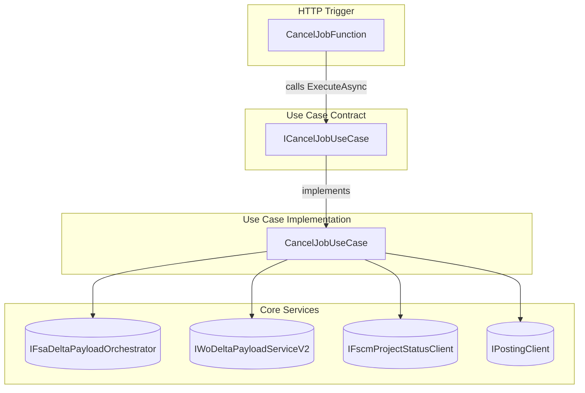

# Cancel Job Use Case Feature Documentation

## Overview 📝

The **Cancel Job** feature enables clients to cancel an existing work‐order job within the accrual orchestration system. It defines a clear contract for processing HTTP cancellation requests, ensuring that function adapters remain thin and business logic stays isolated in a dedicated use‐case implementation. This separation improves testability, maintainability, and adherence to SOLID principles by decoupling HTTP concerns from core payload orchestration and posting workflows.

## Architecture Overview 🔍



## Component Structure 🏗️

### Business Layer: Use‐Case Interface

#### **ICancelJobUseCase**

: `src/Rpc.AIS.Accrual.Orchestrator.Functions/Endpoints/UseCases/ICancelJobUseCase.cs`

```csharp
using System.Threading.Tasks;
using Microsoft.Azure.Functions.Worker;
using Microsoft.Azure.Functions.Worker.Http;

namespace Rpc.AIS.Accrual.Orchestrator.Functions.Functions;

/// <summary>
/// Use case for Job Cancel (sync).
/// </summary>
public interface ICancelJobUseCase
{
    Task<HttpResponseData> ExecuteAsync(HttpRequestData req, FunctionContext ctx);
}
```

- **ExecuteAsync**- Parameters:- `HttpRequestData req` – the incoming HTTP request.
- `FunctionContext ctx` – Azure Functions context for logging and dependencies.
- Returns: `Task<HttpResponseData>` containing the HTTP response.

### Presentation Layer: HTTP Adapter

#### **CancelJobFunction**

: `src/Rpc.AIS.Accrual.Orchestrator.Functions/Endpoints/Split/CancelJobFunction.cs`

```csharp
[Function("CancelJob")]
public async Task<HttpResponseData> RunAsync(
    [HttpTrigger(AuthorizationLevel.Function, "post", Route = "job/cancel")]
    HttpRequestData req,
    FunctionContext ctx)
{
    return await _useCase.ExecuteAsync(req, ctx);
}
```

## Other Use‐Case Interfaces

The functions layer defines a family of use‐case interfaces with the same `ExecuteAsync` signature:

| Interface | Description |
| --- | --- |
| **IAdHocSingleJobUseCase** | Ad‐hoc batch single job execution |
| **IAdHocAllJobsUseCase** | Ad‐hoc batch all jobs (durable orchestration) |
| **IPostJobUseCase** | Synchronous job posting |
| **ICustomerChangeUseCase** | Customer change handling on a work order |
| **ICancelJobUseCase** | Job cancellation |


## API Integration 🔗

### Cancel Job Endpoint

```api
{
    "title": "Cancel Job",
    "description": "Cancels an existing work\u2010order job in the accrual orchestration system.",
    "method": "POST",
    "baseUrl": "https://<your-function-app>.azurewebsites.net",
    "endpoint": "/job/cancel",
    "headers": [
        {
            "key": "x-run-id",
            "value": "Unique run identifier",
            "required": false
        },
        {
            "key": "x-correlation-id",
            "value": "Correlation tracking identifier",
            "required": false
        },
        {
            "key": "x-source-system",
            "value": "Calling system identifier",
            "required": false
        }
    ],
    "queryParams": [],
    "pathParams": [],
    "bodyType": "json",
    "requestBody": "{\n  \"_request\": {\n    \"WorkOrderGuid\": \"<guid>\",\n    \"Company\": \"<company>\",\n    \"SubProjectId\": \"<subProject>\"\n  }\n}",
    "formData": [],
    "rawBody": "",
    "responses": {
        "200": {
            "description": "Cancellation processed successfully",
            "body": "{\n  \"runId\": \"...\",\n  \"correlationId\": \"...\",\n  \"sourceSystem\": \"...\",\n  \"message\": \"CancelJob completed\"\n}"
        },
        "400": {
            "description": "Bad request due to missing or invalid parameters",
            "body": "{\n  \"error\": { \"message\": \"Request body is required and must contain workOrderGuid.\" }\n}"
        }
    }
}
```

## Key Classes Reference

| Class | Path | Responsibility |
| --- | --- | --- |
| **ICancelJobUseCase** | `.../Endpoints/UseCases/ICancelJobUseCase.cs` | Defines contract for job cancellation logic |
| **CancelJobUseCase** | `.../Endpoints/UseCases/CancelJobUseCase.cs` | Implements cancellation workflow |
| **CancelJobFunction** | `.../Endpoints/Split/CancelJobFunction.cs` | HTTP adapter triggering the use case |
| **JobOperationsHttpHandlerCommon** | `.../Endpoints/Split/JobOperationsHttpHandlerCommon.cs` | Legacy facade delegating across all use cases |


## Dependencies

- Microsoft.Azure.Functions.Worker
- Microsoft.Azure.Functions.Worker.Http
- Azure Functions DurableTask client (for other use cases)

## Testing Considerations

- **Unit Tests** should mock `ICancelJobUseCase` to verify that `CancelJobFunction` calls `ExecuteAsync` correctly.
- **Error Scenarios**: missing request body, invalid JSON, absent `WorkOrderGuid`, missing `Company` or `SubProjectId`.

This documentation covers the purpose, structure, and integration points of the **Cancel Job** use case within the accrual orchestrator functions ecosystem.