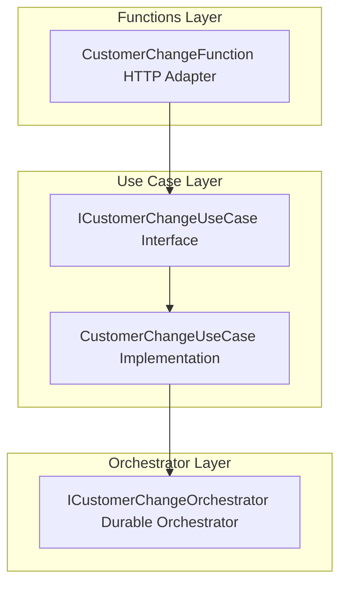

# 💼 Customer Change Use Case Interface

## Overview

The **ICustomerChangeUseCase** interface defines the contract for executing a synchronous **Customer Change** operation within the Azure Functions–based orchestrator. It abstracts the HTTP-triggered logic away from the function entry point, enabling consistent implementations, testability, and separation of concerns.

This use case handles incoming HTTP requests for “customer change” jobs, processes them via the orchestrator, and returns an appropriate HTTP response.

## Architecture Overview



## Component Structure

### 1. Business Layer

#### **ICustomerChangeUseCase** (`src/Rpc.AIS.Accrual.Orchestrator.Functions/Endpoints/UseCases/ICustomerChangeUseCase.cs`)

- **Purpose and Responsibilities**- Declares a **single operation** to execute the Customer Change workflow.
- Ensures any implementation can be invoked from the HTTP-trigger adapter.

- **Interface Definition**

```csharp
  using System.Threading.Tasks;
  using Microsoft.Azure.Functions.Worker;
  using Microsoft.Azure.Functions.Worker.Http;

  namespace Rpc.AIS.Accrual.Orchestrator.Functions.Functions;

  /// <summary>
  /// Use case for Customer Change (sync).
  /// </summary>
  public interface ICustomerChangeUseCase
  {
      Task<HttpResponseData> ExecuteAsync(HttpRequestData req, FunctionContext ctx);
  }
```

- **Methods**

| Method | Signature | Description |
| --- | --- | --- |
| ExecuteAsync | Task<HttpResponseData> ExecuteAsync(HttpRequestData req, FunctionContext ctx) | Processes the incoming HTTP request for a customer change and returns an HTTP response. |


## Dependencies

- **Microsoft.Azure.Functions.Worker**- Provides `FunctionContext` for logging and execution scope.
- **Microsoft.Azure.Functions.Worker.Http**- Defines `HttpRequestData` and `HttpResponseData` for HTTP-trigger handling.

## Integration Points

- **Implemented by**- `CustomerChangeUseCase` in

`src/Rpc.AIS.Accrual.Orchestrator.Functions/Endpoints/UseCases/CustomerChangeUseCase.cs`

- **Invoked by**- `CustomerChangeFunction` HTTP adapter in

`src/Rpc.AIS.Accrual.Orchestrator.Functions/Endpoints/Split/CustomerChangeFunction.cs`

## Key Classes Reference

| Class | Location | Responsibility |
| --- | --- | --- |
| **ICustomerChangeUseCase** | Endpoints/UseCases/ICustomerChangeUseCase.cs | Defines the contract for the Customer Change sync operation. |
| CustomerChangeUseCase | Endpoints/UseCases/CustomerChangeUseCase.cs | Implements the use case; handles request parsing, orchestration, and response. |
| CustomerChangeFunction | Endpoints/Split/CustomerChangeFunction.cs | HTTP-triggered Azure Function that delegates to the use case. |


## Testing Considerations

- **Mocking**: Replace `ICustomerChangeUseCase` with a test stub to validate HTTP adapter behavior.
- **Edge Cases**: Ensure `ExecuteAsync` handles null/invalid payloads and appropriate HTTP status codes.
- **Integration**: Verify end-to-end flow: Function → Use Case → Orchestrator → Function.