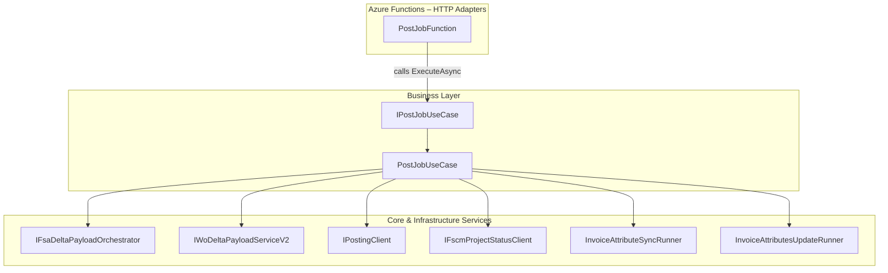

# Job Post Use Case Feature Documentation

## Overview

The **Job Post** feature provides a synchronous mechanism to post a single work order into the accrual orchestrator pipeline. It accepts an HTTP request containing a work order identifier and optional context headers, then delegates to business logic for payload assembly, delta computation, posting to external systems, invoice attribute synchronization, and project status updates.

This contract, exposed via the `IPostJobUseCase` interface, decouples the Azure Function HTTP adapter from concrete implementations, promoting testability and adherence to the Dependency Inversion Principle. Clients invoking the `/job/post` endpoint receive an HTTP response indicating success or detailed error information.

## Architecture Overview



## Component Structure

### 1. Presentation Layer

#### **PostJobFunction** (`src/Rpc.AIS.Accrual.Orchestrator.Functions/Endpoints/Split/PostJobFunction.cs`)

- **Purpose:** HTTP-triggered Azure Function for the `/job/post` route.
- **Responsibilities:**- Bind incoming HTTP POST requests.
- Delegate execution to `IPostJobUseCase`.
- **Key Method:**- `Task<HttpResponseData> RunAsync(HttpRequestData req, FunctionContext ctx)`

### 2. Business Layer

#### **IPostJobUseCase** (`src/Rpc.AIS.Accrual.Orchestrator.Functions/Endpoints/UseCases/IPostJobUseCase.cs`)

- **Purpose:** Defines the contract for the synchronous “Post Job” use case.
- **Method Table:**

| Method Signature | Description | Returns |
| --- | --- | --- |
| `Task<HttpResponseData> ExecuteAsync(HttpRequestData req, FunctionContext ctx)` | Processes a single work order post request and returns an HTTP response. | `HttpResponseData` |


#### **PostJobUseCase** (`src/Rpc.AIS.Accrual.Orchestrator.Functions/Endpoints/UseCases/PostJobUseCase.cs`)

- **Purpose:** Implements `IPostJobUseCase`, orchestrating:- FSA full-fetch payload construction
- Delta payload generation (V2)
- Posting validated journal batches
- Invoice attribute synchronization & update
- Project status update
- **Dependencies:**- `IFsaDeltaPayloadOrchestrator`
- `FsOptions`
- `IPostingClient`
- `IWoDeltaPayloadServiceV2`
- `IFscmProjectStatusClient`
- `InvoiceAttributeSyncRunner`
- `InvoiceAttributesUpdateRunner`

## API Integration

### Post Job Endpoint

```api
{
    "title": "Post Job",
    "description": "Synchronously post a single work order into the accrual pipeline.",
    "method": "POST",
    "baseUrl": "https://<FUNCTION_APP_HOST>/api",
    "endpoint": "/job/post",
    "headers": [
        {
            "key": "x-functions-key",
            "value": "Function access key",
            "required": true
        },
        {
            "key": "x-run-id",
            "value": "Client-provided run identifier",
            "required": false
        },
        {
            "key": "x-correlation-id",
            "value": "Client-provided correlation identifier",
            "required": false
        },
        {
            "key": "x-source-system",
            "value": "Originating system identifier",
            "required": false
        },
        {
            "key": "Content-Type",
            "value": "application/json",
            "required": true
        }
    ],
    "queryParams": [],
    "pathParams": [],
    "bodyType": "json",
    "requestBody": "{\n  \"_request\": {\n    \"WorkOrderGuid\": \"{GUID}\",\n    \"Company\": \"COMPANY_CODE\",\n    \"SubProjectId\": \"SUB_PROJECT_ID\"\n  }\n}",
    "formData": [],
    "rawBody": "",
    "responses": {
        "200": {
            "description": "Job post successful",
            "body": "{\n  \"runId\": \"string\",\n  \"correlationId\": \"string\",\n  \"sourceSystem\": \"string\",\n  \"operation\": \"PostJob\",\n  \"workOrderGuid\": \"GUID\",\n  \"workOrderNumbers\": [ \"string\" ],\n  \"delta\": { /* summary of delta */ },\n  \"postResults\": [ /* per-journal results */ ],\n  \"invoiceAttributesUpdate\": { /* sync/update details */ },\n  \"projectStatusUpdate\": { \"success\": true, \"httpStatus\": 200 }\n}"
        },
        "400": {
            "description": "Bad request (missing/invalid payload)",
            "body": "{\n  \"runId\": \"string\",\n  \"correlationId\": \"string\",\n  \"message\": \"Request body is required and must contain workOrderGuid.\"\n}"
        }
    }
}
```

## Key Classes Reference

| Class | Location | Responsibility |
| --- | --- | --- |
| **IPostJobUseCase** | `Endpoints/UseCases/IPostJobUseCase.cs` | Contract for the Post Job synchronization logic |
| **PostJobFunction** | `Endpoints/Split/PostJobFunction.cs` | HTTP adapter delegating requests to the use case |
| **PostJobUseCase** | `Endpoints/UseCases/PostJobUseCase.cs` | Concrete orchestration of posting and updates |


## Dependencies

| Namespace | Purpose |
| --- | --- |
| `System.Threading.Tasks` | Asynchronous programming support |
| `Microsoft.Azure.Functions.Worker` | Azure Functions runtime types |
| `Microsoft.Azure.Functions.Worker.Http` | HTTP trigger and response abstractions |
| `Rpc.AIS.Accrual.Orchestrator.Core.Abstractions` | Core service contracts (e.g., payload orchestrator) |
| `Rpc.AIS.Accrual.Orchestrator.Infrastructure.Clients.Posting` | Posting client interfaces and implementations |
