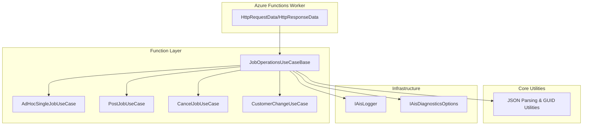
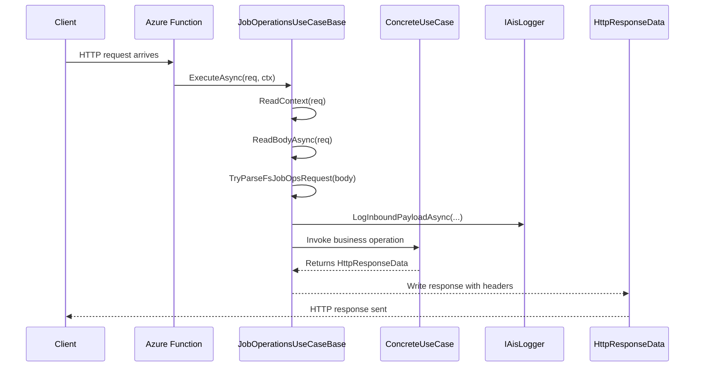

# JobOperationsUseCaseBase Feature Documentation

## Overview

The **JobOperationsUseCaseBase** class centralizes common HTTP handling logic for all job operation use cases in the Azure Functions layer. It provides:

- Extraction of **run identifiers**, **correlation identifiers**, and **source system** from HTTP headers.
- Robust **request body reading** and **JSON parsing** for FS (Field Service) job operation envelopes.
- Standardized **logging** of inbound payloads via the `IAisLogger`.
- Uniform creation of **HTTP responses** (200, 202, 400, 404, 502, 500) with proper headers.

By consolidating these cross-cutting concerns, concrete use cases (e.g., PostJob, AdHocSingleJob, CancelJob, CustomerChange) remain focused on business logic, adhering to SOLID principles and ensuring consistent behavior across endpoints.

## Architecture Overview



## Component Structure

### 1. Function Layer

#### **JobOperationsUseCaseBase** (`src/Rpc.AIS.Accrual.Orchestrator.Functions/Endpoints/UseCases/JobOperationsUseCaseBase.cs`)

- **Purpose:** Shared helpers for HTTP‐triggered job operation use cases.
- **Dependencies:**- `ILogger` (Microsoft.Extensions.Logging)
- `IAisLogger` (infrastructure logging)
- `IAisDiagnosticsOptions` (diagnostic settings)

- **Key Methods:**- **ReadContext(HttpRequestData req):**

Extracts `runId`, `correlationId`, and `sourceSystem` from headers (`x-run-id` / `RunId`, `x-correlation-id` / `CorrelationId`, `x-source-system` / `SourceSystem`).

- **ReadBodyAsync(HttpRequestData req):**

Reads the entire request body as a string.

- **TryParseFsJobOpsRequest(string json, out ParsedFsJobOpsRequest parsed, out string? error):**

Parses the JSON envelope under `_request`, extracts optional `RunId`, `CorrelationId`, `Company`, required `WorkOrderGuid` (supports multiple casing/variants), and optional `SubProjectId`.

- **LogInboundPayloadAsync(string runId, string correlationId, string operation, string? body):**

Logs the inbound JSON payload with contextual fields and respects diagnostic options for body logging.

- **HTTP Response Helpers:**- `OkAsync(...)` → 200 OK
- `AcceptedAsync(...)` → 202 Accepted
- `NotFoundAsync(...)` → 404 Not Found
- `BadRequestAsync(...)` → 400 Bad Request
- `BadGatewayAsync(...)` → 502 Bad Gateway
- `ServerErrorAsync(...)` → 500 Internal Server Error

Each sets `Content-Type: application/json; charset=utf-8` and includes `x-correlation-id` and `x-run-id` headers.

- **Supporting Helpers:**- GUID parsing (`TryReadGuidFromElement`, `TryReadGuid`)
- Work order identity extraction (`TryGetFirstWorkOrderIdentity`)

#### **ParsedFsJobOpsRequest** (nested record)

- **Purpose:** Encapsulates parsed fields from an FS job ops JSON envelope.
- **Properties:**

| Property | Type | Description |
| --- | --- | --- |
| `RunId` | string? | Optional run identifier supplied in JSON envelope |
| `CorrelationId` | string? | Optional correlation identifier in JSON envelope |
| `Company` | string? | Optional company code in JSON envelope |
| `WorkOrderGuid` | Guid | Mandatory work order GUID, normalized without braces |
| `SubProjectId` | string? | Optional subproject identifier in JSON envelope |


### 2. Core Utilities

#### JSON Parsing & GUID Utilities

- Implements safe JSON document parsing (`System.Text.Json`), with macros for:- Multiple property name variants (`WorkOrderGuid`/`WorkOrderGUID`/`workOrderGuid`, `SubProjectId`/`SubprojectId`).
- GUID normalization (trimming braces).
- Error messaging when required fields are absent or malformed.

### 3. Infrastructure Integration

- **IAisLogger:**

Logs structured JSON payloads (`LogJsonPayloadAsync`) with custom dimensions.

- **IAisDiagnosticsOptions:**

Controls whether request bodies and multi-record payloads are logged, via settings like `LogPayloadBodies`, `LogMultiWoPayloadBody`, `PayloadSnippetChars`, `PayloadChunkChars`.

## Feature Flows

### Request Handling Sequence



## Integration Points

- **Concrete Use Cases:**- `AdHocSingleJobUseCase`, `PostJobUseCase`, `CancelJobUseCase`, `CustomerChangeUseCase` all extend `JobOperationsUseCaseBase`.
- **Core Services & Clients:**

Called downstream from concrete use cases (e.g., `IFsaDeltaPayloadOrchestrator`, `IPostingClient`, `IWoDeltaPayloadServiceV2`, `IFscmProjectStatusClient`, invoice sync/update runners).

## Key Classes Reference

| Class | Location | Responsibility |
| --- | --- | --- |
| **JobOperationsUseCaseBase** | `.../Endpoints/UseCases/JobOperationsUseCaseBase.cs` | Base class with shared HTTP parsing, logging, and response helpers |
| **ParsedFsJobOpsRequest** | Nested in `JobOperationsUseCaseBase` | Record capturing parsed JSON envelope fields |


## Error Handling

All parsing or validation failures result in early HTTP responses:

- Missing or invalid JSON envelope fields → **400 Bad Request**
- Payload parsing exceptions → **400 Bad Request** with exception message
- Unhandled errors in downstream logic (in concrete use cases) should leverage `ServerErrorAsync` for **500 Internal Server Error**

Example snippet for bad JSON envelope:

```csharp
if (!TryParseFsJobOpsRequest(body, out var parsed, out var parseError))
    return await BadRequestAsync(req, correlationId, runId, parseError ?? "Invalid request body.");
```

## Dependencies

- Microsoft.Azure.Functions.Worker (HTTP trigger types)
- Microsoft.Extensions.Logging (ILogger)
- Rpc.AIS.Accrual.Orchestrator.Infrastructure.Logging (IAisLogger)
- Rpc.AIS.Accrual.Orchestrator.Core.Services (IAisDiagnosticsOptions)
- System.Text.Json (JSON parsing)
- Rpc.AIS.Accrual.Orchestrator.Core.Utilities (GUID helpers)

## Testing Considerations

- **JSON Envelope Parsing:** Validate `TryParseFsJobOpsRequest` handles all naming variants, missing fields, and malformed GUIDs.
- **Header Extraction:** Ensure `ReadContext` reads both lowercase (`x-run-id`) and PascalCase (`RunId`) headers.
- **Response Helpers:** Verify each helper sets correct status code, headers, and serializes payload.