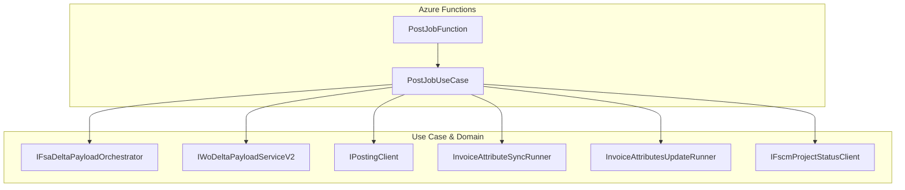

# PostJob Feature Documentation

## Overview

The **PostJob** feature enables synchronous posting of a single work order (“job”) within the Accrual Orchestrator. Upon receiving an HTTP request, it:

- Retrieves the full dataset for the specified work order from the Financial System Adapter (FSA).
- Builds a delta payload comparing FSA data against FSCM history.
- Posts journal entries to the downstream posting system.
- Synchronizes and updates invoice attributes, even if no journal lines exist.
- Updates the project status in FSCM to indicate completion of the posting step.

This feature ensures that work orders transition from the “OPEN” set to a posted state, with all related metadata kept in sync. It fits into the overall Orchestrator Functions layer, acting as the endpoint-specific use case for `/job/post`.

## Architecture Overview



## Component Structure

### PostJobUseCase (`src/Rpc.AIS.Accrual.Orchestrator.Functions/Endpoints/UseCases/PostJobUseCase.cs`)

- **Purpose:** Orchestrates end-to-end posting of a single work order.
- **Responsibilities:**- HTTP request validation and context extraction
- FSA full-fetch payload retrieval
- Delta payload building and journal posting
- Invoice attribute synchronization and update
- FSCM project status update
- **Methods:**

| Method | Description | Returns |
| --- | --- | --- |
| `ExecuteAsync(HttpRequestData req, FunctionContext ctx)` | Main entry point: processes the POST `/job/post` request and returns an HTTP response. | `Task<HttpResponseData>` |
| `BuildMinimalPostingEnvelopeJson(...)` | Constructs a minimal JSON envelope for invoice sync when FSA returns no payload lines. | `string` |
| `TryExtractCompanyAndSubProjectIdString(string, out string?, out string?)` | Parses `Company` and `SubProjectId` from an FSA payload JSON string. | `bool` |


- **Dependencies:**- `IFsaDeltaPayloadOrchestrator` — builds full-fetch payload
- `FsOptions` — configuration for FSA operations
- `IWoDeltaPayloadServiceV2` — builds delta payload
- `IPostingClient` — validates and posts journal entries
- `InvoiceAttributeSyncRunner` — enriches invoice data
- `InvoiceAttributesUpdateRunner` — updates invoice attributes in FSCM
- `IFscmProjectStatusClient` — updates project status

### JobOperationsUseCaseBase (`src/Rpc.AIS.Accrual.Orchestrator.Functions/Endpoints/UseCases/JobOperationsUseCaseBase.cs`)

- **Purpose:** Provides common HTTP use-case helpers: context reading, request parsing, response building, logging scopes, and error-handling methods.
- **Key Helpers:**- `ReadContext`, `ReadBodyAsync`, `TryParseFsJobOpsRequest`
- `OkAsync`, `BadRequestAsync`, `AcceptedAsync`, `NotFoundAsync`, `ServerErrorAsync`
- `LogInboundPayloadAsync`

### IPostJobUseCase (`src/Rpc.AIS.Accrual.Orchestrator.Functions/Endpoints/UseCases/IPostJobUseCase.cs`)

- **Purpose:** Contract defining the `ExecuteAsync` method for the PostJob use case.
- **Signature:**

```csharp
  Task<HttpResponseData> ExecuteAsync(HttpRequestData req, FunctionContext ctx);
```

## API Integration

### Post Job (POST /job/post)

```api
{
    "title": "Post Job",
    "description": "Synchronously post a single work order, including invoice attribute sync and project status update.",
    "method": "POST",
    "baseUrl": "https://<your-function-app>.azurewebsites.net",
    "endpoint": "/api/job/post",
    "headers": [
        {
            "key": "Content-Type",
            "value": "application/json",
            "required": true
        },
        {
            "key": "x-functions-key",
            "value": "<Function Key>",
            "required": true
        },
        {
            "key": "x-run-id",
            "value": "Unique run identifier (optional)",
            "required": false
        },
        {
            "key": "x-correlation-id",
            "value": "Correlation identifier (optional)",
            "required": false
        },
        {
            "key": "x-source-system",
            "value": "Origin system name (optional)",
            "required": false
        }
    ],
    "queryParams": [],
    "pathParams": [],
    "bodyType": "json",
    "requestBody": "{\n  \"_request\": {\n    \"WorkOrderGuid\": \"123e4567-e89b-12d3-a456-426614174000\",\n    \"Company\": \"COMPANY_CODE\",\n    \"SubProjectId\": \"SUBPROJECT_CODE\"\n  }\n}",
    "formData": [],
    "rawBody": "",
    "responses": {
        "200": {
            "description": "Job posted successfully",
            "body": "{\n  \"runId\": \"<runId>\",\n  \"correlationId\": \"<corrId>\",\n  \"sourceSystem\": \"<sourceSystem>\",\n  \"operation\": \"PostJob\",\n  \"workOrderGuid\": \"123e4567-e89b-12d3-a456-426614174000\",\n  \"workOrderNumbers\": [\"WO12345\"],\n  \"delta\": {\n    \"workOrdersInInput\": 1,\n    \"workOrdersInOutput\": 1,\n    \"totalDeltaLines\": 10,\n    \"totalReverseLines\": 0,\n    \"totalRecreateLines\": 0\n  },\n  \"postResults\": [\n    { \"journalType\": \"Sales\", \"success\": true, \"posted\": 1, \"errors\": 0 }\n  ],\n  \"invoiceAttributesUpdate\": {\n    \"attempted\": true,\n    \"success\": true,\n    \"workOrdersWithInvoiceAttributes\": 1,\n    \"totalAttributePairs\": 5,\n    \"note\": \"All attributes synced\",\n    \"update\": { \"workOrdersConsidered\": 1, \"workOrdersWithUpdates\": 1, \"updatePairs\": 5, \"successCount\": 5, \"failureCount\": 0 }\n  },\n  \"projectStatusUpdate\": { \"success\": true, \"httpStatus\": 200 }\n}"
        },
        "400": {
            "description": "Invalid request or missing required fields",
            "body": "{\n  \"runId\": \"<runId>\",\n  \"correlationId\": \"<corrId>\",\n  \"message\": \"Request body is required and must contain workOrderGuid.\"\n}"
        }
    }
}
```

## Key Classes Reference

| Class | Location | Responsibility |
| --- | --- | --- |
| PostJobUseCase | `Endpoints/UseCases/PostJobUseCase.cs` | Implements the synchronous post-job use case |
| JobOperationsUseCaseBase | `Endpoints/UseCases/JobOperationsUseCaseBase.cs` | Provides shared HTTP and logging helpers for job operations |
| IPostJobUseCase | `Endpoints/UseCases/IPostJobUseCase.cs` | Defines the contract for the PostJob use case |
| PostJobFunction | `Endpoints/Split/PostJobFunction.cs` | Azure Function adapter exposing the `/job/post` HTTP trigger |
| IFsaDeltaPayloadOrchestrator | `Core/Abstractions/IFsaDeltaPayloadOrchestrator.cs` | Builds full-fetch payloads from FSA |
| IWoDeltaPayloadServiceV2 | `Core/Services/IWoDeltaPayloadServiceV2.cs` | Generates delta payloads comparing FSA vs. FSCM history |
| IPostingClient | `Infrastructure/Clients/Posting/IPostingClient.cs` | Validates and posts journal entries to external system |
| IFscmProjectStatusClient | `Infrastructure/Clients/Posting/IFscmProjectStatusClient.cs` | Updates project status in FSCM |
| InvoiceAttributeSyncRunner | `Functions/Services/InvoiceAttributeSyncRunner.cs` | Enriches posting payloads with invoice attributes |
| InvoiceAttributesUpdateRunner | `Functions/Services/InvoiceAttributesUpdateRunner.cs` | Applies invoice attribute updates in FSCM |


## Dependencies

- Microsoft.Azure.Functions.Worker
- Microsoft.Azure.Functions.Worker.Http
- Microsoft.Extensions.Logging
- Rpc.AIS.Accrual.Orchestrator.Core.Abstractions
- Rpc.AIS.Accrual.Orchestrator.Core.Domain
- Rpc.AIS.Accrual.Orchestrator.Core.Services
- Rpc.AIS.Accrual.Orchestrator.Infrastructure.Clients.Posting
- Rpc.AIS.Accrual.Orchestrator.Infrastructure.Options

## Error Handling

The use case leverages base-class helpers to return standardized HTTP responses:

- **400 Bad Request** for missing/invalid payload or required context.
- **200 OK** for successful posting flows.
- **Logging** uses structured scopes (`LogScopes.BeginFunctionScope`) with `RunId`, `CorrelationId`, and operation metadata.