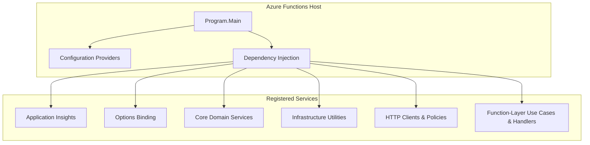

# Functions Host Bootstrap & Dependency Injection Feature Documentation

## Overview

The **Program.cs** file serves as the entry point for the .NET 8 isolated Azure Functions worker. It bootstraps the Functions host, configures multiple configuration sources (including optional local files, environment variables, and Azure Key Vault), and sets up comprehensive dependency injection for all layers of the application. This ensures the orchestrator and activity functions run with strongly-typed settings, observability, resilient HTTP clients, and all core/infrastructure services wired up at startup .

By organizing registrations into logical groups—**observability**, **options binding**, **core domain services**, **infrastructure utilities**, **HTTP clients with resilience policies**, and **function-layer use cases/handlers**—this file provides a single source of truth for the application’s runtime dependencies and fail-fast configuration validation.

## Architecture Overview



## Component Structure

### 1. Configuration Sources

- **appsettings.json** (optional; local/dev convenience)
- **Environment Variables** (loaded by default)
- **Azure Key Vault** if `KeyVault:VaultUri` or `KeyVault:Uri` is set- In non-Development environments, the Vault URI is **required** or the host fails fast

```csharp
.ConfigureAppConfiguration((ctx, config) => {
    config.AddJsonFile("appsettings.json", optional: true)
          .AddEnvironmentVariables();

    var built = config.Build();
    var vaultUri = built["KeyVault:VaultUri"] 
                ?? built["KeyVault:Uri"];
    if (!string.IsNullOrWhiteSpace(vaultUri)) {
        config.AddAzureKeyVault(new Uri(vaultUri),
                                new DefaultAzureCredential());
    }
    else if (!ctx.HostingEnvironment.EnvironmentName
             .Equals("Development", StringComparison.OrdinalIgnoreCase)) {
        throw new InvalidOperationException(
            "KeyVault:VaultUri is required in non-Development environments.");
    }
})
```

### 2. 🔍 Observability

- **Application Insights**- `services.AddApplicationInsightsTelemetryWorkerService()`
- `services.ConfigureFunctionsApplicationInsights()`
- Captures telemetry for both the host and Durable Functions

### 3. 🎛 Options Binding

| Option Class | Section | ValidateOnStart |
| --- | --- | --- |
| `HttpPolicyOptions` | `HttpPolicyOptions` | ✅ |
| `ProcessingOptions` | `ProcessingOptions` | ✅ |
| `CoreNotificationOptions` | `NotificationOptions` (Core) | ✅ |
| `AisDiagnosticsOptions` | `AisLogging` | ✅ |
| `InfraNotificationOptions` | `NotificationOptions` (Infra) | ✅ |
| `AcsEmailOptions` | `AcsEmailOptions` | ✅ |
| `FscmODataStagingOptions` | `FscmODataStagingOptions` | ✅ |
| `HttpResilienceOptions` | `HttpResilienceOptions` + legacy | ✅ |
| `FsOptions` | Mapped from `FsaIngestion` & `Dataverse:Auth` | ✅ |
| `FscmOptions` | Mapped from `Endpoints` & `Fscm:Auth` | ✅ |


### 4. 🔧 Core Domain Services

```csharp
services.AddSingleton<IRunIdGenerator, RunIdGenerator>();
services.AddSingleton<JournalReversalPlanner>();
services.AddSingleton<DeltaCalculationEngine>();
services.AddScoped<IFsaDeltaPayloadUseCase, FsaDeltaPayloadUseCase>();
services.AddSingleton<IWoDeltaPayloadService, WoDeltaPayloadService>();
services.AddSingleton<InvoiceAttributeDeltaBuilder>();
services.AddSingleton<RuntimeInvoiceAttributeMapper>();
// … and other domain/use-case registrations
```

Key responsibilities:

- Generating unique **RunId** and **CorrelationId**
- Calculating deltas, planning reversals, and building payloads
- Synchronizing invoice attributes and journal policies

### 5. 🏗 Infrastructure Utilities

- **Email**- `EmailClient` constructed from `AcsEmailOptions`
- `IEmailSender` → `AcsEmailSender`
- **Logging & Telemetry**- `IAisLogger` → `AppInsightsAisLogger`
- `ITelemetry` → `Telemetry`
- **Resilience**- `IResilientHttpExecutor` → `ResilientHttpExecutor`
- `IHttpFailureClassifier` → `DefaultHttpFailureClassifier`

### 6. 🚀 Function-Layer Use Cases & Handlers

- **Orchestrators & HTTP Use Cases**- `IFsaDeltaPayloadOrchestrator`
- `IJobOperationsHttpUseCase`
- `IAdHocSingleJobUseCase`, `IAdHocAllJobsUseCase`, `IPostJobUseCase`, `ICancelJobUseCase`, `ICustomerChangeUseCase`
- **Activity Handlers (SOLID)**- `ValidateAndPostWoPayloadHandler`
- `PostSingleWorkOrderHandler`
- `UpdateWorkOrderStatusHandler`
- `PostRetryableWoPayloadHandler`
- `SyncInvoiceAttributesHandler`
- `FinalizeAndNotifyWoPayloadHandler`
- **Orchestration Adapters**- `AccrualOrchestratorFunctions` (timer trigger)
- `JobOperationsOrchestration`, `DurableAccrualOrchestration`

### 7. 🌐 HTTP Clients & Resilience Policies

- **Policy Factories**- `AddDataversePolicies(…)`
- `AddFscmPolicies(…)`
- **Typed Clients**- Dataverse:- `IWarehouseSiteEnricher`, `IVirtualLookupNameResolver`, `FsaLineFetcher`
- FSCM:- `IPostingClient`, `ISingleWorkOrderPostingClient`, `IWorkOrderStatusUpdateClient`,

`IFscmProjectStatusClient`, `IFscmInvoiceAttributesClient`, etc.

- **Caching**- `FscmReleasedDistinctProductsClient` decorated with memory cache
- Controlled by `FscmReleasedDistinctProductsCacheOptions`

```csharp
// Example of adding a Dataverse client with policies:
AddDataversePolicies(
    services.AddHttpClient<IWarehouseSiteEnricher, WarehouseSiteEnricher>(...),
    clientName: "dataverse-warehouse-site-enricher"
)
```

### 8. ⚙️ Custom Validators

#### FscmOptionsStartupValidator

Ensures FSCM endpoint configuration is neither missing nor placeholder and that multi-endpoint journal paths are distinct. Implements `IValidateOptions<FscmOptions>` to fail on startup if any contract violation is detected .

```csharp
private sealed class FscmOptionsStartupValidator 
    : IValidateOptions<FscmOptions>
{
    public ValidateOptionsResult Validate(string? _, FscmOptions opts)
    {
        // Check for missing or placeholder values...
        // Ensure endpoints JValidate, JCreate, JPost, UpdateInvoiceAttributes, UpdateProjectStatus are distinct
    }
}
```

## Key Classes Reference

| Class | Location | Responsibility |
| --- | --- | --- |
| **Program** | `src/Rpc.AIS.Accrual.Orchestrator.Functions/Program.cs` | Host bootstrap, configuration, and DI container setup |
| **FscmOptionsStartupValidator** | Nested in `Program.cs` | Fail-fast validation for FSCM options |
| **RunIdGenerator** | Core/Abstractions | Generates unique RunId and CorrelationId |
| **FsaDeltaPayloadUseCase** | Core/UseCases/FsaDeltaPayload | Orchestrates FSA delta fetching and enrichment |
| **ResilientHttpExecutor** | Infrastructure/Resilience | Executes HTTP calls with retry and timeout policies |
| **AcsEmailSender** | Infrastructure/Notifications | Sends emails via Azure Communication Email |


## Dependencies

- Azure Functions Worker SDK (.NET 8 isolated)
- Microsoft.Extensions.* (Configuration, DependencyInjection, Options, Logging, Caching)
- Azure.Identity, Azure.Communication.Email
- Microsoft.Azure.Functions.Worker.ApplicationInsights
- Polly for HTTP resilience

## Caching Strategy

- **ReleasedDistinctProducts**: in-memory cache with configurable TTL and negative TTL
- Controlled by `FscmReleasedDistinctProductsCacheOptions` with validation on startup

## Testing Considerations

- **Options validation** ensures misconfiguration is caught before runtime
- **DI composition** can be verified via integration or container-validation tests
- **Custom validator** covers the multi-endpoint contract for FSCM configurations