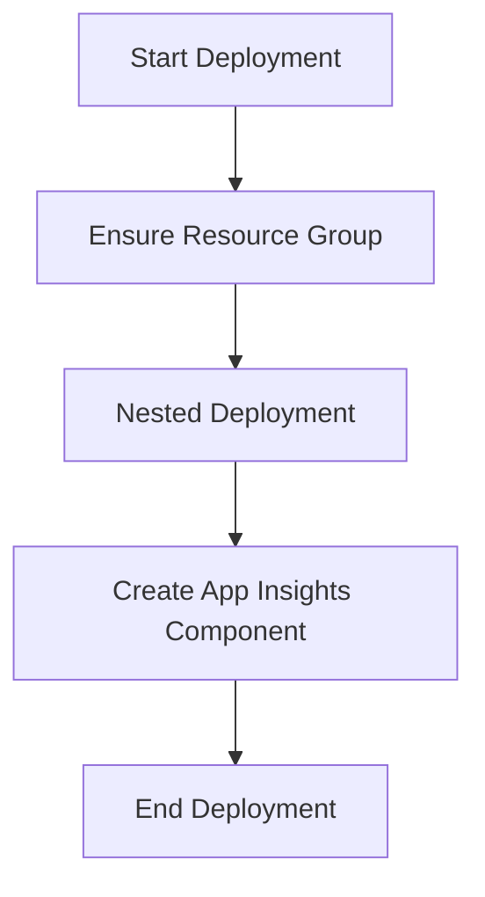

# App Insights Deployment ARM Template

## Overview

This ARM template provisions the **Application Insights** component for the FSA-FSCM WOTransaction AIS function in the East US region. It ensures that a dedicated resource group exists, then deploys an App Insights resource named `app-fs-fscm-intg-woprojects`. Integrating Application Insights enables centralized telemetry and diagnostics for the function’s runtime behavior.

## Template Parameters

| Parameter | Type | Default Value | Description |
| --- | --- | --- | --- |
| **resourceGroupName** | string | rg-d365-fs-fscm-intg-wo-projects-eastus | Name of the Azure resource group. Grouping related resources aids in lifecycle management. |
| **resourceGroupLocation** | string | (empty) | Location of the resource group. Can differ from individual resource locations. |
| **resourceLocation** | string | `[parameters('resourceGroupLocation')]` | Location of deployed resources. Defaults to the resource group’s location unless overridden. |


```json
{
  "parameters": {
    "resourceGroupName": {
      "type": "string",
      "defaultValue": "rg-d365-fs-fscm-intg-wo-projects-eastus",
      "metadata": {
        "_parameterType": "resourceGroup",
        "description": "Name of the resource group for the resource. It is recommended to put resources under same resource group for better tracking."
      }
    },
    "resourceGroupLocation": {
      "type": "string",
      "defaultValue": "",
      "metadata": {
        "_parameterType": "location",
        "description": "Location of the resource group. Resource groups could have different location than resources."
      }
    },
    "resourceLocation": {
      "type": "string",
      "defaultValue": "[parameters('resourceGroupLocation')]",
      "metadata": {
        "_parameterType": "location",
        "description": "Location of the resource. By default use resource group's location, unless the resource provider is not supported there."
      }
    }
  }
}
```

## Resource Definitions

### 1. Resource Group Creation

- **Type**: `Microsoft.Resources/resourceGroups`
- **Name**: `"[parameters('resourceGroupName')]"`
- **Location**: `"[parameters('resourceGroupLocation')]"`
- **API Version**: `2019-10-01`

Ensures the target resource group exists before any nested deployment.

### 2. Nested Deployment

- **Type**: `Microsoft.Resources/deployments`
- **Name**:

```text
  [concat(parameters('resourceGroupName'), 'Deployment', uniqueString(concat('app-fs-fscm-intg-woprojects', subscription().subscriptionId)))]
```

- **Scope**: The created resource group (`resourceGroup` property).
- **Depends On**: The resource group itself.
- **Mode**: `Incremental`

This nested deployment applies an inline template to provision the Application Insights component.

#### 2.1. Nested Template: App Insights Component

| Property | Value |
| --- | --- |
| **kind** | `web` |
| **name** | `app-fs-fscm-intg-woprojects` |
| **type** | `microsoft.insights/components` |
| **location** | `"[parameters('resourceLocation')]"` |
| **apiVersion** | `2015-05-01` |
| **properties** | `{ }` (no explicit properties, defaults apply) |


```json
{
  "resources": [
    {
      "kind": "web",
      "name": "app-fs-fscm-intg-woprojects",
      "type": "microsoft.insights/components",
      "location": "[parameters('resourceLocation')]",
      "apiVersion": "2015-05-01",
      "properties": {}
    }
  ]
}
```

## Metadata

```json
"metadata": {
  "_dependencyType": "appInsights.azure"
}
```

- **_dependencyType**: Indicates this template provides an Azure Application Insights dependency for function deployments.

## Deployment Flow



1. **Ensure Resource Group**: Creates or validates the named RG.
2. **Nested Deployment**: Executes an incremental deployment scoped to the RG.
3. **Create App Insights Component**: Instantiates `app-fs-fscm-intg-woprojects` for telemetry.

## Usage

1. Place this file alongside the Function’s Zip Deploy artifacts under `Properties/ServiceDependencies`.
2. During CI/CD, invoke an Azure subscription-level deployment using this template.
3. Supply or override parameters as needed to target different environments or regions.

```bash
az deployment sub create \
  --template-file appInsights1.arm.json \
  --parameters resourceGroupLocation=eastus
```

## Key Elements Reference

| Element | Location Path | Responsibility |
| --- | --- | --- |
| `parameters` block | src/.../appInsights1.arm.json | Defines inputs controlling naming and location. |
| `Microsoft.Resources/resourceGroups` | `resources[0]` | Creates or validates the RG. |
| `Microsoft.Resources/deployments` | `resources[1]` | Deploys nested template for App Insights. |
| `app-fs-fscm-intg-woprojects` | `resources[1].properties.template.resources[0]` | Application Insights component resource. |
| `metadata._dependencyType` | Top-level `metadata` | Indicates service dependency classification. |


## Integration Points

- **Function App Zip Deploy**: The resulting Application Insights connection string is injected into the Function App via `serviceDependencies`.
- **Azure Monitoring**: Downstream services pull telemetry from this component for logging and performance analysis.

## Dependencies

- **Azure Resource Manager**: Executes this template at subscription scope.
- **ARM Parameters**: Relies on standard deployment parameters for location and naming consistency.

## Testing Considerations

- Validate that resource group exists or is created without errors.
- Confirm the nested deployment completes and the App Insights resource appears in the target RG.
- Ensure parameter overrides (e.g., different `resourceLocation`) are honored.