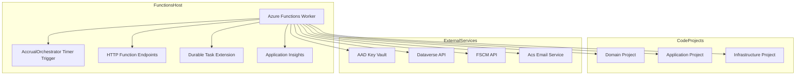
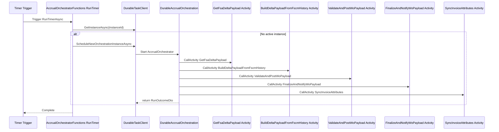

# Rpc.AIS.Accrual.Orchestrator.Functions Project Documentation

## Overview ⚙️

The **Rpc.AIS.Accrual.Orchestrator.Functions** project is an Azure Functions app built on the .NET 8 isolated worker model. It hosts durable orchestrations and HTTP-triggered functions responsible for:

- **Scheduling accrual runs** on a timer trigger
- **Executing multi-step workflows** via Durable Task orchestration
- **Handling ad-hoc job operations** (post, cancel, customer change) through HTTP endpoints
- **Integrating** with Core, Application and Infrastructure libraries for business logic, data access, and external APIs

This separation ensures a **scalable**, **observable**, and **resilient** pipeline for fetching, transforming, posting and finalizing financial accrual data.

## Architecture Overview



## Component Structure

### 1. Host Configuration & Project Setup

#### Rpc.AIS.Accrual.Orchestrator.Functions.csproj

Path: `src/Rpc.AIS.Accrual.Orchestrator.Functions/Rpc.AIS.Accrual.Orchestrator.Functions.csproj`

- **TargetFramework**: `net8.0`
- **AzureFunctionsVersion**: `v4`
- **OutputType**: `Exe` (isolated worker)
- **IsPackable**: `false`
- **Hard-Disable In-Proc Extensions**- `FunctionsWorkerDisableInProcExtensions` = `true`
- `DisableImplicitAzureFunctionsExtensions` = `true`

#### Build-Time Analyzers (CI Hygiene)

Condition: `$(TF_BUILD) == 'true'`

- **RunAnalyzersDuringBuild**: `true`
- **EnableNETAnalyzers**: `true`
- **DisableImplicitNuGetAnalyzers**: `false`

#### Project References

| Project | Path |
| --- | --- |
| **Domain** | `..\Rpc.AIS.Accrual.Orchestrator.Domain\Rpc.AIS.Accrual.Orchestrator.Domain.csproj` |
| **Application** | `..\Rpc.AIS.Accrual.Orchestrator.Application\Rpc.AIS.Accrual.Orchestrator.Application.csproj` |
| **Infrastructure** | `..\Rpc.AIS.Accrual.Orchestrator.Infrastructure\Rpc.AIS.Accrual.Orchestrator.Infrastructure.csproj` |


#### Package References

| Package | Version | Purpose |
| --- | --- | --- |
| `Microsoft.Azure.Functions.Worker` | 2.51.0 | .NET isolated Functions worker runtime |
| `Microsoft.Azure.Functions.Worker.Sdk` | 2.0.7 | Build tooling for isolated Functions (Analyzer) |
| `Microsoft.Azure.Functions.Worker.Extensions.Http` | 3.3.0 | HTTP trigger support |
| `Microsoft.Azure.Functions.Worker.Extensions.Timer` | 4.3.1 | Timer trigger support |
| `Microsoft.Azure.Functions.Worker.Extensions.DurableTask` | 1.14.1 | Durable Task extension (orchestrations & activities) |
| `Microsoft.Azure.Functions.Worker.ApplicationInsights` | 2.50.0 | Application Insights telemetry integration |
| `Microsoft.ApplicationInsights.WorkerService` | 2.22.0 | App Insights SDK for worker services |
| `Azure.Identity` | 1.17.1 | Azure AD authentication (Key Vault, etc.) |
| `Azure.Extensions.AspNetCore.Configuration.Secrets` | 1.4.0 | Key Vault configuration provider |
| `Microsoft.Extensions.Options.DataAnnotations` | 10.0.3 | Data-annotation validation for IOptions |


### 2. Host Settings Files

| File | Purpose | Publish Behavior |
| --- | --- | --- |
| **host.json** | Configure Functions host (durableTask, extensionBundle) | Copied to publish root |
| **local.settings.json** | Local dev settings (storage, secrets, environment) | Never published |


### 3. Orchestration Functions

#### **AccrualOrchestratorFunctions**

> **🚫 Hardened Build:** The in-proc WebJobs DurableTask package is explicitly **excluded** to avoid mixing with isolated worker extensions: ```xml <PackageReference Update="Microsoft.Azure.WebJobs.Extensions.DurableTask" ExcludeAssets="all" PrivateAssets="all" /> ```

Path: `src/Rpc.AIS.Accrual.Orchestrator.Functions/Durable/Orchestrators/AccrualOrchestratorFunctions.cs`

- **Trigger**: Timer (`%AccrualSchedule%`)
- **Behavior**:1. Generate a **RunId** & **CorrelationId**
2. Log start with custom scopes
3. Fetch notification recipients
4. Enforce **single-flight** via deterministic instance ID
5. Schedule `DurableAccrualOrchestration.AccrualOrchestrator` if no active instance
6. On exception, send **fatal email** via `IEmailSender`

```csharp
[Function("AccrualOrchestrator_Timer")]
public async Task RunTimerAsync(
    [TimerTrigger("%AccrualSchedule%")] TimerInfo timer,
    [DurableClient] DurableTaskClient client,
    FunctionContext ctx)
{
    // ... generate IDs, logging scopes ...
    var instanceId = $"Accrual|Timer|{DateTime.UtcNow:yyyyMMddHHmm}";
    var existing = await client.GetInstanceAsync(instanceId, ctx.CancellationToken);
    if (existing == null) {
        await client.ScheduleNewOrchestrationInstanceAsync(
            nameof(DurableAccrualOrchestration.AccrualOrchestrator),
            input, options, ctx.CancellationToken);
    }
    // error handling with email notification...
}
```

### 4. Durable Orchestration Workflows

#### **DurableAccrualOrchestration**

Path: `src/Rpc.AIS.Accrual.Orchestrator.Functions/Durable/Orchestrators/DurableAccrualOrchestration.cs`

- **Pattern**: Task orchestration with `TaskOrchestrationContext`
- **Steps**:1. **Fetch** work‐order payload from FSA (`GetFsaDeltaPayload`)
2. Optionally **compute delta** against FSCM history (`BuildDeltaPayloadFromFscmHistory`)
3. **Validate & post** all journal lines (`ValidateAndPostWoPayload`)
4. **Retry** transient failures (`RetryRetryableGroupsAsync`)
5. **Finalize & notify** (`FinalizeAndNotifyWoPayload`)
6. **Sync invoice attributes** if all posts succeeded

#### **JobOperationsOrchestration**

> **Note:** A feature flag `_applyFscmDeltaBeforePosting` controls whether FSCM delta is applied before posting.

Path: `src/Rpc.AIS.Accrual.Orchestrator.Functions/Durable/Orchestrators/JobOperationsOrchestration.cs`

- **Purpose**: Reuse the FSA→delta→validate→post pipeline for **ad-hoc job operations** (post, customer change).
- **Additional Steps**: Invoke FSCM project lifecycle handlers (status update, reversal) via injected services.

#### **CustomerChangeOrchestrator**

Path: `src/Rpc.AIS.Accrual.Orchestrator.Functions/Durable/Orchestrators/CustomerChangeOrchestrator.cs`

- **Flows**: Deserialize customer-change requests, enrich payload, invoke common orchestration steps, and update project attributes in FSCM.

### 5. Activity Business Logic

#### **ActivitiesUseCase**

Path: `src/Rpc.AIS.Accrual.Orchestrator.Functions/Durable/Activities/ActivitiesUseCase.cs`

- **Role**: Encapsulates all orchestration activity handlers behind one interface (`IActivitiesUseCase`)
- **Handlers Registered**:- `ValidateAndPostWoPayloadHandler`
- `PostSingleWorkOrderHandler`
- `UpdateWorkOrderStatusHandler`
- `PostRetryableWoPayloadHandler`
- `SyncInvoiceAttributesHandler`
- `FinalizeAndNotifyWoPayloadHandler`

### 6. Dependency Injection & App Bootstrap

#### **Program.cs**

Path: `src/Rpc.AIS.Accrual.Orchestrator.Functions/Program.cs`

- **Host Builder** for .NET 8 isolated worker
- **DI Registrations**:- **Core services** (`IRunIdGenerator`, `IWoDeltaPayloadService`, etc.)
- **Infrastructure clients** (Dataverse, FSCM HTTP clients with Polly policies)
- **Email sender** (Azure Communication Services)
- **Function handlers** (Orchestrator, Activities, HTTP use cases)
- **Configuration**: Binds settings sections to typed options (`FsOptions`, `FscmOptions`, `HttpResilienceOptions`, `AcsEmailOptions`, etc.)
- **Policies**: Config-driven HTTP retry/fallback via Polly

## Data Models & DTOs

| Record | Properties |
| --- | --- |
| **RunInputDto** | `string RunId`<br/>`string CorrelationId`<br/>`string TriggeredBy`<br/>`string? SourceSystem`<br/>`string? WorkOrderGuid` |
| **WoPayloadPostingInputDto** | `string RunId`<br/>`string CorrelationId`<br/>`string WoPayloadJson`<br/>`string? DurableInstanceId` |
| **RetryableWoPayloadPostingInputDto** | `string RunId`<br/>`string CorrelationId`<br/>`string WoPayloadJson`<br/>`JournalType JournalType`<br/>`int Attempt`<br/>`string? DurableInstanceId` |
| **FinalizeWoPayloadInputDto** | `string RunId`<br/>`string CorrelationId`<br/>`string WoPayloadJson`<br/>`List<PostResult> PostResults`<br/>`string[]? GeneralErrors`<br/>`string? DurableInstanceId` |
| **SingleWoPostingInputDto** | `string RunId`<br/>`string CorrelationId`<br/>`string TriggeredBy`<br/>`string RawJsonBody`<br/>`string? DurableInstanceId` |
| **WorkOrderStatusUpdateInputDto** | `string RunId`<br/>`string CorrelationId`<br/>`string TriggeredBy`<br/>`string RawJsonBody`<br/>`string? DurableInstanceId` |
| **InvoiceAttributesSyncInputDto** | `string RunId`<br/>`string CorrelationId`<br/>`string WoPayloadJson`<br/>`string? DurableInstanceId` |
| **InvoiceAttributesSyncResultDto** | `bool Attempted`<br/>`bool Success`<br/>`int WorkOrdersWithInvoiceAttributes`<br/>`int TotalAttributePairs`<br/>`string Note`<br/>`int UpdateSuccessCount`<br/>`int UpdateFailureCount` |
| **RunOutcomeDto** | `string RunId`<br/>`string CorrelationId`<br/>`int WorkOrdersConsidered`<br/>`int WorkOrdersValid`<br/>`int WorkOrdersInvalid`<br/>`int PostFailureGroups`<br/>`bool HasAnyErrors`<br/>`List<string> GeneralErrors` |


## Feature Flows

### 1. Timer-Scheduled Accrual Run



## Integration Points

- **Domain**, **Application**, **Infrastructure** projects via ProjectReferences
- **Azure Functions Worker** (isolated .NET 8)
- **Durable Task Extension** for orchestrations
- **Azure Application Insights** for tracing & metrics
- **Azure Key Vault** via `Azure.Identity` + `Azure.Extensions.AspNetCore.Configuration.Secrets`
- **Dataverse API** (FSA ingestion)
- **FSCM APIs** (journal history, posting, status updates)
- **Azure Communication Services** Email for fatal alerts

## Key Classes Reference

| Class | Location | Responsibility |
| --- | --- | --- |
| AccrualOrchestratorFunctions | `Durable/Orchestrators/AccrualOrchestratorFunctions.cs` | Timer trigger and scheduling durable orchestrations |
| DurableAccrualOrchestration | `Durable/Orchestrators/DurableAccrualOrchestration.cs` | Core accrual orchestration workflow |
| JobOperationsOrchestration | `Durable/Orchestrators/JobOperationsOrchestration.cs` | Ad-hoc job operation orchestrations |
| CustomerChangeOrchestrator | `Durable/Orchestrators/CustomerChangeOrchestrator.cs` | Customer change orchestration |
| ActivitiesUseCase | `Durable/Activities/ActivitiesUseCase.cs` | Orchestrator activity handlers adapter |
| Program | `Program.cs` | Host builder, DI registrations, HTTP & Durable configuration |
| RunInputDto, WoPayloadPostingInputDto, … | `Durable/Orchestrators/DurableAccrualOrchestration.cs` | DTOs for orchestration inputs/results |


## Error Handling 🔥

- **Scoped Logging**: Custom scopes for function name, trigger, RunId, CorrelationId
- **Try-Catch** around scheduling logic
- On error:1. Log exception
2. Send **fatal error** email to configured distribution list
3. Silently catch email-send failures and log
4. Rethrow to surface failure to Functions host

## Dependencies 📦

- **Project References**: Domain, Application, Infrastructure
- **NuGet Packages**: Azure Functions Worker, DurableTask, App Insights, Azure.Identity, Polly (via Infrastructure)
- **External Services**: Dataverse OData, FSCM REST, Azure Key Vault, Azure Communication Services Email

## Testing Considerations ✅

- **HTTP Endpoint Contracts** validated in

`tests/Rpc.AIS.Accrual.Orchestrator.Tests/Functions/HttpEndpointsContractTests.cs`

- Leverages **xUnit**, **Moq**, **FluentAssertions**
- Key scenarios:- Accepted responses for ad-hoc job requests
- Durable orchestration scheduling on timer trigger
- Error-email path on orchestration failure

---

**This documentation covers the csproj setup, function triggers, orchestrations, activities, DTOs, error-handling patterns, dependencies, and testing scaffolding for the Rpc.AIS.Accrual.Orchestrator.Functions project.**