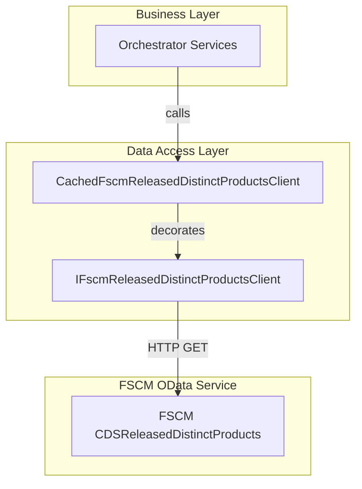
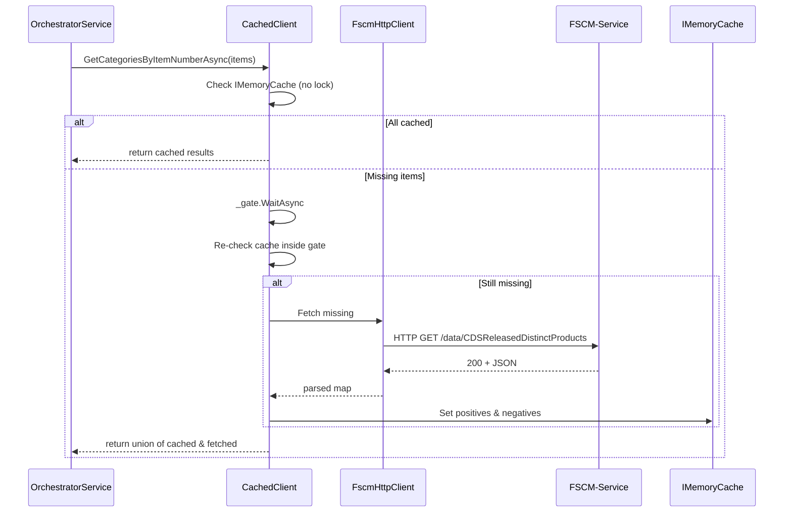

# CachedFscmReleasedDistinctProductsClient Feature Documentation

## Overview

The **CachedFscmReleasedDistinctProductsClient** acts as a drop-in decorator for `IFscmReleasedDistinctProductsClient`, adding an in-memory caching layer. It dramatically reduces repeated FSCM OData calls by caching:

- **Positive entries** (found mappings) for a configurable TTL.
- **Negative entries** (missing mappings) for a shorter TTL to prevent repeated misses.

This client ensures high throughput and low latency in scenarios where the same ItemNumbers are enriched across multiple runs on warm hosts .

## Architecture Overview



## Component Structure

### Data Access Layer

#### **CachedFscmReleasedDistinctProductsClient** (`src/Rpc.AIS.Accrual.Orchestrator.Infrastructure/Adapters/Fscm/Clients/CachedFscmReleasedDistinctProductsClient.cs`)

- **Purpose:**

Decorates the FSCM client to cache mappings from `ItemNumber` to `ReleasedDistinctProductCategory`.

- **Dependencies:**- `IFscmReleasedDistinctProductsClient` ()
- `IMemoryCache`
- `IOptions<FscmReleasedDistinctProductsCacheOptions>`
- `ILogger<CachedFscmReleasedDistinctProductsClient>`
- `SemaphoreSlim` (to prevent cache stampedes)

- **Constructor:**

```csharp
  public CachedFscmReleasedDistinctProductsClient(
      IFscmReleasedDistinctProductsClient inner,
      IMemoryCache cache,
      IOptions<FscmReleasedDistinctProductsCacheOptions> options,
      ILogger<CachedFscmReleasedDistinctProductsClient> logger)
```

Throws `ArgumentNullException` if any dependency is null .

- **Public Method:**

```csharp
  Task<IReadOnlyDictionary<string, ReleasedDistinctProductCategory>>
  GetCategoriesByItemNumberAsync(RunContext ctx, IReadOnlyList<string> itemNumbers, CancellationToken ct)
```

- **Behavior:**1. Validates parameters.
2. If caching is , forwards call to inner client.
3. Cleans, trims, deduplicates and bounds-checks ItemNumbers.
4. Reads cache (no lock) to collect hits and negatives.
5. If any missing, enters a semaphore-gated block to avoid stampedes.
6. Fetches only still-missing items from the inner client.
7. Caches positive results for `Ttl` and negatives for `NegativeTtl`.
8. Logs each stage with run and correlation IDs .

- **Throws:**- `ArgumentNullException` for null `ctx` or `itemNumbers`.
- `InvalidOperationException` if `itemNumbers.Count > MaxItemCountPerCall`.

## Caching Strategy

- **Cache Key Pattern:**

`"FSCM:RDP:{ITEMNUMBER}"` (upper-cased and trimmed) .

- **Cache Entries:**

| Entry Type | TTL (Absolute Expiration) | Purpose |
| --- | --- | --- |
| Positive | `FscmReleasedDistinctProductsCacheOptions.Ttl` | Cache found mappings (default 24 h) |
| Negative | `FscmReleasedDistinctProductsCacheOptions.NegativeTtl` | Cache missing mappings (default 1 h) |


- **Stampede Protection:**

Uses a `SemaphoreSlim(1,1)` to batch parallel fetches for the same missing set .

## Usage Flow



## Related Data Models

#### ReleasedDistinctProductCategory

Represents FSCM category IDs for a released distinct product.

| Property | Type | Description |
| --- | --- | --- |
| `ItemNumber` | string | The product’s item number. |
| `ProjCategoryId` | string? | FSCM Project Category ID. |
| `RpcProjCategoryId` | string? | RPC Project Category ID. |


#### FscmReleasedDistinctProductsCacheOptions

Configures cache behavior.

| Property | Type | Default | Description |
| --- | --- | --- | --- |
| `Enabled` | bool | true | Enables or disables caching. |
| `Ttl` | TimeSpan | 24 hours | TTL for positive cache entries. |
| `NegativeTtl` | TimeSpan | 1 hour | TTL for negative cache entries. |
| `MaxItemCountPerCall` | int | 200 000 | Upper bound on items per call to avoid huge allocations. |


## Key Classes Reference

| Class | Location | Responsibility |
| --- | --- | --- |
| CachedFscmReleasedDistinctProductsClient | `.../Adapters/Fscm/Clients/CachedFscmReleasedDistinctProductsClient.cs` | Caches and decorates FSCM ItemNumber-to-Category enrichments. |
| IFscmReleasedDistinctProductsClient | `.../Core/Abstractions/IFscmReleasedDistinctProductsClient.cs` | Defines contract for fetching FSCM distinct product categories. |
| FscmReleasedDistinctProductsCacheOptions | `.../Infrastructure/Options/FscmReleasedDistinctProductsCacheOptions.cs` | Configures caching policy and limits. |
| ReleasedDistinctProductCategory | `.../Core/Domain/ReleasedDistinctProductCategory.cs` | Domain record for FSCM product category IDs. |


## Dependencies

- Microsoft.Extensions.Caching.Memory
- Microsoft.Extensions.Options
- Microsoft.Extensions.Logging
- System.Threading (SemaphoreSlim)
- Underlying `IFscmReleasedDistinctProductsClient` (HTTP client)

---

*ℹ️ This documentation is based on the source code as provided and reflects actual implementations without inferred features.*