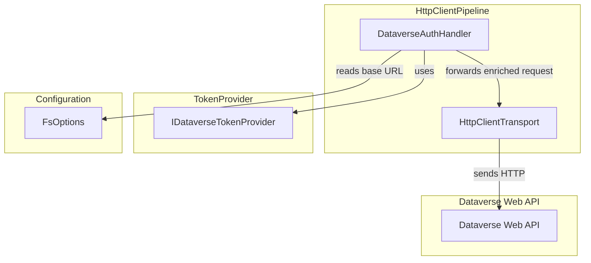
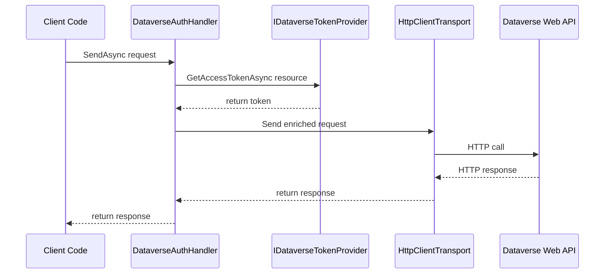

# Dataverse Auth Handler Feature Documentation

## Overview

The **DataverseAuthHandler** integrates with `HttpClient` to transparently apply Azure AD bearer tokens and OData headers for calls to the Dataverse Web API. It validates configuration, obtains tokens via a pluggable provider, and enriches each outgoing request. This ensures secure, consistent communication with the Dataverse service without manual header management.

This component sits in the infrastructure layer of the accrual orchestrator. It supports any HTTP client configured with `AddHttpMessageHandler<DataverseAuthHandler>()`, promoting reuse across field-service ingestion and virtual lookup workflows.

## Architecture Overview



## Component Structure

### Infrastructure Layer

#### **DataverseAuthHandler** (`src/Rpc.AIS.Accrual.Orchestrator.Infrastructure/Adapters/Fscm/Clients/DataverseAuthHandler.cs`)

- **Purpose and responsibilities**- Enriches each `HttpRequestMessage` with AAD bearer token and OData headers.
- Validates that `FsOptions.DataverseApiBaseUrl` is configured and valid.
- Logs errors on token retrieval failures and debug details on success.

- **Key Fields**- `_tokens` (IDataverseTokenProvider): acquires access tokens.
- `_ingestion` (IOptions<FsOptions>): provides `DataverseApiBaseUrl`.
- `_log` (ILogger<DataverseAuthHandler>): emits diagnostic messages.

- **Constructor**

```csharp
  public DataverseAuthHandler(
      IDataverseTokenProvider tokens,
      IOptions<FsOptions> ingestion,
      ILogger<DataverseAuthHandler> log)
```

- Throws `ArgumentNullException` if any dependency is null.

### Key Methods

#### `SendAsync(HttpRequestMessage request, CancellationToken cancellationToken)`

- **Signature**

```csharp
  protected override async Task<HttpResponseMessage> SendAsync(
      HttpRequestMessage request,
      CancellationToken cancellationToken)
```

- **Behavior**1. Validate `request` is not null.
2. Read and validate `DataverseApiBaseUrl` from `FsOptions`.
3. Derive the AAD resource/audience (authority portion of the URL).
4. Acquire token via `_tokens.GetAccessTokenAsync(resource, cancellationToken)`.
5. Attach `Authorization: Bearer <token>` header.
6. Ensure OData headers:- `OData-MaxVersion: 4.0`
- `OData-Version: 4.0`
- `Prefer: odata.include-annotations="*"`
7. Clear and set `Accept: application/json`.
8. Log debug information without leaking secrets.
9. Delegate to `base.SendAsync`.

## Sequence Diagram



## Dependencies

- **IDataverseTokenProvider**

Abstracts token retrieval. Implemented by `DataverseBearerTokenProvider` (caches tokens per scope).

- **FsOptions**

Holds `DataverseApiBaseUrl` and AAD credentials.

```csharp
  public sealed class FsOptions {
      public string DataverseApiBaseUrl { get; set; } = "";
      // AAD TenantId, ClientId, ClientSecret…
  }
```

- **Microsoft.Extensions.Options**

Binds configuration to `FsOptions`.

- **Microsoft.Extensions.Logging**

Logs operational details and errors.

## Error Handling

- Throws `ArgumentNullException` for null dependencies or request.
- Throws `InvalidOperationException` if `DataverseApiBaseUrl` is missing or invalid.
- Logs and rethrows any exception from token acquisition.

## Integration Points

- Registered via DI in `Program.cs` with:

```csharp
  services.AddTransient<DataverseAuthHandler>();
  services.AddHttpClient<FsaLineFetcher>(...)
          .AddHttpMessageHandler<DataverseAuthHandler>();
  services.AddHttpClient<IWarehouseSiteEnricher>(...)
          .AddHttpMessageHandler<DataverseAuthHandler>();
  services.AddHttpClient<IVirtualLookupNameResolver>(...)
          .AddHttpMessageHandler<DataverseAuthHandler>();
```

- Applies to all HTTP clients calling the Dataverse OData endpoints.

## Caching Strategy

- The handler itself does not cache tokens. It delegates caching to the injected `IDataverseTokenProvider`.

## Testing Considerations

- Mock `IDataverseTokenProvider` to simulate token success/failure.
- Verify that missing or invalid `DataverseApiBaseUrl` triggers the correct exceptions.
- Assert presence and correctness of the `Authorization` and OData headers on outgoing requests.

## Key Classes Reference

| Class | Location | Responsibility |
| --- | --- | --- |
| DataverseAuthHandler | `Adapters/Fscm/Clients/DataverseAuthHandler.cs` | Enriches `HttpRequestMessage` with AAD token and OData headers. |
| IDataverseTokenProvider | `Adapters/Fscm/Clients/IDataverseTokenProvider.cs` | Defines contract for acquiring Dataverse access tokens. |
| FsOptions | `Infrastructure/Options/FsOptions.cs` | Holds Dataverse API base URL and AAD credentials. |
| DataverseBearerTokenProvider | `Adapters/Fscm/Clients/DataverseBearerTokenProvider.cs` | Implements token provider with Azure Identity and caching. |
