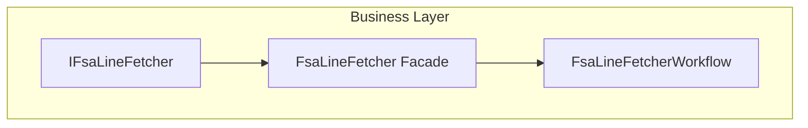

# FsaLineFetcher Facade Feature Documentation

## Overview

The **FsaLineFetcher** facade provides a thin wrapper over the `IFsaLineFetcher` interface, delegating all fetching operations to a more complex workflow implementation. It preserves existing dependency-injection wiring while enforcing the Single Responsibility Principle at the class level. This facade allows higher-level components (e.g., orchestrator functions) to remain decoupled from the detailed OData paging, query buildup, JSON parsing, and enrichment logic.

## Architecture Overview



## Component Structure

### 🛡️ FsaLineFetcher Facade (`src/Rpc.AIS.Accrual.Orchestrator.Infrastructure/Adapters/Fscm/Clients/FsaLineFetcher.Facade.cs`)

- **Purpose:** Act as a thin facade for the `IFsaLineFetcher` interface, preserving DI contracts and delegating logic.
- **Responsibilities:**- Instantiate an inner `FsaLineFetcherWorkflow`.
- Forward all interface calls to that workflow.
- **Dependencies:**- `HttpClient http`
- `ILogger<FsaLineFetcher> log`
- `IOptions<FsOptions> opt`
- `IFsaODataQueryBuilder qb`
- `IODataPagedReader reader`
- `IFsaRowFlattener flattener`
- `IWarehouseSiteEnricher warehouseEnricher`
- `IVirtualLookupNameResolver virtualLookupResolver`

#### Constructor

```csharp
public FsaLineFetcher(
    HttpClient http,
    ILogger<FsaLineFetcher> log,
    IOptions<FsOptions> opt,
    IFsaODataQueryBuilder qb,
    IODataPagedReader reader,
    IFsaRowFlattener flattener,
    IWarehouseSiteEnricher warehouseEnricher,
    IVirtualLookupNameResolver virtualLookupResolver)
{
    _inner = new FsaLineFetcherWorkflow(
        http, log, opt, qb, reader, flattener, warehouseEnricher, virtualLookupResolver);
}
```

#### Public Methods

| Method Signature | Description |
| --- | --- |
| `Task<JsonDocument> GetOpenWorkOrdersAsync(RunContext context, CancellationToken ct)` | Retrieve all open work orders via Dataverse filter and enrich. |
| `Task<JsonDocument> GetWorkOrdersAsync(RunContext context, List<string> workOrderIds, CancellationToken ct)` | Fetch specific work orders by their string IDs. |
| `Task<JsonDocument> GetWorkOrderProductsAsync(RunContext context, List<string> workOrderIds, CancellationToken ct)` | Fetch product lines for given work orders. |
| `Task<JsonDocument> GetWorkOrderServicesAsync(RunContext context, List<string> workOrderIds, CancellationToken ct)` | Fetch service lines for given work orders. |
| `Task<HashSet<string>> GetWorkOrderIdsWithProductsAsync(RunContext context, List<string> workOrderIds, CancellationToken ct)` | Light presence check for product lines. |
| `Task<HashSet<string>> GetWorkOrderIdsWithServicesAsync(RunContext context, List<string> workOrderIds, CancellationToken ct)` | Light presence check for service lines. |
| `Task<JsonDocument> GetProductsAsync(RunContext context, IReadOnlyList<Guid> productIds, CancellationToken ct)` | Retrieve product master data for given GUIDs. |


## Dependencies

- **Core Abstraction:** `IFsaLineFetcher` in `Rpc.AIS.Accrual.Orchestrator.Core.Abstractions` defines the fetcher contract.
- **Inner Implementation:** `FsaLineFetcherWorkflow` contains the full OData query, paging, flattening, and enrichment logic.
- **Supporting Services:** Query builder (`IFsaODataQueryBuilder`), paged reader (`IODataPagedReader`), row flattener (`IFsaRowFlattener`), warehouse/site enricher, and virtual-lookup resolver.

## Relationships

- **Implements:** `IFsaLineFetcher`, ensuring compatibility with existing orchestrator functions.
- **Delegates to:** `FsaLineFetcherWorkflow`, which handles all HTTP, JSON, and enrichment operations.

## Key Classes Reference

| Class | Location | Responsibility |
| --- | --- | --- |
| **FsaLineFetcher** | `Infrastructure/Adapters/Fscm/Clients/FsaLineFetcher.Facade.cs` | Thin facade implementing `IFsaLineFetcher` and delegating to workflow. |
| **FsaLineFetcherWorkflow** | `Infrastructure/Adapters/Fscm/Clients/FsaLineFetcherWorkflow.Public.cs` | Core workflow for OData queries, paging, parsing, and enrichment. |
| **IFsaLineFetcher** | `Application/Ports/Common/Abstractions/IFsaLineFetcher.cs` | Defines the contract for fetching FSA line data. |


## Testing Considerations

- **Unit Tests:**- Mock all constructor dependencies and verify that each facade method calls the corresponding workflow method exactly once.
- **Integration Tests:**- Configure a real or in-memory `HttpClient` against a test Dataverse endpoint and validate end-to-end data retrieval and JSON structure.

## Error Handling

This facade does not introduce its own error logic—it propagates any exceptions thrown by the inner workflow, including configuration errors (e.g., missing `FsOptions.DataverseApiBaseUrl`) and HTTP or JSON parsing failures.