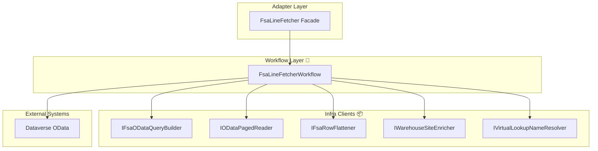

# FSA Line Fetcher Feature Documentation

## Overview

The FSA Line Fetcher feature retrieves Field Service Application (FSA) line‐item data from Microsoft Dataverse. It supports:

- Fetching open work orders based on a configurable filter
- Retrieving specific work orders, their product lines, and service lines
- Delivering raw JSON documents that downstream components can flatten, enrich, and process

By centralizing OData query construction, paging, retry logic, and enrichment, it ensures reliable, repeatable data retrieval for accrual calculations. This component lives in the Infrastructure layer of the AIS Accrual Orchestrator and underpins delta‐payload generation.

## Architecture Overview



## Component Structure

### 1. Adapter Layer

#### **FsaLineFetcher** (`src/Rpc.AIS.Accrual.Orchestrator.Infrastructure/Adapters/Fscm/Clients/FsaLineFetcher.cs`)

- Acts as a thin facade delegating every `IFsaLineFetcher` method to `FsaLineFetcherWorkflow`, preserving existing DI wiring and SRP at the class level  .
- **Constructor**

```csharp
  public FsaLineFetcher(
      HttpClient http,
      ILogger<FsaLineFetcher> log,
      IOptions<FsOptions> opt,
      IFsaODataQueryBuilder qb,
      IODataPagedReader reader,
      IFsaRowFlattener flattener,
      IWarehouseSiteEnricher warehouseEnricher,
      IVirtualLookupNameResolver virtualLookupResolver)
```

- **Key Methods**

| Method | Description |
| --- | --- |
| `GetOpenWorkOrdersAsync(context, ct)` | Fetches open work orders |
| `GetWorkOrdersAsync(context, ids, ct)` | Retrieves specified work orders |
| `GetWorkOrderProductsAsync(context, ids, ct)` | Retrieves product lines for given work orders |
| `GetWorkOrderServicesAsync(context, ids, ct)` | Retrieves service lines for given work orders |
| `GetWorkOrderIdsWithProductsAsync(context, ids, ct)` | Returns IDs with ≥1 product line |
| `GetWorkOrderIdsWithServicesAsync(context, ids, ct)` | Returns IDs with ≥1 service line |
| `GetProductsAsync(context, productIds, ct)` | Fetches product metadata by GUIDs |


### 2. Workflow Layer

#### **FsaLineFetcherWorkflow** (`src/Rpc.AIS.Accrual.Orchestrator.Infrastructure/Adapters/Fscm/Clients/FsaLineFetcher.cs`)

- Implements `IFsaLineFetcher` by:- Configuring `HttpClient` with base address, OData headers, and a “Prefer” header for annotations
- Validating required options (e.g. `DataverseApiBaseUrl`, `WorkOrderFilter`)
- Executing GUID-based queries internally and bridging string-based interface calls
- Parsing GUID lists via `ParseWorkOrderGuids` and extracting presence sets via `ExtractWorkOrderGuidSet`

- **Constructor Parameters**- `HttpClient http`
- `ILogger<FsaLineFetcher> log`
- `IOptions<FsOptions> opt`
- `IFsaODataQueryBuilder qb`
- `IODataPagedReader reader`
- `IFsaRowFlattener flattener`
- `IWarehouseSiteEnricher warehouseEnricher`
- `IVirtualLookupNameResolver virtualLookupResolver`

- **Explicit Interface Bridge**

```csharp
Task<JsonDocument> IFsaLineFetcher.GetOpenWorkOrdersAsync(RunContext context, CancellationToken ct)
Task<JsonDocument> IFsaLineFetcher.GetWorkOrdersAsync(RunContext context, List<string> workOrderIds, CancellationToken ct)
Task<JsonDocument> IFsaLineFetcher.GetWorkOrderProductsAsync(RunContext context, List<string> workOrderIds, CancellationToken ct)
// ...and so on
```

### 3. Infrastructure Clients

#### **IFsaODataQueryBuilder**

Defines methods to construct OData relative URLs for:

- Open work orders
- Work orders, products, services
- Presence queries
- Warehouses and operational sites
- Virtual lookup entities

#### **IODataPagedReader**

Reads and aggregates paged OData JSON into a single `JsonDocument`

#### **IFsaRowFlattener**

Flattens expanded lookup shapes (company, currency, worker) into top-level fields expected by core services

#### **IWarehouseSiteEnricher**

Enriches work-order-product lines with warehouse identifier and operational site ID by:

1. Deduping warehouse GUIDs
2. Fetching from `msdyn_warehouses` (selecting key attributes and formatted site ID)
3. Augmenting each row with `Warehouse` and `Site` fields

#### **IVirtualLookupNameResolver**

Extracts formatted values for option-set lookups (line property, department, product line) directly from Dataverse annotations

## Configuration 🔧

**FsOptions** (in `Rpc.AIS.Accrual.Orchestrator.Infrastructure.Options`) drives runtime behavior:

- `DataverseApiBaseUrl`: Base URI for OData calls
- `PageSize`, `MaxPages`: Paging parameters
- `PreferMaxPageSize`: Preferred OData page size
- `WorkOrderFilter`: OData filter for open work orders
- `OrFilterChunkSize`: Chunk size for “or” filters
- `RequireSubProjectForProcessing`: Enforce subproject presence
- `DisableVirtualLookupResolution`: Skip virtual lookup enrichment

## Error Handling & Resilience

- **Validation**: Throws `InvalidOperationException` if critical options are missing (e.g. base URL, filter)
- **Retry Logic**:- Non-POST requests retry up to 6 attempts on 429 or 5xx, honoring `Retry-After` when present
- Exponential backoff for transient failures
- No retries for POST to prevent idempotency issues

## Key Classes Reference

| Class | Path | Responsibility |
| --- | --- | --- |
| **FsaLineFetcher** | `Infrastructure/Adapters/Fscm/Clients/FsaLineFetcher.cs` | Thin facade for `IFsaLineFetcher` |
| **FsaLineFetcherWorkflow** | `Infrastructure/Adapters/Fscm/Clients/FsaLineFetcher.cs` (partial) | Core implementation of `IFsaLineFetcher` |
| **IFsaODataQueryBuilder** | `Infrastructure/Adapters/Fscm/Clients/Refactor/FsaClientAbstractions.cs` | Builds OData relative URLs |
| **IODataPagedReader** | Same as above | Aggregates paged OData results |
| **IFsaRowFlattener** | Same file | Flattens expand annotations into scalar fields |
| **IWarehouseSiteEnricher** | `Infrastructure/Adapters/Fscm/Clients/Refactor/WarehouseSiteEnricher.cs` | Enriches WOP lines with warehouse/site data |
| **IVirtualLookupNameResolver** | `Infrastructure/Adapters/Fscm/Clients/Refactor/VirtualLookupNameResolver.cs` | Resolves formatted option-set names |
| **FsOptions** | `Infrastructure/Options/FsOptions.cs` | Configuration rules for fetch behavior |


## Testing Considerations

- Validate that missing or invalid `FsOptions` properties produce clear exceptions.
- Simulate 429 and 500+ responses to exercise retry/backoff logic.
- Ensure `ParseWorkOrderGuids` correctly handles GUID strings with or without braces.
- Confirm enrichment pipelines add or skip `Warehouse` and `Site` based on lookup availability.