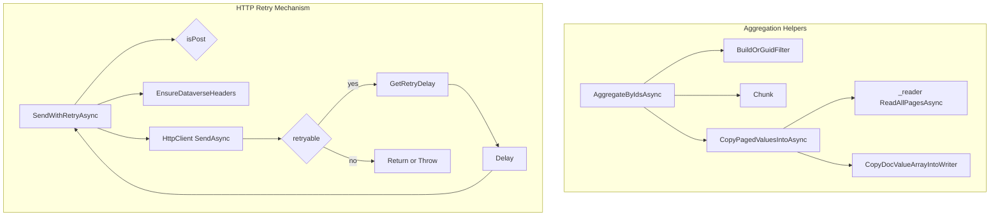

# FsaLineFetcherWorkflow.Helpers Feature Documentation

## Overview

The **FsaLineFetcherWorkflow.Helpers** partial class supplies foundational utilities for the **FsaLineFetcherWorkflow**. It centralizes:

- **OData query execution** with batching, paging, and chunking.
- **JSON aggregation** by streaming multiple pages into a single `JsonDocument`.
- **HTTP resilience** through retry logic with exponential backoff and header management.
- **Value extraction** helpers for `JsonElement` objects.

These helpers keep the core workflow focused on orchestration and enrichment, promote code reuse, and handle low-level concerns (network I/O, JSON streaming, filter building).

## Architecture Overview



## Component Structure

### FsaLineFetcherWorkflow.Helpers (src/Rpc.AIS.Accrual.Orchestrator.Infrastructure/Adapters/Fscm/Clients/FsaLineFetcherWorkflow.Helpers.cs)

- **Purpose**

Provides private utility methods for OData data fetching, JSON assembly, and HTTP request retries used by the `FsaLineFetcherWorkflow` class.

- **Collaborators**- `_http` (HttpClient): issues HTTP requests.
- `_reader` (IODataPagedReader): reads paged OData responses.
- `_log` (ILogger): logs progress and errors.
- `_opt` (FsOptions): configuration (page size, max pages, retry limits).

## Key Methods Reference

| Method | Signature | Returns | Description |
| --- | --- | --- | --- |
| **AggregateByIdsAsync** | `Task<JsonDocument> AggregateByIdsAsync(string entitySetName, string idProperty, IReadOnlyList<Guid> ids, string select, string? expand, string? orderBy, int chunkSize, CancellationToken ct)` | JsonDocument | Fetches multiple chunks of OData entity pages by GUIDs, streams all “value” arrays into one JSON. |
| **AggregatePagedAsync** | `Task<JsonDocument> AggregatePagedAsync(string initialUrl, int maxPages, string logEntityName, CancellationToken ct)` | JsonDocument | Shortcut to `_reader.ReadAllPagesAsync`. |
| **CopyDocValueArrayIntoWriter** (static) | `int CopyDocValueArrayIntoWriter(JsonDocument doc, Utf8JsonWriter writer)` | int | Writes each element of `doc.RootElement.value` to `writer`; returns count. |
| **CopyPagedValuesIntoAsync** | `Task<int> CopyPagedValuesIntoAsync(string initialUrl, int maxPages, Utf8JsonWriter writer, string logEntityName, CancellationToken ct)` | int | Fetches all pages via reader, then copies values array into writer. |
| **TryGetValueObject** (static) | `bool TryGetValueObject(JsonElement obj, string prop, out JsonElement valueObj)` | bool | Checks if `obj[prop]` exists and is an object. |
| **TryString** (static) | `string? TryString(JsonElement obj, string prop)` | string? | Returns string at `obj[prop]` or null. |
| **TryGuid** (static) | `bool TryGuid(JsonElement row, string prop, out Guid id)` | bool | Parses `obj[prop]` as GUID string. |
| **BuildOrGuidFilter** (static) | `string BuildOrGuidFilter(string property, IReadOnlyList<Guid> ids)` | string | Constructs an OData “or” filter across multiple GUID values. |
| **Chunk** (static) | `IEnumerable<IReadOnlyList<Guid>> Chunk(IReadOnlyList<Guid> source, int chunkSize)` | IEnumerable<…> | Splits a GUID list into fixed-size chunks. |
| **EmptyValueDocument** (static) | `JsonDocument EmptyValueDocument()` | JsonDocument | Returns a parsed `{"value":[]}` document. |
| **SendWithRetryAsync** | `Task<HttpResponseMessage> SendWithRetryAsync(Func<HttpRequestMessage> requestFactory, CancellationToken ct)` | HttpResponseMessage | Sends HTTP requests with headers, retries on transient errors (429, 5xx), respects `Retry-After`. |
| **IsRetryable** (static) | `bool IsRetryable(HttpStatusCode statusCode)` | bool | Indicates if status code should trigger retry (429 or ≥500). |
| **GetRetryDelay** (static) | `TimeSpan GetRetryDelay(HttpResponseMessage resp, int attempt)` | TimeSpan | Derives delay from `Retry-After` header or exponential backoff. |
| **SafeReadBodyAsync** (static) | `Task<string> SafeReadBodyAsync(HttpResponseMessage resp, CancellationToken ct)` | Task<string> | Attempts to read response body; returns placeholder on failure. |


## Paging & Chunking Strategy

- **Chunking**

Splits large GUID lists into batches using `Chunk(...)` to avoid URL-length limits and manage OData filters.

- **Filter Building**

`BuildOrGuidFilter` emits either a single equality or a parenthesized “or” list:

```csharp
  // Single ID:
  "property eq <guid>"

  // Multiple:
  "(property eq <guid1> or property eq <guid2> ...)"
```

- **Paged Fetching**

`AggregateByIdsAsync` loops over chunks and:

1. Builds the relative OData URL with `$select`, `$expand`, `$filter`, `$orderby`, and `$top`.
2. Logs start of each chunk.
3. Calls `CopyPagedValuesIntoAsync` to fetch pages and stream “value” entries to a shared `Utf8JsonWriter`.
4. Logs completion with row count and timing.

## JSON Aggregation Utilities

- **Streaming Write**

Uses `Utf8JsonWriter` over a `MemoryStream` to accumulate results without full in-memory lists.

- **Value Extraction**- `CopyDocValueArrayIntoWriter` appends `value` array entries from any `JsonDocument`.
- `EmptyValueDocument` provides a safe empty result.

- **Property Readers**- `TryGetValueObject`, `TryString`, `TryGuid` simplify conditional JSON access.

## HTTP Retry Mechanism

- **Idempotency Check**

Detects POST requests via a probe; only non-POST methods are retried (up to `MaxHttpAttempts`).

- **Header Enforcement**

`EnsureDataverseHeaders` injects:

- `Prefer: odata.maxpagesize=…, odata.include-annotations="OData.Community.Display.V1.FormattedValue"`
- `OData-MaxVersion: 4.0`
- `OData-Version: 4.0`
- `Accept: application/json`

- **Retry Logic**- Retries on **429 (Too Many Requests)** or **5xx** codes.
- Checks for a `Retry-After` header; otherwise uses `2^attempt` seconds, capped at 30s.
- Logs each attempt, failure reason, and delay.

- **Error Propagation**- On non-retryable failures, reads body safely and throws `HttpRequestException` with status and body.

## Dependencies

| Dependency | Role |
| --- | --- |
| HttpClient (`_http`) | Sends HTTP/OData requests |
| IODataPagedReader | Reads paged OData JSON responses |
| Utf8JsonWriter | Streams JSON output |
| JsonDocument | Represents aggregated JSON result |
| FsOptions (`_opt`) | Holds configuration: page size, max pages, retry settings |
| ILogger | Logs informational, warning, and error messages |
| MemoryStream | Buffers streaming JSON before parsing into `JsonDocument` |


## Error Handling

- **Argument Validation**- Throws `ArgumentException`, `ArgumentNullException`, or `ArgumentOutOfRangeException` for invalid parameters in public helpers.

- **HTTP Errors**- Wraps non-retryable HTTP failures in `HttpRequestException` including response body.
- Respects cancellation via `CancellationToken.ThrowIfCancellationRequested`.

## Key Classes Reference

| Class | Location | Responsibility |
| --- | --- | --- |
| FsaLineFetcherWorkflow.Helpers | src/Rpc.AIS.Accrual.Orchestrator.Infrastructure/Adapters/Fscm/Clients/FsaLineFetcherWorkflow.Helpers.cs | Low-level OData paging, chunking, JSON streaming, retry |
| IODataPagedReader | (injected) | Reads all pages of an OData feed |
| FsOptions | Rpc.AIS.Accrual.Orchestrator.Infrastructure.Options | Configuration for Dataverse API calls |
| Utf8JsonWriter | System.Text.Json | Writes JSON tokens to a stream |
| HttpClient | System.Net.Http | Performs HTTP requests |


## Dependencies & Relationships

- **FsaLineFetcherWorkflow**

This helper partial is invoked by the main `FsaLineFetcherWorkflow` methods in other partial files (`Public`, `Parsing`, `TaxabilityEnrichment`), enabling:

- Batched fetch of open work orders, products, services.
- Enrichment steps (warehouse lookup, virtual lookup, taxability).

Facade (`FsaLineFetcher`) delegates calls into `FsaLineFetcherWorkflow`, which in turn uses these helpers for actual data retrieval.