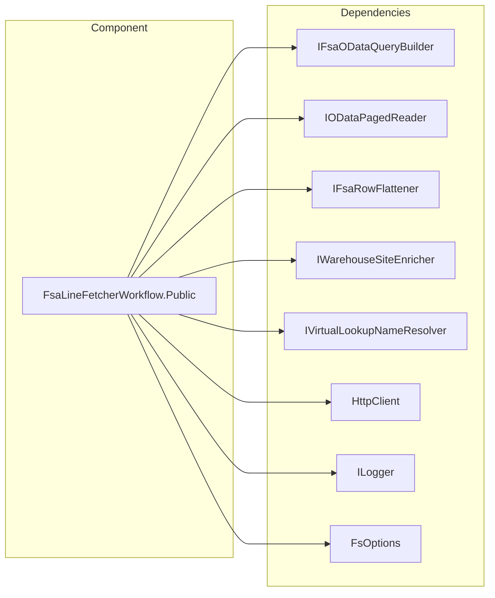

# FSA Line Fetcher Workflow – Public API

## Overview

The **FsaLineFetcherWorkflow** class orchestrates data retrieval and enrichment for Field Service Accrual (FSA).

It fetches open work orders, specific work orders, product lines, and service lines from Microsoft Dataverse.

It applies flattening, subproject augmentation, work-type splitting, and taxability enrichment.

## Architecture Overview



## Component Structure

### **FsaLineFetcherWorkflow** (src/Rpc.AIS.Accrual.Orchestrator.Infrastructure/Adapters/Fscm/Clients/FsaLineFetcherWorkflow.Public.cs)

This class exposes high-level methods to fetch and process FSA data. It delegates paging, query building, flattening, and enrichment to SRP-style components.

#### Dependencies

- **_qb**: Builds OData query URLs.
- **_reader**: Reads all OData pages.
- **_flattener**: Flattens nested JSON from expands.
- **_warehouseEnricher**: Enriches product lines with warehouse and site data.
- **_virtualLookupResolver**: Resolves virtual lookup names on line items.
- **_http**: Sends HTTP requests to Dataverse.
- **_log**: Logs informational and warning messages.
- **_opt**: Holds fetcher configuration options.

#### Public Methods

| Method | Signature | Description |
| --- | --- | --- |
| GetOpenWorkOrdersAsync | Task<JsonDocument> GetOpenWorkOrdersAsync(string filter, int pageSize, int maxPages, CancellationToken ct) | Fetches open work orders, flattens and enriches them with subproject and taxability. |
| GetWorkOrdersAsync | Task<JsonDocument> GetWorkOrdersAsync(IReadOnlyList<Guid> woIds, CancellationToken ct) | Fetches specified work orders and applies flattening and enrichment. |
| GetWorkOrderProductsAsync | Task<JsonDocument> GetWorkOrderProductsAsync(IReadOnlyList<Guid> woIds, CancellationToken ct) | Fetches product lines, enriches with warehouse, virtual lookups, and taxability. |
| GetWorkOrderServicesAsync | Task<JsonDocument> GetWorkOrderServicesAsync(IReadOnlyList<Guid> woIds, CancellationToken ct) | Fetches service lines, enriches with virtual lookups and taxability. |
| GetProductsAsync | Task<JsonDocument> GetProductsAsync(IReadOnlyList<Guid> productIds, CancellationToken ct) | Fetches product definitions by their GUIDs. |
| GetWorkOrderProductPresenceAsync | Task<JsonDocument> GetWorkOrderProductPresenceAsync(IReadOnlyList<Guid> woIds, CancellationToken ct) | Performs a lightweight presence query for product lines per work order. |
| GetWorkOrderServicePresenceAsync | Task<JsonDocument> GetWorkOrderServicePresenceAsync(IReadOnlyList<Guid> woIds, CancellationToken ct) | Performs a lightweight presence query for service lines per work order. |


#### Internal Helpers

- **PostProcessWorkOrders**

Adds SubProjectId, SubProjectName, and optionally filters missing subprojects.

- **TryGetLookup**

Extracts lookup id and formatted name from a JSON row.

- **EmptyValueDocument**

Returns `{"value":[]}` as a `JsonDocument`.

```csharp
private static JsonDocument PostProcessWorkOrders(JsonDocument doc, bool requireSubProject)
```

## Error Handling

- All public methods guard against null or empty inputs.
- They throw `ArgumentNullException`, `ArgumentException`, or `ArgumentOutOfRangeException` on invalid parameters.
- HTTP failures bubble as `HttpRequestException` from underlying paging reader or enrichment calls.

## Dependencies

- Rpc.AIS.Accrual.Orchestrator.Infrastructure.Options.FsOptions
- Rpc.AIS.Accrual.Orchestrator.Core.Abstractions.IFsaODataQueryBuilder
- Rpc.AIS.Accrual.Orchestrator.Infrastructure.Clients.IODataPagedReader
- Rpc.AIS.Accrual.Orchestrator.Infrastructure.Clients.IFsaRowFlattener
- Rpc.AIS.Accrual.Orchestrator.Infrastructure.Clients.IWarehouseSiteEnricher
- Rpc.AIS.Accrual.Orchestrator.Infrastructure.Clients.IVirtualLookupNameResolver
- System.Net.Http.HttpClient
- Microsoft.Extensions.Logging.ILogger<FsaLineFetcher>

```card
{
    "title": "Configuration Required",
    "content": "FsOptions.WorkOrderFilter and DataverseApiBaseUrl must be set in configuration."
}
```

## Key Classes Reference

| Class | Location | Responsibility |
| --- | --- | --- |
| FsaLineFetcherWorkflow | Infrastructure/Adapters/Fscm/Clients/FsaLineFetcherWorkflow.Public.cs | Orchestrates FSA data fetch, flattening, and enrichment from Dataverse. |
| FsOptions | Infrastructure/Options/FsOptions.cs (in context) | Holds pagination, filter, and enrichment settings for the fetcher. |
| IFsaODataQueryBuilder | Core/Abstractions/IFsaLineFetcher.cs (in context) | Defines methods to build OData query URLs. |
| IODataPagedReader | Infrastructure/Clients/Refactor/FsaClientAbstractions.cs (in context) | Reads OData pages using HttpClient. |
| IFsaRowFlattener | Infrastructure/Clients/Refactor/FsaClientAbstractions.cs (in context) | Flattens JSON from OData expand. |
| IWarehouseSiteEnricher | Infrastructure/Clients/Refactor/FsaClientAbstractions.cs (in context) | Enriches work order product lines with warehouse and site info. |
| IVirtualLookupNameResolver | Infrastructure/Clients/Refactor/FsaClientAbstractions.cs (in context) | Resolves virtual lookup names on line items. |


## Testing Considerations

- Verify exceptions on null or empty inputs.
- Confirm paging respects `pageSize` and `maxPages`.
- Test enrichment paths with and without enabled subproject requirement.
- Simulate empty GUID lists to ensure `EmptyValueDocument` is returned.