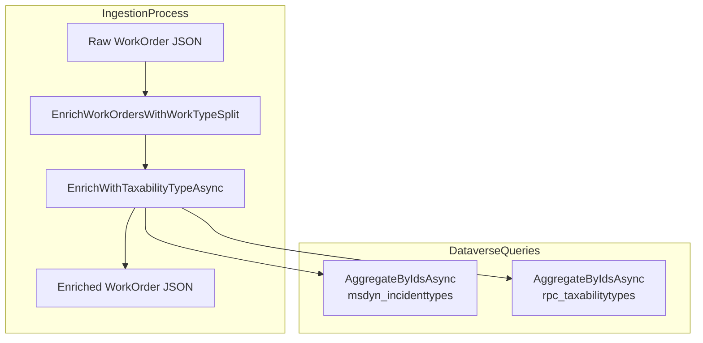
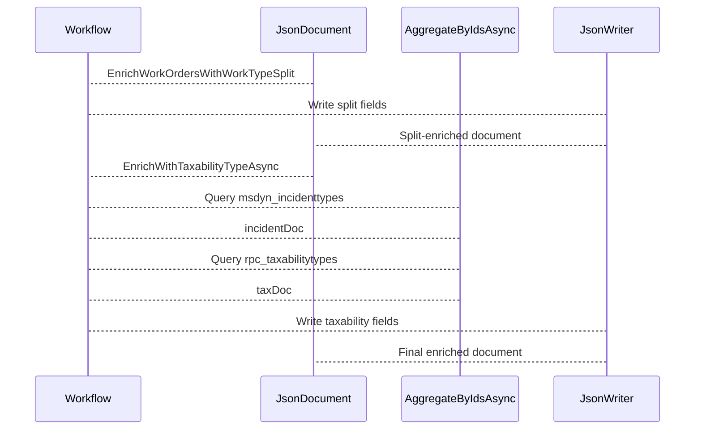

# FSA Line Fetcher Workflow – Taxability Enrichment

## Overview

This partial class adds two enrichment steps to the FsaLineFetcherWorkflow:

- **Work Type Split**: Parses the formatted work-type lookup value into separate “Well Name” and “Well Age” fields.
- **Taxability Lookup**: Resolves each record’s operation type to a taxability name by querying two Dataverse entity sets—incident types and taxability types—and injects “Taxability Type” and “FSATaxabilityType” into each JSON row.

These enrichments augment raw work-order JSON with business-critical attributes, enabling downstream processors to include well metadata and taxability information in delta payloads.

## Architecture Overview



## Component Structure

### Partial Class: FsaLineFetcherWorkflow

**Location:**

`src/Rpc.AIS.Accrual.Orchestrator.Infrastructure/Adapters/Fscm/Clients/FsaLineFetcherWorkflow.TaxabilityEnrichment.cs`

The class implements two enrichment methods on a JSON document of work-order rows. It relies on shared helpers (`AggregateByIdsAsync`, `DataverseSchema`) and runtime options (`_opt`).

#### Constants

| Name | Value | Purpose |
| --- | --- | --- |
| OperationTypeLookupField | `_rpc_operationtype_value` | Field holding operation-type lookup GUID |
| IncidentTypeEntitySet | `msdyn_incidenttypes` | Dataverse set for incident type records |
| IncidentTypeIdField | `msdyn_incidenttypeid` | Primary key for incident type |
| IncidentTypeTaxabilityLookupField | `_rpc_taxabilitytype_value` | Lookup field to taxability type on incident type |
| TaxabilityEntitySet | `rpc_taxabilitytypes` | Dataverse set for taxability type records |
| TaxabilityIdField | `rpc_taxabilitytypeid` | Primary key for taxability type |
| TaxabilityNameField | `rpc_name` | Name field on taxability record |
| PayloadTaxabilityKey | `Taxability Type` | JSON property key for injected taxability name |
| PayloadWellNameKey | `Well Name` | JSON property key for injected well name |
| PayloadWellAgeKey | `Well Age` | JSON property key for injected well age |


### Methods

#### 1. EnrichWorkOrdersWithWorkTypeSplit

**Signature:**

```csharp
internal JsonDocument EnrichWorkOrdersWithWorkTypeSplit(JsonDocument doc)
```

**Responsibilities:**

- Reads each row’s formatted work-type lookup:

`_rpc_worktypelookup_value@OData.Community.Display.V1.FormattedValue`.

- Splits on `_opt.WorkTypeSeparator` (default `" "`).
- Injects two new string properties per row:- `Well Name` (first segment)
- `Well Age` (second segment, if present)
- Preserves all existing fields.

**Logic Steps:**

1. Validate `doc` and ensure it contains a top-level `"value"` array.
2. For each row object:- Copy all properties.
- If the formatted lookup exists and is non-empty:- Split on separator, trim segments.
- Write `Well Name` and `Well Age` as available.
3. Return a new `JsonDocument` built via `Utf8JsonWriter`.

#### 2. EnrichWithTaxabilityTypeAsync

**Signature:**

```csharp
private async Task<JsonDocument> EnrichWithTaxabilityTypeAsync(
    JsonDocument doc,
    CancellationToken ct)
```

**Responsibilities:**

- Maps each row’s operation type GUID to a taxability name.
- Queries two Dataverse entity sets in sequence:1. **msdyn_incidenttypes**

Selects `msdyn_incidenttypeid` and `_rpc_taxabilitytype_value`.

1. **rpc_taxabilitytypes**

Selects `rpc_taxabilitytypeid` and `rpc_name`.

- Builds lookup dictionaries:- **incident type → taxability type ID**
- **taxability type ID → name**
- Writes two new string properties per row when mapping succeeds:- `Taxability Type`
- `FSATaxabilityType`
- Preserves all existing fields.

**Logic Steps:**

1. Validate `doc` and extract `"value"` array.
2. Collect distinct non-empty GUIDs from `_rpc_operationtype_value`.
3. If none, return original `doc`.
4. Fetch incident-type rows via `AggregateByIdsAsync`.
5. Build `Dictionary<Guid, Guid>` mapping incident IDs to taxability IDs.
6. If empty, return original `doc`.
7. Fetch taxability-type rows via `AggregateByIdsAsync`.
8. Build `Dictionary<Guid, string>` mapping taxability IDs to names.
9. If empty, return original `doc`.
10. Iterate rows:- Copy all properties.
- If row’s operation type maps to a taxability name:- Write `Taxability Type` and `FSATaxabilityType`.
11. Return new `JsonDocument` via `Utf8JsonWriter`.

## Data Enrichment Sequence



## Error Handling

- **Null or malformed JSON**

Methods return the original `JsonDocument` unchanged.

- **No lookup values found**

If no operation types or taxability mappings exist, methods skip enrichment and return original doc.

- **Empty or invalid GUIDs**

Rows with missing or non-parsable GUIDs are ignored in mapping loops.

## Dependencies

- **AggregateByIdsAsync** (helper in `FsaLineFetcherWorkflow.Helpers.cs`)
- **DataverseSchema.ODataFormattedSuffix** for formatted lookup suffix.
- **_opt.WorkTypeSeparator** and **_opt.OrFilterChunkSize** from `FsOptions`.
- **System.Text.Json** APIs: `JsonDocument`, `Utf8JsonWriter`.
- **System.IO** `MemoryStream` for in-memory JSON mutation.

## Key Class Reference

| Class | Location | Responsibility |
| --- | --- | --- |
| FsaLineFetcherWorkflow | `…/Infrastructure/Adapters/Fscm/Clients/FsaLineFetcherWorkflow.TaxabilityEnrichment.cs` | Enriches work-order JSON with well and taxability data. |


## Configuration

- **WorkTypeSeparator** (`string`)

Defines how to split the formatted work type; defaults to a single space if unset.

- **OrFilterChunkSize** (`int`)

Controls batch size when querying Dataverse for lookup records.

- **DefaultChunkSize** (`const int`)**=25**

Fallback chunk size for OData filters.