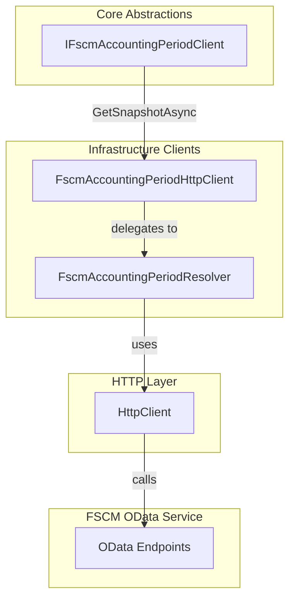
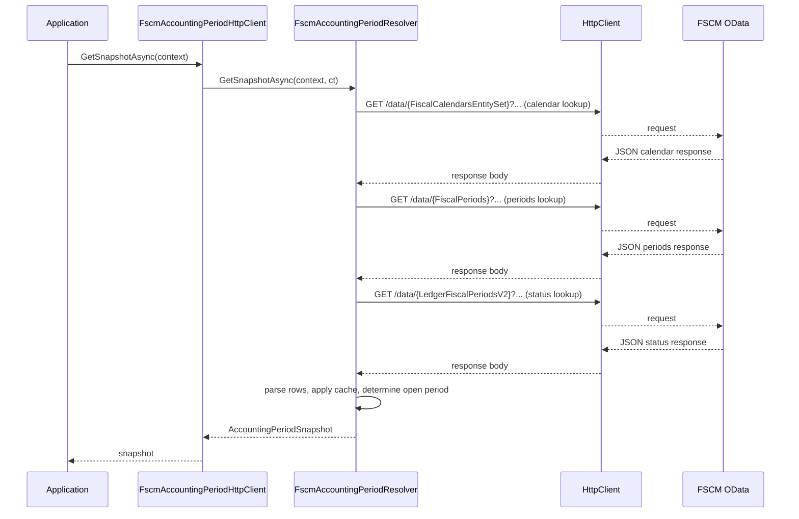

# Fscm Accounting Period HTTP Client Feature Documentation

## Overview

The **FscmAccountingPeriodHttpClient** provides a thin facade for retrieving accounting period snapshots from the FSCM OData service. It implements the `IFscmAccountingPeriodClient` interface and delegates all resolution logic to the `FscmAccountingPeriodResolver`. This snapshot is critical for classifying dates as open or closed periods and driving reversal logic within the orchestrator.

This component fits into the **Data Access Layer** of the application’s infrastructure, bridging the core orchestration logic with external FSCM endpoints. By centralizing HTTP calls, parsing, caching, and error handling in the resolver, it ensures a single source of truth for period resolution.

## Architecture Overview



## Component Structure

### Core Abstractions

#### **IFscmAccountingPeriodClient** (`src/Rpc.AIS.Accrual.Orchestrator.Core.Abstractions/IFscmAccountingPeriodClient.cs`)

- **Purpose**: Defines the contract for retrieving an accounting period snapshot.
- **Key Method**:- `Task<AccountingPeriodSnapshot> GetSnapshotAsync(RunContext context, CancellationToken ct);`

### Infrastructure Clients

#### **FscmAccountingPeriodHttpClient** (`src/Rpc.AIS.Accrual.Orchestrator.Infrastructure/Adapters/Fscm/Clients/FscmAccountingPeriodHttpClient.cs`)

- **Purpose**: Implements `IFscmAccountingPeriodClient` by forwarding calls to `FscmAccountingPeriodResolver`.
- **Constructor**:

```csharp
  public FscmAccountingPeriodHttpClient(
      HttpClient http,
      FscmOptions endpoints,
      ILogger<FscmAccountingPeriodHttpClient> logger,
      ILogger<FscmAccountingPeriodResolver> resolverLogger)
```

- **Validates** none of the injected dependencies are null.
- **Instantiates** `FscmAccountingPeriodResolver` with the provided `HttpClient`, `FscmOptions`, and resolver-specific logger.

#### **FscmAccountingPeriodResolver** (`src/Rpc.AIS.Accrual.Orchestrator.Infrastructure/Adapters/Fscm/Clients/FscmAccountingPeriodResolver.cs` and partial files)

- **Purpose**: Encapsulates all OData query construction, HTTP execution, JSON parsing, caching, and snapshot logic.
- **Responsibilities**:- **Calendar resolution** (partial: `Calendar.cs`)
- **Fiscal periods fetch** (partial: `Periods.cs`)
- **Ledger status fetch** (partial: `Periods.cs`)
- **Parsing helpers** (partial: `Parsing.cs`)
- **Out‐of‐window cache** (partial: `Cache.cs`)
- **HTTP execution** with retry and error handling (partial: `Http.cs`)
- **Key Outputs**:- **AccountingPeriodSnapshot** containing:- Current open period start date
- Closed reversal date strategy
- Snapshot min/max dates
- Functions to classify closed dates and resolve transaction dates

## Feature Flows

### Period Snapshot Retrieval



## Key Classes Reference

| Class | Location | Responsibility |
| --- | --- | --- |
| IFscmAccountingPeriodClient | src/Rpc.AIS.Accrual.Orchestrator.Core.Abstractions/IFscmAccountingPeriodClient.cs | Defines the contract for fetching accounting period snapshots. |
| FscmAccountingPeriodHttpClient | src/Rpc.AIS.Accrual.Orchestrator.Infrastructure/Adapters/Fscm/Clients/FscmAccountingPeriodHttpClient.cs | Thin facade implementing the interface and delegating to the resolver. |
| FscmAccountingPeriodResolver | src/Rpc.AIS.Accrual.Orchestrator.Infrastructure/Adapters/Fscm/Clients/FscmAccountingPeriodResolver.cs | Executes OData queries, parses JSON, caches results, and constructs the `AccountingPeriodSnapshot`. |
| HttpClient | .NET built-in class | Performs HTTP requests to external FSCM OData service. |
| FscmOptions | src/Rpc.AIS.Accrual.Orchestrator.Infrastructure/Options/FscmOptions.cs | Configuration for FSCM endpoints, entity sets, and field mappings. |


## Error Handling

- **Constructor validation**: `ArgumentNullException` is thrown if any dependency is null.
- **Resolver-level**: Handles HTTP 4xx/5xx with detailed exceptions, retries, and unauthorized detection within `SendODataAsync` (in `Http.cs` partial).

## Dependencies

- Microsoft.Extensions.Logging
- System.Net.Http.HttpClient
- Rpc.AIS.Accrual.Orchestrator.Infrastructure.Options.FscmOptions
- Rpc.AIS.Accrual.Orchestrator.Core.Abstractions.IFscmAccountingPeriodClient
- Rpc.AIS.Accrual.Orchestrator.Core.Domain.AccountingPeriodSnapshot

## Testing Considerations

- **AlwaysOpenAccountingPeriodClient**: A test double implementing `IFscmAccountingPeriodClient` returns a perpetually open snapshot (used in unit and integration tests).

---

This documentation is grounded in the existing code and contextual files, providing a clear view of how the FSCM accounting period client integrates into the orchestrator’s data access layer.