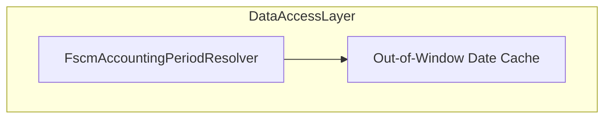

# Out-of-Window Date Cache Feature Documentation

## Overview

The **Out-of-Window Date Cache** provides a bounded, in-memory store for date-to-closed-status lookups outside the configured snapshot window. It boosts performance by avoiding repeated remote calls for identical out-of-window dates. This cache resides within the `FscmAccountingPeriodResolver` and is governed by the `OutOfWindowDateCacheSize` setting .

## Architecture Overview



## Component Structure

### Data Access Layer

#### **FscmAccountingPeriodResolver.Cache** (`src/Rpc.AIS.Accrual.Orchestrator.Infrastructure/Adapters/Fscm/Clients/FscmAccountingPeriodResolver.Cache.cs`)

- **Purpose**

Manages a thread-safe, bounded cache for dates outside the snapshot window in accounting period resolution.

- **Key Fields**- `_outOfWindowCacheLock` (object): Protects cache operations.
- `_outOfWindowClosedCache` (Dictionary<DateOnly,bool>): Stores date→isClosed entries.
- `_outOfWindowCacheOrder` (Queue<DateOnly>): Tracks insertion order for eviction.
- `_opt.OutOfWindowDateCacheSize` (int): Maximum cache entries, default 512 .
- **Key Methods**

| Method | Description |
| --- | --- |
| `void CacheOutOfWindow(DateOnly key, bool isClosed)` | Adds a date status if not already cached; evicts oldest entries when capacity is exceeded . |


```csharp
private void CacheOutOfWindow(DateOnly key, bool isClosed)
{
    lock (_outOfWindowCacheLock)
    {
        if (_outOfWindowClosedCache.ContainsKey(key)) return;
        _outOfWindowClosedCache[key] = isClosed;
        _outOfWindowCacheOrder.Enqueue(key);
        var max = _opt.OutOfWindowDateCacheSize <= 0 ? 512 : _opt.OutOfWindowDateCacheSize;
        while (_outOfWindowClosedCache.Count > max && _outOfWindowCacheOrder.Count > 0)
        {
            var old = _outOfWindowCacheOrder.Dequeue();
            _outOfWindowClosedCache.Remove(old);
        }
    }
}
```

## State Management

- **Thread Safety**: All cache writes occur under `_outOfWindowCacheLock` to prevent race conditions.
- **Eviction Policy**: FIFO removal of oldest entries once cache size exceeds `OutOfWindowDateCacheSize`.
- **Duplicate Prevention**: Existing keys are not overwritten or re-queued.

```card
{
    "title": "Thread Safety",
    "content": "Cache writes are synchronized using a lock to avoid concurrent access issues."
}
```

## Caching Strategy

- **Capacity**: Configurable via `OutOfWindowDateCacheSize`; defaults to 512 when set to zero or negative .
- **Insertion**: Only new dates are added; repeated lookups skip caching.
- **Eviction**: Oldest entries dequeued when count exceeds maximum.

## Dependencies

- **Configuration**: `FscmAccountingPeriodOptions.OutOfWindowDateCacheSize` .
- **Core**: Relies on `System.Collections.Generic` and `DateOnly` for keys.
- **Integration**: Used internally by `FscmAccountingPeriodResolver` to optimize out-of-window date checks.

## Integration Points

- **FscmAccountingPeriodResolver**- The resolver invokes `CacheOutOfWindow` when resolving transaction dates or checking closed status for dates outside the main period snapshot.
- The cache prevents redundant HTTP calls for repeated date-status queries.

## Key Classes Reference

| Class | Location | Responsibility |
| --- | --- | --- |
| FscmAccountingPeriodResolver | `Adapters/Fscm/Clients/FscmAccountingPeriodResolver.cs` | Core resolution of fiscal periods with caching logic. |
| FscmAccountingPeriodResolver.Cache | `Adapters/Fscm/Clients/FscmAccountingPeriodResolver.Cache.cs` | Manages bounded cache for out-of-window dates. |
| FscmAccountingPeriodOptions | `Infrastructure/Options/FscmOptions.cs` | Holds configuration including `OutOfWindowDateCacheSize`. |


## Testing Considerations

- **Cache Hit**: Verify repeated calls with the same date do not alter cache size.
- **Eviction**: Test that inserting one more than capacity evicts the oldest entry.
- **Concurrency**: Simulate parallel `CacheOutOfWindow` calls to ensure no exceptions or lost entries.