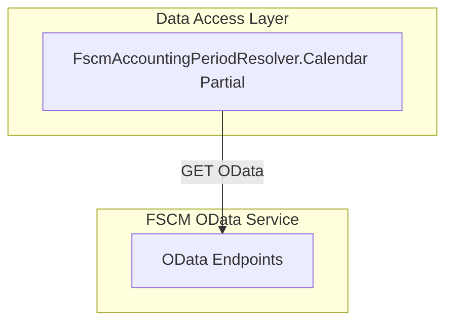
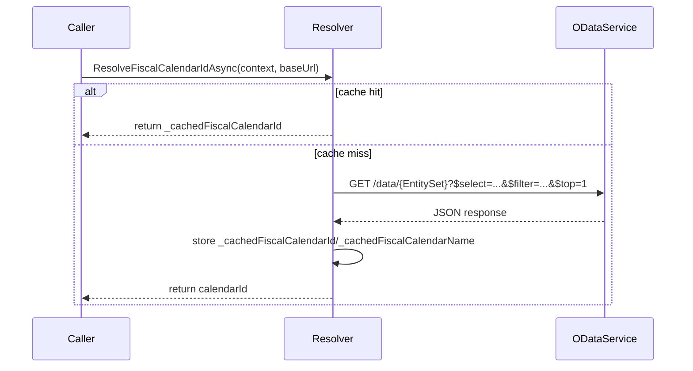

# Fiscal Calendar Resolution Feature Documentation

## Overview

The **Fiscal Calendar Resolution** feature locates and caches the FSCM fiscal calendar identifier based on a configured name. It ensures all subsequent accounting‐period queries use a consistent calendar id. By caching the result, it minimizes repeated HTTP calls and improves performance. Any misconfiguration or lookup failure surfaces clear errors with candidate hints to aid diagnostics.

## Architecture Overview



## Component Structure

### Data Access Layer

#### **FscmAccountingPeriodResolver.Calendar Partial** (`src/Rpc.AIS.Accrual.Orchestrator.Infrastructure/Adapters/Fscm/Clients/FscmAccountingPeriodResolver.Calendar.cs`)

- **Purpose**: Resolve the fiscal calendar id by name and cache it per process.
- **Responsibilities**:- Validate configuration (`FiscalCalendarName`, `FiscalCalendarEntitySet`).
- Perform OData lookups to find or list calendar ids.
- Cache the resolved id under `_cachedFiscalCalendarId` / `_cachedFiscalCalendarName`.
- Surface meaningful errors when lookup fails.

##### Methods

| Method | Description | Returns |
| --- | --- | --- |
| `ResolveFiscalCalendarIdAsync(RunContext, string, CancellationToken)` | Fetches or returns cached calendar id for the configured name. | `Task<string>` |
| `TryResolveCalendarIdAsync(RunContext, string, string, string, string, string, CancellationToken)` | Attempts a single‐row OData query filtering by field/value to retrieve the calendar id. | `Task<string?>` |
| `ListCalendarCandidatesAsync(RunContext, string, string, string, CancellationToken)` | Retrieves up to 10 calendar id samples for diagnostics when resolution fails. | `Task<List<string>>` |


##### Method Details

**ResolveFiscalCalendarIdAsync**

```csharp
private async Task<string> ResolveFiscalCalendarIdAsync(RunContext context, string baseUrl, CancellationToken ct)
{
    var configured = _opt.FiscalCalendarName?.Trim();
    if (string.IsNullOrWhiteSpace(configured))
        throw new InvalidOperationException("FSCM FiscalCalendarName is not configured.");

    if (!string.IsNullOrEmpty(_cachedFiscalCalendarId) 
        && string.Equals(_cachedFiscalCalendarName, configured, StringComparison.OrdinalIgnoreCase))
    {
        _logger.LogInformation("FSCM Calendar cache HIT. Configured={Configured} Calendar={Calendar}", configured, _cachedFiscalCalendarId);
        return _cachedFiscalCalendarId;
    }

    var entitySet = _opt.FiscalCalendarEntitySet?.Trim();
    if (string.IsNullOrWhiteSpace(entitySet))
        throw new InvalidOperationException("FSCM FiscalCalendarEntitySet is not configured.");

    // Lookup by name field
    var calendarId = await TryResolveCalendarIdAsync(context, baseUrl, entitySet,
        nameField: _opt.FiscalCalendarNameField.Trim(), 
        filterValue: configured, 
        selectField: _opt.FiscalCalendarIdField.Trim(), 
        ct).ConfigureAwait(false);

    // Fallback lookup by id field if name lookup yielded nothing
    if (string.IsNullOrWhiteSpace(calendarId) 
        && !string.Equals(_opt.FiscalCalendarNameField, _opt.FiscalCalendarIdField, StringComparison.OrdinalIgnoreCase))
    {
        calendarId = await TryResolveCalendarIdAsync(context, baseUrl, entitySet,
            filterField: _opt.FiscalCalendarIdField.Trim(), 
            filterValue: configured, 
            selectField: _opt.FiscalCalendarIdField.Trim(), 
            ct).ConfigureAwait(false);
    }

    if (string.IsNullOrWhiteSpace(calendarId))
    {
        var candidates = await ListCalendarCandidatesAsync(context, baseUrl, entitySet, _opt.FiscalCalendarIdField.Trim(), ct);
        var hint = candidates.Count == 0 
            ? "No calendars returned from FSCM." 
            : $"Available CalendarId samples: {string.Join(", ", candidates)}";
        throw new InvalidOperationException($"FSCM fiscal calendar not found. Configured='{configured}'. {hint}");
    }

    _cachedFiscalCalendarId = calendarId;
    _cachedFiscalCalendarName = configured;
    _logger.LogInformation("FSCM Calendar resolved. Configured={Configured} Calendar={Calendar}", configured, calendarId);
    return calendarId;
}
```

**TryResolveCalendarIdAsync**

```csharp
private async Task<string?> TryResolveCalendarIdAsync(
    RunContext context,
    string baseUrl,
    string entitySet,
    string filterField,
    string filterValue,
    string selectField,
    CancellationToken ct)
{
    var filter = $"{filterField} eq '{EscapeODataString(filterValue)}'";
    var url = $"{baseUrl.TrimEnd('/')}/data/{entitySet}?$select={Uri.EscapeDataString(selectField)}&$filter={Uri.EscapeDataString(filter)}&$top=1";
    var body = await SendODataAsync(context, "FSCM.Calendar", url, ct).ConfigureAwait(false);

    using var doc = JsonDocument.Parse(body);
    if (doc.RootElement.TryGetProperty("value", out var value) 
        && value.ValueKind == JsonValueKind.Array 
        && value.GetArrayLength() > 0)
    {
        var row = value[0];
        if (row.TryGetProperty(selectField, out var ce))
        {
            var id = ce.ValueKind == JsonValueKind.String 
                ? ce.GetString() 
                : ce.ToString();
            if (!string.IsNullOrWhiteSpace(id))
            {
                _logger.LogInformation("FSCM Calendar lookup success. FilterField={FilterField} FilterValue={FilterValue} Calendar={Calendar}", filterField, filterValue, id);
                return id;
            }
        }
    }

    _logger.LogWarning("FSCM Calendar lookup returned 0 rows. FilterField={FilterField} FilterValue={FilterValue}", filterField, filterValue);
    return null;
}
```

**ListCalendarCandidatesAsync**

```csharp
private async Task<List<string>> ListCalendarCandidatesAsync(
    RunContext context,
    string baseUrl,
    string entitySet,
    string calendarIdField,
    CancellationToken ct)
{
    var url = $"{baseUrl.TrimEnd('/')}/data/{entitySet}?$select={Uri.EscapeDataString(calendarIdField)}&$top=10";
    var body = await SendODataAsync(context, "FSCM.CalendarCandidates", url, ct).ConfigureAwait(false);
    var rows = ParseArray(body, "FSCM.CalendarCandidates");

    var list = new List<string>(Math.Min(rows.Count, 10));
    foreach (var r in rows)
    {
        var s = TryGetString(r, calendarIdField);
        if (!string.IsNullOrWhiteSpace(s))
            list.Add(s);
    }
    return list;
}
```

## API Integration

### FSCM Calendar Lookup

```api
{
    "title": "FSCM Calendar Lookup",
    "description": "Fetch a single calendar id by configured name or id field.",
    "method": "GET",
    "baseUrl": "https://<fscm-base-url>",
    "endpoint": "/data/{FiscalCalendarEntitySet}",
    "headers": [
        {
            "key": "Accept",
            "value": "application/json",
            "required": true
        },
        {
            "key": "x-run-id",
            "value": "<RunContext.RunId>",
            "required": false
        },
        {
            "key": "x-correlation-id",
            "value": "<RunContext.CorrelationId>",
            "required": false
        }
    ],
    "queryParams": [
        {
            "key": "$select",
            "value": "{FiscalCalendarIdField}",
            "required": true
        },
        {
            "key": "$filter",
            "value": "{FilterField} eq '{ConfiguredName}'",
            "required": true
        },
        {
            "key": "$top",
            "value": "1",
            "required": true
        }
    ],
    "pathParams": [],
    "bodyType": "none",
    "requestBody": "",
    "formData": [],
    "rawBody": "",
    "responses": {
        "200": {
            "description": "Success; returns an array under 'value'.",
            "body": "{\n  \"value\": [\n    { \"CalendarId\": \"<id>\" }\n  ]\n}"
        }
    }
}
```

### FSCM Calendar Candidates

```api
{
    "title": "FSCM Calendar Candidates",
    "description": "List up to 10 calendar id samples for diagnostics.",
    "method": "GET",
    "baseUrl": "https://<fscm-base-url>",
    "endpoint": "/data/{FiscalCalendarEntitySet}",
    "headers": [
        {
            "key": "Accept",
            "value": "application/json",
            "required": true
        },
        {
            "key": "x-run-id",
            "value": "<RunContext.RunId>",
            "required": false
        },
        {
            "key": "x-correlation-id",
            "value": "<RunContext.CorrelationId>",
            "required": false
        }
    ],
    "queryParams": [
        {
            "key": "$select",
            "value": "{FiscalCalendarIdField}",
            "required": true
        },
        {
            "key": "$top",
            "value": "10",
            "required": true
        }
    ],
    "pathParams": [],
    "bodyType": "none",
    "requestBody": "",
    "formData": [],
    "rawBody": "",
    "responses": {
        "200": {
            "description": "Success; returns an array of up to 10 calendar ids.",
            "body": "{\n  \"value\": [\n    { \"CalendarId\": \"id1\" },\n    { \"CalendarId\": \"id2\" }\n  ]\n}"
        }
    }
}
```

## Feature Flows

### 1. Calendar Resolution Flow



## Caching Strategy

- **Fields**:- `_cachedFiscalCalendarId`: stores the last resolved calendar id.
- `_cachedFiscalCalendarName`: stores the configured name tied to the cached id.
- **Policy**: Cache is valid for process lifetime. A lookup runs only if the configured name changes or cache is empty.

## Error Handling

- **Missing Configuration**

Throws `InvalidOperationException` if `FiscalCalendarName` or `FiscalCalendarEntitySet` is blank.

- **Lookup Failure**

Throws `InvalidOperationException` with hints when no calendar matches; includes candidate samples if available.

- **Logging**- Cache hits at INFO level.
- Zero‐row lookups at WARN level.

## Key Classes Reference

| Class | Location | Responsibility |
| --- | --- | --- |
| FscmAccountingPeriodResolver (partial) | `src/Rpc.AIS.Accrual.Orchestrator.Infrastructure/Adapters/Fscm/Clients/FscmAccountingPeriodResolver.Calendar.cs` | Locate and cache FSCM fiscal calendar identifier. |


## Dependencies

- **FscmAccountingPeriodOptions**: Supplies entity‐set names and field mappings.
- **RunContext**: Provides `RunId` and `CorrelationId` for distributed tracing.
- **ILogger**: Logs flow, cache hits, and warnings.
- **SendODataAsync**: Base HTTP GET helper used to call FSCM OData endpoints.
- **JsonDocument**: Parses JSON OData payloads.
- **ParseArray / TryGetString / EscapeODataString**: Utility methods for JSON handling in other partial files.

## Testing Considerations

- **Cache Behavior**: Validate scenarios where the same name yields a cache hit on second call.
- **Error Cases**:- Blank `FiscalCalendarName` or `EntitySet`.
- No matching calendar in FSCM (ensure exception message includes candidate hint).
- **Lookup Logic**: Confirm both name‐field and id‐field fallback lookups succeed as expected.