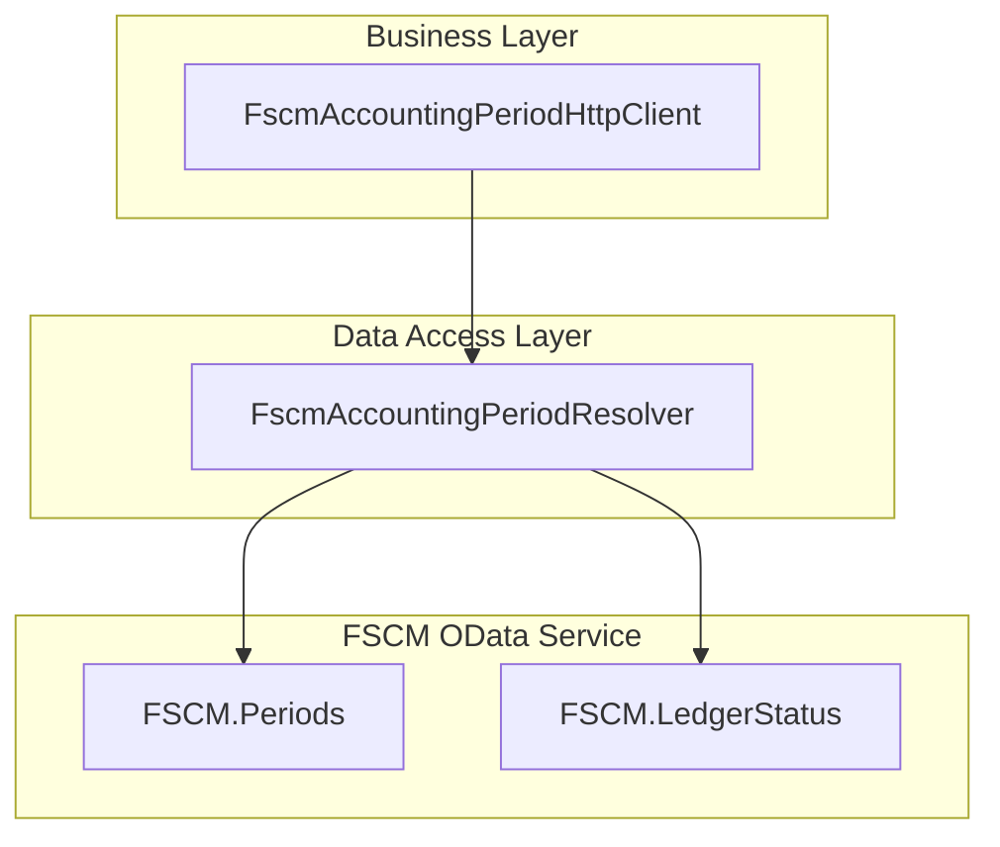
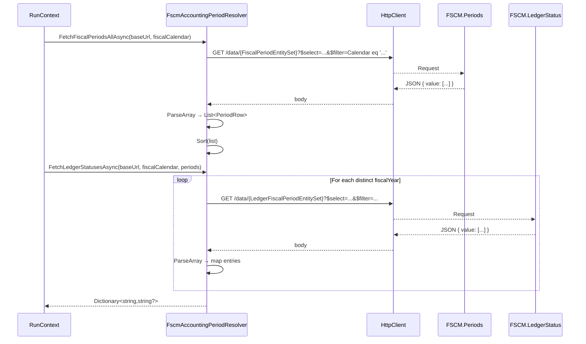

# FSCM Accounting Period Resolver – Periods Component

## Overview 🎯

The **FscmAccountingPeriodResolver.Periods** partial class implements core data-access logic for fetching and interpreting fiscal periods and ledger statuses from the FSCM OData API. It retrieves:

- All defined fiscal periods for a given calendar.
- Ledger period statuses (e.g. Open/Closed) per period.

This resolution underpins transaction-date determination and closed-period checks used across accrual and reversal workflows .

## Architecture Overview



## Component Structure

### Data Access Layer

#### FscmAccountingPeriodResolver.Periods.cs

*Path*: `src/Rpc.AIS.Accrual.Orchestrator.Infrastructure/Adapters/Fscm/Clients/FscmAccountingPeriodResolver.Periods.cs`

Implements methods to query the FSCM OData endpoints, parse JSON arrays into domain models, and map ledger statuses to period keys .

##### Key Methods

| Method | Description | Returns |
| --- | --- | --- |
| **FetchFiscalPeriodsAllAsync**<br/>`(RunContext, string baseUrl, string fiscalCalendar, CancellationToken)` | Calls `GET /data/{FiscalPeriodEntitySet}` filtered by calendar, parses `PeriodRow` entries, sorts by start date, year, and name. | `Task<List<PeriodRow>>` |
| **FetchLedgerStatusesAsync**<br/>`(RunContext, string baseUrl, string fiscalCalendar, List<PeriodRow>, CancellationToken)` | Batches by fiscal year, calls `GET /data/{LedgerFiscalPeriodEntitySet}`, constrains by calendar and optional `DataAreaId`, builds `Dictionary<string, string?>` mapping period keys to status. | `Task<Dictionary<string,string?>>` |
| **IsOpenStatus**<br/>`(IReadOnlyDictionary<string,string?>, string periodKey, RunContext)` | Logs and returns whether the given status value indicates an open period; missing/blank status ⇒ treated as closed (fail-closed). | `bool` |
| **IsOpenPeriodStatusValue**<br/>`(string status)` | Compares trimmed status against configured open status values (case-insensitive). | `bool` |
| **GetOpenStatusValues**<br/>`() ` | Retrieves open-status strings from options: `OpenPeriodStatusValues` list, else `OpenPeriodStatusValue`, else `["Open"]`. | `List<string>` |


## Data Models

#### PeriodRow

Defined in parsing helpers and used by fetch methods .

| Property | Type | Description |
| --- | --- | --- |
| Calendar | string | FSCM calendar identifier (e.g., "Fis Cal") |
| FiscalYear | string | Fiscal year label |
| PeriodName | string | Name of the period |
| StartDate | DateTime | Period start date (UTC date component) |
| EndDate | DateTime | Period end date (UTC date component) |
| **Key** | string | Composite key `"Calendar | FiscalYear | PeriodName"` |


```csharp
private sealed record PeriodRow(
    string Calendar,
    string FiscalYear,
    string PeriodName,
    DateTime StartDate,
    DateTime EndDate)
{
    public string Key => PeriodKey(Calendar, FiscalYear, PeriodName);
}
```

## Feature Flows

### Fiscal Periods & Status Mapping



## Error Handling

- **Missing Configuration**: Throws `InvalidOperationException` if any required entity-set or field name option is unset .
- **HTTP 404 on Ledger Status**: Catches 404 and fails closed with `InvalidOperationException` to prevent invalid posting dates.
- **Missing Status Row**: `IsOpenStatus` logs a warning and treats status as closed.

## Caching Strategy

This file does not implement caching; out-of-window date caching is handled in `FscmAccountingPeriodResolver.Cache.cs`.

## Integration Points

- **FscmAccountingPeriodHttpClient** delegates to this resolver to fulfill `IFscmAccountingPeriodClient.GetSnapshotAsync`.
- The resulting `AccountingPeriodSnapshot` is consumed by features like **PayloadPostingDateAdjuster** for transaction-date resolution.

## Key Classes Reference

| Class | Location | Responsibility |
| --- | --- | --- |
| **FscmAccountingPeriodResolver** | `.../FscmAccountingPeriodResolver*.cs` | Encapsulates fiscal period and ledger-status resolution logic |
| **FscmAccountingPeriodHttpClient** | `.../FscmAccountingPeriodHttpClient.cs` | Facade implementing `IFscmAccountingPeriodClient` |
| **PeriodRow** | `.../FscmAccountingPeriodResolver.Parsing.cs` | Data model carrying period details |
| **IFscmAccountingPeriodClient** | `.../IFscmAccountingPeriodClient.cs` | Interface defining snapshot retrieval contract |


## Dependencies

- **HttpClient**: Executes OData REST calls.
- **System.Text.Json**: Parses and enumerates JSON payloads.
- **Microsoft.Extensions.Logging**: Structured logging for diagnostics.
- **FscmAccountingPeriodOptions**: Configuration for entity-set names, field mappings, and open-status values.