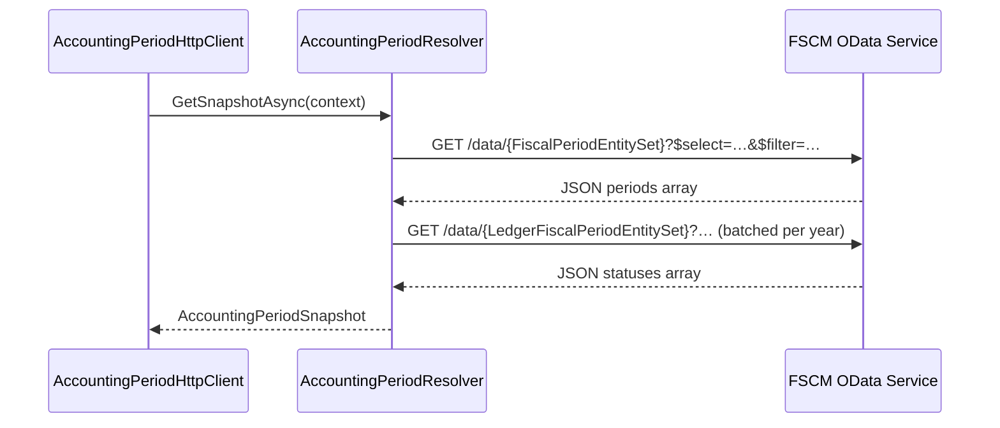

# FSCM Accounting Period Resolution Feature Documentation

## Overview

The **FSCM Accounting Period Resolution** feature provides AIS with a reliable source of truth for fiscal period dates and statuses from the FSCM system. It fetches all periods for a configured calendar, retrieves ledger period statuses, and constructs an `AccountingPeriodSnapshot` that:

- Identifies the current open period start date
- Defines snapshot bounds (min/max dates)
- Exposes delegates to determine if a date falls in a closed period
- Resolves effective transaction dates for closed-period reversals

This ensures journal reversals and delta calculations honor FSCM’s open/closed period rules. The logic is encapsulated in a dedicated resolver to uphold single-responsibility and facilitate testing.

## Architecture Overview

```mermaid
flowchart TB
    subgraph BusinessLayer [Business Layer]
        A[IFscmAccountingPeriodClient]
    end
    subgraph DataAccessLayer [Data Access Layer]
        B[FscmAccountingPeriodHttpClient] --> C[FscmAccountingPeriodResolver]
    end
    subgraph External [FSCM OData Service]
        C --> D[/data/{entitySet} endpoints/]
    end
    A --> B
```

## Component Structure

### Data Access Layer

#### **FscmAccountingPeriodResolver**

`src/Rpc.AIS.Accrual.Orchestrator.Infrastructure/Adapters/Fscm/Clients/FscmAccountingPeriodResolver.cs`

Encapsulates query building, HTTP calls, parsing, caching, and open/closed semantics .

- **Key Fields**- `_http`: HTTP client for OData calls
- `_opt`: Accounting period options (entity sets, field names, status values)
- `_cachedFiscalCalendarId/_cachedFiscalCalendarName`: Process-level cache for calendar lookup
- `_outOfWindowClosedCache`: Bounded cache mapping `DateOnly` → closed status

- **Key Methods**

| Method | Description | Returns |
| --- | --- | --- |
| `GetSnapshotAsync(context, ct)` | Orchestrates fetch of periods, statuses; builds `AccountingPeriodSnapshot`. | `Task<AccountingPeriodSnapshot>` |
| `FetchFiscalPeriodsAllAsync(...)` | Queries all fiscal periods for a calendar via OData and parses into `PeriodRow` list. | `Task<List<PeriodRow>>` |
| `FetchLedgerStatusesAsync(...)` | Retrieves ledger period statuses, builds map of `PeriodKey` → status value. | `Task<Dictionary<string, string?>>` |
| `ResolveBaseUrlOrThrow()` | Ensures FSCM base URL is configured; returns trimmed URL. | `string` |
| `SendODataAsync(context,step,url,ct)` | Sends HTTP GET, handles headers, logs, and error mapping for OData calls. | `Task<string>` |
| Parsing & Helpers | `ParseArray`, `TryGetString`, `TryGetDateTimeUtc`, `PeriodKey`, `IsOpenPeriodStatusValue` | Various |


#### **FscmAccountingPeriodHttpClient**

`src/Rpc.AIS.Accrual.Orchestrator.Infrastructure/Adapters/Fscm/Clients/FscmAccountingPeriodHttpClient.cs`

Thin façade implementing `IFscmAccountingPeriodClient`, delegating to the resolver .

- **Methods**

| Method | Description | Returns |
| --- | --- | --- |
| `GetSnapshotAsync(context, ct)` | Delegates to resolver’s `GetSnapshotAsync`. | `Task<AccountingPeriodSnapshot>` |


### Core Abstractions

#### **IFscmAccountingPeriodClient**

`src/Rpc.AIS.Accrual.Orchestrator.Core.Abstractions/IFscmAccountingPeriodClient.cs`

Defines contract for fetching an accounting period snapshot .

- **Methods**- `Task<AccountingPeriodSnapshot> GetSnapshotAsync(RunContext context, CancellationToken ct)`

## Sequence Flow

### 1. Snapshot Retrieval Flow



## Caching Strategy

- **Calendar ID Cache**:- Stores the resolved calendar ID and name in `_cachedFiscalCalendarId/_cachedFiscalCalendarName`.
- Safe for process-level reuse; no invalidation until restart.
- **Out-of-Window Date Cache**:- Bounded dictionary `DateOnly → bool` with corresponding FIFO queue.
- Size governed by `OutOfWindowDateCacheSize` option; evicts oldest entries when limit exceeded .

## Error Handling

- **Configuration**- Throws `InvalidOperationException` for missing entity-set or calendar configuration.
- **HTTP Errors**- 401/403 → `UnauthorizedAccessException`
- 429/5xx → `HttpRequestException` for transient retries
- 4xx (other) → `InvalidOperationException`
- **Parsing**- Logs warnings on missing `value` array or non-array responses; returns empty lists.
- Catches `JsonException`, logs error, and returns an empty list .

## Dependencies

- `HttpClient` (injected via DI with FSCM policies)
- `FscmOptions` & nested `FscmAccountingPeriodOptions` for configuration
- `ILogger<FscmAccountingPeriodResolver>` for structured logging
- Core domain types: `AccountingPeriodSnapshot`, `RunContext`, `PeriodRow` (inner record)
- .NET libraries: `System.Net.Http`, `System.Text.Json`, `System.Threading.Tasks`

## Testing Considerations

- **AlwaysOpenAccountingPeriodClient**- Test double that returns an always-open snapshot, bypassing HTTP calls.
- Facilitates unit tests for upstream delta/reversal logic .

## Key Classes Reference

| Class | Location | Responsibility |
| --- | --- | --- |
| FscmAccountingPeriodResolver | `.../FscmAccountingPeriodResolver.cs` | Encapsulates FSCM period resolution, parsing, caching, and semantics. |
| FscmAccountingPeriodHttpClient | `.../FscmAccountingPeriodHttpClient.cs` | Implements `IFscmAccountingPeriodClient`; delegates to resolver. |
| IFscmAccountingPeriodClient | `.../IFscmAccountingPeriodClient.cs` | Contract for fetching accounting period snapshots. |
| AlwaysOpenAccountingPeriodClient | `tests/.../AlwaysOpenAccountingPeriodClient.cs` | Test double returning an always-open period snapshot. |
