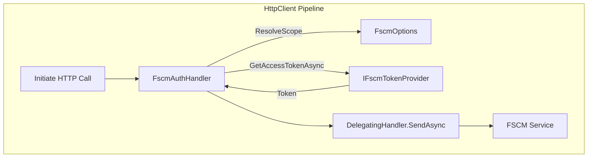

# FSCM Authentication Handler Feature Documentation

## Overview

The **FscmAuthHandler** injects Azure AD bearer tokens into outgoing HTTP requests destined for FSCM (Financial Supply Chain Management) services. It ensures each request carries a valid token scope, resolved per request host or via configuration. This handler integrates seamlessly into `HttpClient` pipelines to secure all FSCM API calls .

By centralizing token acquisition and header management, the handler simplifies client implementations and enforces consistent authentication. It logs token attachments at the debug level without exposing sensitive data.

## Architecture Overview



## Component Structure

### **FscmAuthHandler** (`src/Rpc.AIS.Accrual.Orchestrator.Infrastructure/Adapters/Fscm/Clients/FscmAuthHandler.cs`)

- **Purpose:**

Adds FSCM AAD bearer token to outbound HTTP requests.

It resolves the scope from the request URI or uses configured defaults.

- **Responsibilities:**- Acquire and attach bearer token.
- Resolve token scope per request.
- Prevent duplicate Authorization headers.
- Log token attachments securely.

#### Constructor

| Parameter | Type | Description |
| --- | --- | --- |
| `tokenProvider` | `IFscmTokenProvider` | Provides AAD token acquisition. |
| `authOptions` | `IOptions<FscmOptions>` | Holds default scope and per-host overrides. |
| `logger` | `ILogger<FscmAuthHandler>` | Records debug information about token attachment. |


```csharp
public FscmAuthHandler(
    IFscmTokenProvider tokenProvider,
    IOptions<FscmOptions> authOptions,
    ILogger<FscmAuthHandler> logger)
```

#### Methods

| Method | Signature | Description |
| --- | --- | --- |
| `SendAsync` | `override Task<HttpResponseMessage> SendAsync(HttpRequestMessage request, CancellationToken ct)` | Attaches Authorization header if missing, then forwards the request. |
| `ResolveScope` | `private string ResolveScope(Uri? uri)` | Determines token scope from request host or configuration. |


##### SendAsync Flow

```csharp
protected override async Task<HttpResponseMessage> SendAsync(
    HttpRequestMessage request, CancellationToken ct)
{
    if (request is null) 
        throw new ArgumentNullException(nameof(request));

    // Attach token only if not already present
    if (request.Headers.Authorization is null)
    {
        var scope = ResolveScope(request.RequestUri);
        var token = await _tokenProvider.GetAccessTokenAsync(scope, ct);
        request.Headers.Authorization = new AuthenticationHeaderValue("Bearer", token);

        _logger.LogDebug(
            "Attached FSCM bearer token. Host={Host} Scope={Scope} Method={Method} Url={Url}",
            request.RequestUri?.Host, scope, request.Method, request.RequestUri);
    }

    return await base.SendAsync(request, ct);
}
```

##### ResolveScope Logic

- If `RequestUri` is missing or host empty:- Return `_auth.DefaultScope` if set.
- Otherwise throw `InvalidOperationException`.
- If `ScopesByHost` contains an override for the host, use it.
- Else use `_auth.DefaultScope` if configured.
- Fallback: derive scope as `https://{host}/.default`.

```csharp
private string ResolveScope(Uri? uri)
{
    if (uri is null || string.IsNullOrWhiteSpace(uri.Host))
    {
        if (!string.IsNullOrWhiteSpace(_auth.DefaultScope))
            return _auth.DefaultScope;
        throw new InvalidOperationException(
            "Cannot resolve FSCM scope: request URI/host is missing and DefaultScope is empty.");
    }

    var host = uri.Host;
    if (_auth.ScopesByHost?.TryGetValue(host, out var overrideScope) == true &&
        !string.IsNullOrWhiteSpace(overrideScope))
    {
        return overrideScope;
    }

    if (!string.IsNullOrWhiteSpace(_auth.DefaultScope))
        return _auth.DefaultScope;

    return $"https://{host}/.default";
}
```

## Configuration Options

**FscmOptions** (`Rpc.AIS.Accrual.Orchestrator.Infrastructure.Options.FscmOptions`) supports:

- `DefaultScope` (string): Global default token scope.
- `ScopesByHost` (Dictionary<string,string>): Per-host scope overrides.

These values typically bind from configuration under `Fscm` section.

## Handler Registration

In `Program.cs`, the handler attaches to all FSCM HTTP clients:

```csharp
services.AddHttpClient<FscmSubProjectHttpClient>(...)
    .AddHttpMessageHandler<FscmAuthHandler>();
```

This pattern applies to clients like `FscmBaselineFetcher`, `FscmGlobalAttributeMappingHttpClient`, and others .

## Error Handling

- Throws `ArgumentNullException` if `request` is null or constructor arguments are missing.
- Throws `InvalidOperationException` when scope resolution fails due to missing host and default scope.

## Logging

- **Debug**: Logs token attachment details (host, scope, method, URL).
- Does **not** log token values to avoid secret exposure.

## Dependencies & Relationships

- **IFscmTokenProvider**: Abstract token provider interface.
- **FscmBearerTokenProvider**: `IFscmTokenProvider` implementation with per-scope caching.
- **HttpClient**: The handler sits within the message pipeline of each FSCM-bound client.

## Architectural Flow

```mermaid
flowchart LR
    ClientCode -->|HttpClient.SendAsync| FscmAuthHandler
    FscmAuthHandler -->|ResolveScope| FscmOptions
    FscmAuthHandler -->|GetAccessTokenAsync| IFscmTokenProvider
    IFscmTokenProvider -->|AAD/AzureIdentity| Azure AD
    FscmAuthHandler -->|Attach Token| NextHandler
    NextHandler -->|Forward Request| FSCM API
```

## Key Classes Reference

| Class | Location | Responsibility |
| --- | --- | --- |
| `FscmAuthHandler` | `Adapters/Fscm/Clients/FscmAuthHandler.cs` | Adds and logs AAD bearer token on HTTP requests. |
| `IFscmTokenProvider` | `Adapters/Fscm/Clients/IFscmTokenProvider.cs` | Defines token acquisition contract. |
| `FscmBearerTokenProvider` | `Adapters/Fscm/Clients/FscmBearerTokenProvider.cs` | Caches and retrieves AAD tokens per scope. |


## Usage Example

```csharp
// In Azure Functions startup or DI configuration:
services.AddHttpClient<FscmInvoiceAttributesHttpClient>(sp =>
{
    var opt = sp.GetRequiredService<IOptions<FscmOptions>>().Value;
    http.BaseAddress = new Uri(opt.BaseUrl, UriKind.Absolute);
})
.AddHttpMessageHandler<FscmAuthHandler>();
```

This ensures every call from `FscmInvoiceAttributesHttpClient` carries a valid FSCM bearer token.