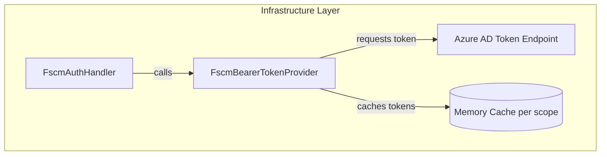
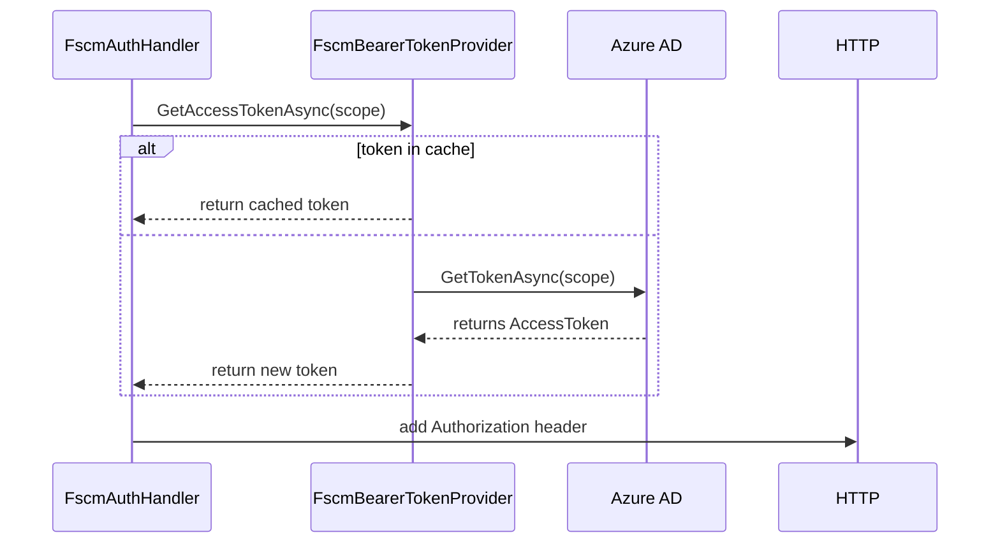

# FSCM Bearer Token Provider Feature Documentation

## Overview

The **FscmBearerTokenProvider** class handles Azure AD client-credentials authentication for FSCM HTTP clients. It acquires and caches bearer tokens per scope (typically per FSCM host) to minimize repeated token requests and ensure thread-safe access across multiple application instances. Business value includes reduced latency, lower token issuance load on Azure AD, and consistent authentication for downstream FSCM API calls.

This component sits in the **Infrastructure** layer of the Accrual Orchestrator and implements the `IFscmTokenProvider` interface, making it injectable into HTTP message handlers or clients that call FSCM services .

## Architecture Overview



## Component Structure

### Infrastructure Layer

#### **FscmBearerTokenProvider** (`src/Rpc.AIS.Accrual.Orchestrator.Infrastructure/Adapters/Fscm/Clients/FscmBearerTokenProvider.cs`)

- **Responsibility**: Acquire and cache AAD access tokens for FSCM scopes.
- **Registration**: Add as a **singleton** in DI.
- **Interface**: Implements `IFscmTokenProvider` .

## Class Details

| Class | Namespace | Path |
| --- | --- | --- |
| FscmBearerTokenProvider | Rpc.AIS.Accrual.Orchestrator.Infrastructure.Clients | src/Rpc.AIS.Accrual.Orchestrator.Infrastructure/Adapters/Fscm/Clients/FscmBearerTokenProvider.cs |


### Constructor

```csharp
public FscmBearerTokenProvider(IOptions<FscmOptions> options)
```

- Validates that `TenantId`, `ClientId`, and `ClientSecret` are provided in `FscmOptions`.
- Instantiates an Azure `ClientSecretCredential` for token requests .

### Key Properties

| Field | Type | Description |
| --- | --- | --- |
| _credential | ClientSecretCredential | Azure Identity credential for client-auth. |
| _cache | ConcurrentDictionary<string, AccessToken> | Per-scope token cache. |
| _locks | ConcurrentDictionary<string, SemaphoreSlim> | Per-scope lock to prevent token stampede. |


## Key Methods

### GetAccessTokenAsync

```csharp
public async Task<string> GetAccessTokenAsync(string scope, CancellationToken ct)
```

- **Parameters**- `scope`: The AAD resource scope (e.g. `https://{host}/.default`).
- `ct`: Cancellation token for async operations.
- **Returns**- A valid bearer token string.
- **Behavior**1. **Fast path**: If a non-expired token (>2 min TTL) exists in `_cache`, return it.
2. **Synchronize**: Acquire a per-scope `SemaphoreSlim` to avoid concurrent token requests.
3. **Double-check** cache under lock.
4. **Request** a new token from Azure AD via `_credential.GetTokenAsync`.
5. **Cache** the fresh `AccessToken`.
6. **Release** the semaphore.
7. **Return** the token string .

```csharp
// Fast path check
if (_cache.TryGetValue(scope, out var cached)
    && cached.ExpiresOn > DateTimeOffset.UtcNow.AddMinutes(2))
{
    return cached.Token;
}

// Ensure only one fetch per scope
var gate = _locks.GetOrAdd(scope, _ => new SemaphoreSlim(1,1));
await gate.WaitAsync(ct);
try {
    // Double-check, then acquire and cache new token
    var token = await _credential.GetTokenAsync(new TokenRequestContext(new[]{scope}), ct);
    _cache[scope] = token;
    return token.Token;
}
finally {
    gate.Release();
}
```

## Caching Strategy

- **Cache Key**: The exact scope string (case-insensitive).
- **Expiration**: Tokens with >2 minutes remaining TTL are reused.
- **Invalidation**: When token TTL falls below 2 minutes, a new token is fetched and replaces the old one.
- **Concurrency**: A dedicated `SemaphoreSlim` per scope prevents simultaneous token requests from multiple threads or instances.

## Error Handling

- Throws `ArgumentException` if `scope` is null or whitespace.
- Throws `InvalidOperationException` if required `FscmOptions` (TenantId/ClientId/ClientSecret) are missing.
- Propagates token-request exceptions from Azure Identity.

## Dependencies

- **Azure.Core** & **Azure.Identity**: For `ClientSecretCredential` and `AccessToken`.
- **Microsoft.Extensions.Options**: To bind `FscmOptions` configuration.
- **System.Collections.Concurrent**: For thread-safe caches and locks.

## Integration Points

- **FscmAuthHandler** uses `FscmBearerTokenProvider` to attach the `Authorization: Bearer` header on outgoing HTTP requests to FSCM APIs .
- Registered in `Program.cs` alongside HTTP clients calling FSCM endpoints.

## Sequence of Token Acquisition



## Key Classes Reference

| Class | Path | Responsibility |
| --- | --- | --- |
| FscmBearerTokenProvider | src/.../FscmBearerTokenProvider.cs | Acquire & cache AAD tokens for FSCM scopes |
| IFscmTokenProvider | src/.../IFscmTokenProvider.cs | Abstraction for FSCM token providers |
| FscmAuthHandler | src/.../FscmAuthHandler.cs | HTTP handler to attach FSCM bearer token header |


## Testing Considerations

- Verify that concurrent calls to `GetAccessTokenAsync` for the same scope result in only **one** call to Azure AD.
- Test cache expiry path by simulating token TTL near expiration.
- Ensure exceptions bubble correctly when misconfigured or when Azure AD fails.

---

<small>Documentation generated from source code at `src/Rpc.AIS.Accrual.Orchestrator.Infrastructure/Adapters/Fscm/Clients/FscmBearerTokenProvider.cs` .</small>