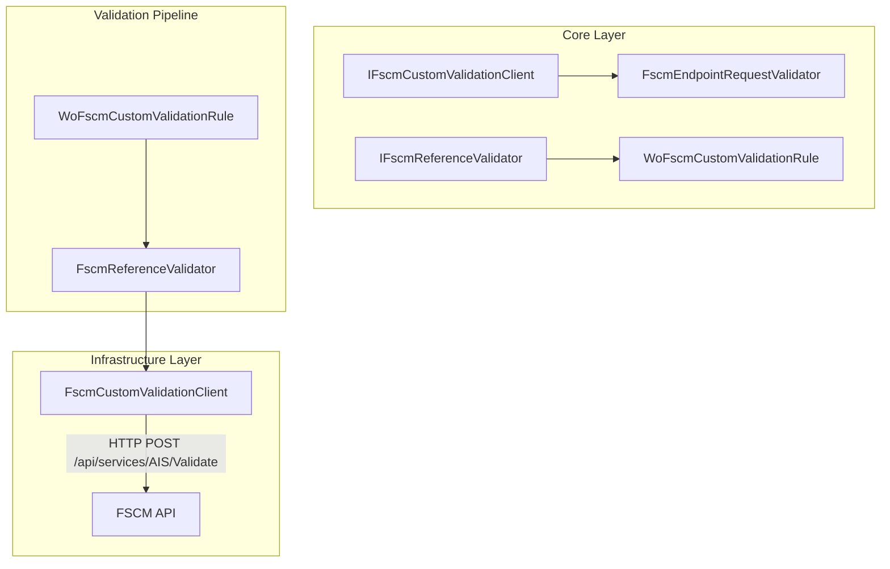

# FSCM Custom Validation Feature Documentation

## Overview

The **FSCM Custom Validation** feature adds a remote validation step to the AIS Work Order orchestration pipeline. After local contract checks, it calls a customer-specific FSCM endpoint to ensure payloads meet external business rules. Failures returned by FSCM are classified as **Invalid**, **Retryable**, or **Fail-Fast**, influencing downstream processing and error handling.

This feature improves data quality by deferring to the authoritative FSCM system for final validation. It fits into the existing validation pipeline via a dedicated client (`FscmCustomValidationClient`) and a pipeline rule (`WoFscmCustomValidationRule`).

## Architecture Overview



## Component Structure

### 1. Core Abstractions & Options

#### **IFscmCustomValidationClient**

`src/Rpc.AIS.Accrual.Orchestrator.Application/Ports/Common/Abstractions/IFscmCustomValidationClient.cs`

Defines the contract for invoking the FSCM custom validation endpoint.

- **Method**

```csharp
  Task<IReadOnlyList<WoPayloadValidationFailure>> ValidateAsync(
      RunContext context,
      JournalType journalType,
      string company,
      string woPayloadJson,
      CancellationToken ct);
```

#### **FscmCustomValidationOptions**

`src/Rpc.AIS.Accrual.Orchestrator.Application/Options/FscmCustomValidationOptions.cs`

| Property | Type | Default | Description |
| --- | --- | --- | --- |
| EndpointPath | string | "/api/services/AIS/Validate" | Relative path under FSCM base URL. |
| TimeoutSeconds | int | 60 | HTTP timeout in seconds for validation call. |


#### **PayloadValidationOptions**

`src/Rpc.AIS.Accrual.Orchestrator.Core.Options`

- **Key Policy**:- `FailClosedOnFscmCustomValidationError` (bool)

Determines whether transport errors result in **Fail-Fast** or **Retryable** failures.

#### **FscmEndpointRequestValidator**

`src/.../FscmEndpointRequestValidator.cs`

- **Purpose**: Validates local request objects before calling FSCM.
- **Key Methods**:- `Validate<TRequest>(FscmEndpointType endpoint, TRequest? request, params RequiredFieldRule<TRequest>[] rules)`
- `Required<TRequest>(string fieldName, Func<TRequest,string?> getValue, ...)`
- `RequiredGuid<TRequest>(...)`

#### **RequiredFieldRule<TRequest>**

`src/.../RequiredFieldRule.cs`

| Property | Type | Description |
| --- | --- | --- |
| FieldName | string | Name of the required request field. |
| IsSatisfied | Func<TRequest,bool> | Predicate that checks field presence/validity |
| ErrorCode | string? | Custom error code. |
| Message | string? | Custom error message. |


#### **EndpointValidationError**

`src/.../EndpointValidationError.cs`

| Property | Type | Description |
| --- | --- | --- |
| Code | string | Unique error identifier. |
| Message | string | Human-readable error message. |


### 2. Infrastructure Client

#### **FscmCustomValidationClient**

`src/Rpc.AIS.Accrual.Orchestrator.Infrastructure/Adapters/Fscm/Clients/FscmCustomValidationClient.cs`

Handles the HTTP call to the FSCM custom validation endpoint.

- **Dependencies**- `HttpClient _http`
- `ILogger<FscmCustomValidationClient> _log`
- `PayloadValidationOptions _policy`
- `FscmCustomValidationOptions _options`

- **Constructor**

```csharp
  public FscmCustomValidationClient(
      HttpClient http,
      ILogger<FscmCustomValidationClient> log,
      IOptions<PayloadValidationOptions> policy,
      IOptions<FscmCustomValidationOptions> options)
```

- **ValidateAsync**

```csharp
  public async Task<IReadOnlyList<WoPayloadValidationFailure>> ValidateAsync(
      RunContext context,
      JournalType journalType,
      string company,
      string woPayloadJson,
      CancellationToken ct)
```

**Flow**

1. **Company missing** → return **Fail-Fast** failure.
2. **Empty payload** → return empty list.
3. Build `POST` to `_options.EndpointPath`, adding headers: `x-company`, `x-journalType`.
4. Send request; read response body.
5. **Non-2xx** → `BuildTransportFailure`
6. **Exception** → `BuildExceptionFailure`
7. **2xx & non-empty body** → `TryParseFailures`

- **Supporting Methods**

| Method | Description |
| --- | --- |
| `BuildTransportFailure` | Wraps non-success HTTP status into a single `WoPayloadValidationFailure`. |
| `BuildExceptionFailure` | Wraps exception into a single `WoPayloadValidationFailure`. |
| `TryParseFailures` | Best-effort JSON parsing for keys: `failures`, `errors`, `validationErrors` |
| `ReadString/ReadGuid` | Helpers to extract string or GUID fields from `JsonElement`. |
| `ReadDisposition` | Maps text severity to `ValidationDisposition` enum. |
| `Truncate` | Shortens long response snippets for logs. |


### 3. Validation Pipeline Integration

#### **IFscmReferenceValidator**

`src/Rpc.AIS.Accrual.Orchestrator.Application/Ports/Common/Abstractions/IFscmReferenceValidator.cs`

Defines the method to apply FSCM custom validation within the WO pipeline.

- **Method**

```csharp
  Task ApplyFscmCustomValidationAsync(
      RunContext context,
      JournalType journalType,
      List<WoPayloadValidationFailure> invalidFailures,
      List<WoPayloadValidationFailure> retryableFailures,
      List<FilteredWorkOrder> validWorkOrders,
      List<FilteredWorkOrder> retryableWorkOrders,
      Stopwatch stopwatch,
      CancellationToken ct);
```

#### **FscmReferenceValidator**

`src/.../FscmReferenceValidator.cs`

Groups valid WOs by company, calls the custom validator, then:

- **Classifies** failures into **invalid** or **retryable**.
- **Handles Fail-Fast**: clears payload when a fail-fast error appears.
- **Filters** out work orders with remote failures.

#### **WoFscmCustomValidationRule**

`src/.../WoFscmCustomValidationRule.cs`

Implements `IWoPayloadRule`; delegates to `FscmReferenceValidator`.

```csharp
public async Task ApplyAsync(WoPayloadRuleContext ctx, CancellationToken ct)
    => await _validator.ApplyFscmCustomValidationAsync(
        ctx.RunContext, ctx.JournalType,
        ctx.InvalidFailures, ctx.RetryableFailures,
        ctx.ValidWorkOrders, ctx.RetryableWorkOrders,
        ctx.Stopwatch, ct);
```

## Data Models

| Model | Key Properties |
| --- | --- |
| WoPayloadValidationFailure | `WorkOrderGuid`, `WorkOrderNumber`, `JournalType`, `LineGuid`, `Code`, `Message`, `Disposition` |
| FilteredWorkOrder | `WorkOrder` (JSON payload), plus metadata for pipeline filtering. |


## Error Handling

> Core domain types not fully shown here; summarizing key validation model.

- **Configuration-driven Disposition**:

`PayloadValidationOptions.FailClosedOnFscmCustomValidationError` toggles **Fail-Fast** vs **Retryable** on transport or exception errors.

- **Unknown JSON Schema**:

If parsing fails or schema is unrecognized, the client treats the call as a success (returns empty failures) to avoid blocking.

## Dependencies

- Microsoft.Extensions.Http (typed `HttpClient`)
- Microsoft.Extensions.Logging
- Microsoft.Extensions.Options
- Rpc.AIS.Accrual.Orchestrator.Core (domain models, interfaces, options)

## Integration Points

- **Dependency Injection** (`Program.cs`):- Registers `FscmCustomValidationClient` with `HttpClient` using `FscmOptions.BaseUrl`.
- Applies `FscmAuthHandler` for authentication.
- Maps `IFscmCustomValidationClient` to the concrete implementation.
- Integrates with the WO validation pipeline via `WoFscmCustomValidationRule`.

## Testing Considerations

- Although no direct tests cover `FscmCustomValidationClient`, the **WO payload client** (`FscmWoPayloadValidationClient`) is covered by `FscmWoPayloadValidationClientContractTests`.
- **Key Scenarios**:- Missing configuration (path empty)
- HTTP 2xx with valid/empty body
- Non-2xx status codes
- Exceptions during HTTP call
- JSON parsing of known error schemas

---

This documentation outlines the **FSCM Custom Validation** feature: its purpose, how it integrates into the orchestration pipeline, and the key classes, methods, and error-handling patterns employed to ensure robust remote validation against customer-specific FSCM rules.