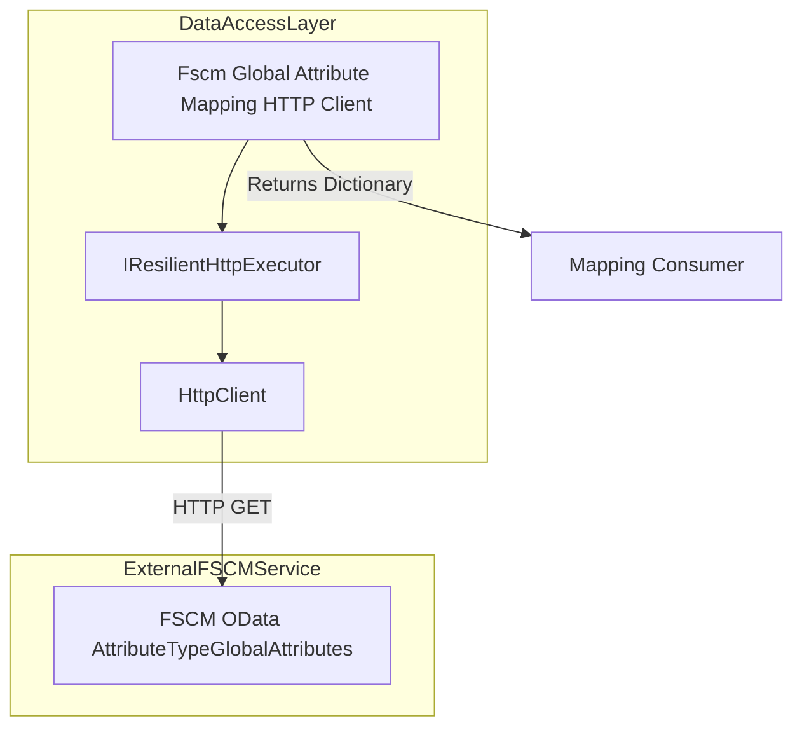
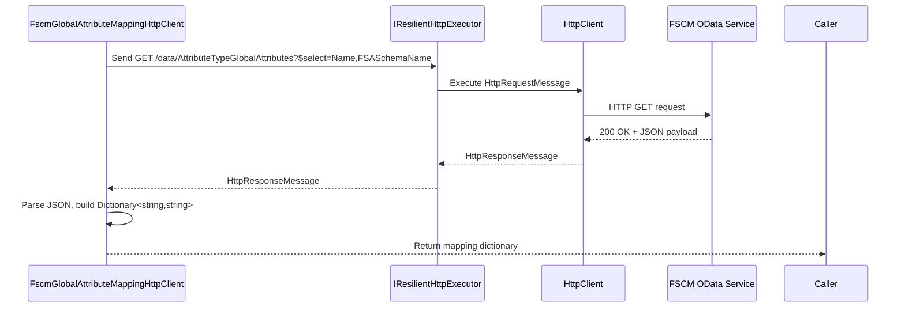

# Global Attribute Mapping Feature Documentation

## Overview

The **Global Attribute Mapping** feature retrieves and caches the mapping between FSA attribute keys and FSCM attribute names from the FSCM OData service. This mapping enables runtime translation of attribute identifiers when orchestrating invoice and posting operations.

By loading the `AttributeTypeGlobalAttributes` entity set into memory, downstream components can look up FSCM attribute names by their FSA schema names, ensuring consistent attribute handling. In case of failures, the client returns an empty map, allowing callers to fall back on configuration-based mappings.

## Architecture Overview



## Component Structure

### Data Access Layer

#### **FscmGlobalAttributeMappingHttpClient** (`src/Rpc.AIS.Accrual.Orchestrator.Infrastructure/Adapters/Fscm/Clients/FscmGlobalAttributeMappingHttpClient.cs`)

- **Purpose:**

Loads the FSCM OData entity set `AttributeTypeGlobalAttributes` into an in-memory map of FSA schema names to FSCM attribute names.

- **Dependencies:**- `HttpClient _http`
- `FscmOptions _opt` (base URL and entity set name)
- `IResilientHttpExecutor _executor` (retries, transient-fault handling)
- `ILogger<FscmGlobalAttributeMappingHttpClient> _logger`
- **Key Methods:**- `Task<IReadOnlyDictionary<string, string>> GetFsToFscmNameMapAsync(RunContext ctx, CancellationToken ct)`

Fetches and parses the OData feed, returning a case-insensitive dictionary.

## Data Models

#### AttributeTypeGlobalAttributes Entity

| Property | Type | Description |
| --- | --- | --- |
| FSASchemaName | string | The FSA attribute logical name (key) |
| Name | string | The corresponding FSCM attribute name |


## API Integration

### Fetch Global Attribute Mapping (GET)

```api
{
    "title": "Fetch Global Attribute Mapping",
    "description": "Retrieves the mapping of FSA schema names to FSCM attribute names via OData.",
    "method": "GET",
    "baseUrl": "<FscmOptions.BaseUrl>",
    "endpoint": "/data/AttributeTypeGlobalAttributes",
    "headers": [
        {
            "key": "Accept",
            "value": "application/json",
            "required": false
        },
        {
            "key": "x-run-id",
            "value": "ctx.RunId",
            "required": false
        },
        {
            "key": "x-correlation-id",
            "value": "ctx.CorrelationId",
            "required": false
        }
    ],
    "queryParams": [
        {
            "key": "$select",
            "value": "Name,FSASchemaName",
            "required": true
        }
    ],
    "pathParams": [],
    "bodyType": "none",
    "requestBody": "",
    "formData": [],
    "rawBody": "",
    "responses": {
        "200": {
            "description": "Successful fetch of attribute mappings",
            "body": "{\n  \"value\": [\n    { \"FSASchemaName\": \"rpc_attr1\", \"Name\": \"FscmAttr1\" },\n    { \"FSASchemaName\": \"rpc_attr2\", \"Name\": \"FscmAttr2\" }\n  ]\n}"
        },
        "default": {
            "description": "Non-success status code returns empty mapping"
        }
    }
}
```

## Feature Flow

### Global Attribute Mapping Load



## Error Handling

- **Cancellation:** Calls `ct.ThrowIfCancellationRequested()` at start.
- **Non-Success HTTP:**- Logs warning with status code, response length, elapsed time.
- Returns an empty dictionary (`StringComparer.OrdinalIgnoreCase`) to allow fallback.
- **JSON Format Issues:**- If the `value` array is missing or malformed, logs a warning and returns whatever mappings parsed so far.

```csharp
if (!resp.IsSuccessStatusCode)
{
    _logger.LogWarning(
      "FSCM AttributeTypeGlobalAttributes non-success: status={StatusCode} bodyLen={Len} elapsedMs={ElapsedMs}",
      (int)resp.StatusCode, body?.Length ?? 0, sw.ElapsedMilliseconds
    );
    return new Dictionary<string, string>(StringComparer.OrdinalIgnoreCase);
}
```

## Caching Strategy

- **No internal caching.** Each call fetches fresh data.
- Consumers may cache the returned dictionary for the duration of a run to avoid repeated HTTP requests.

## Integration Points

- Implements the interface **`IFscmGlobalAttributeMappingClient`** from

`src/Rpc.AIS.Accrual.Orchestrator.Application/Ports/Common/Abstractions/IFscmGlobalAttributeMappingClient.cs`.

- Consumed by services that require FSA→FSCM attribute name translation at runtime.

## Dependencies

- Microsoft.Extensions.Logging
- System.Net.Http
- Rpc.AIS.Accrual.Orchestrator.Infrastructure.Options (`FscmOptions`)
- Rpc.AIS.Accrual.Orchestrator.Infrastructure.Resilience (`IResilientHttpExecutor`)
- Rpc.AIS.Accrual.Orchestrator.Core.Domain (`RunContext`)

## Key Classes Reference

| Class | Location | Responsibility |
| --- | --- | --- |
| FscmGlobalAttributeMappingHttpClient | src/Rpc.AIS.Accrual.Orchestrator.Infrastructure/Adapters/Fscm/Clients/FscmGlobalAttributeMappingHttpClient.cs | Fetches and parses FSCM global attribute mappings via OData |
| IFscmGlobalAttributeMappingClient | src/Rpc.AIS.Accrual.Orchestrator.Application/Ports/Common/Abstractions/IFscmGlobalAttributeMappingClient.cs | Defines contract for retrieving FSA→FSCM name mappings |


```card
{
    "title": "Fallback Behavior",
    "content": "On HTTP failure or missing data, returns an empty mapping. Callers should handle missing entries or use config-based mappings."
}
```

## Testing Considerations

- **Success Path:**

Mock `HttpClient` and `IResilientHttpExecutor` to return a 200 JSON payload; verify returned dictionary entries.

- **Error Path:**

Simulate non-2xx responses; confirm method returns an empty dictionary and logs warnings.

- **Malformed JSON:**

Return JSON without a `value` array; assert that mapping is empty and logged appropriately.