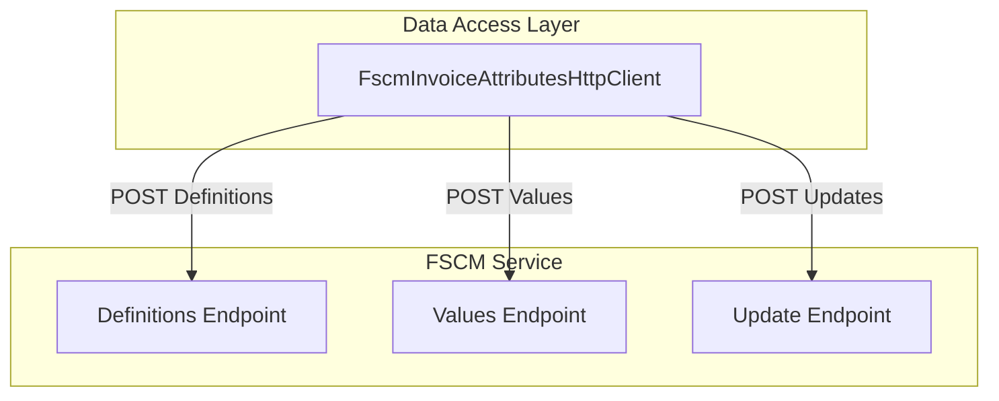

# FSCM Invoice Attributes Client 📄

## Overview

The **FscmInvoiceAttributesHttpClient** provides methods to interact with custom FSCM invoice attribute endpoints. It supports:

- Fetching attribute definitions (the “attribute table”)
- Retrieving current attribute values (value snapshot)
- Updating attribute values (sending name/value pairs)

This client plugs into the posting pipeline without altering existing behavior. It enriches work‐order payloads with invoice attribute data, enabling runtime mapping and delta updates between Field Service (FS) and FSCM.

## Architecture Overview



## Component Structure

### Data Access Layer

#### **FscmInvoiceAttributesHttpClient** (`src/Rpc.AIS.Accrual.Orchestrator.Infrastructure/Adapters/Fscm/Clients/FscmInvoiceAttributesHttpClient.cs`)

**Purpose & Responsibilities**

- Implements `IFscmInvoiceAttributesClient`
- Calls FSCM custom endpoints for invoice attributes
- Handles logging, diagnostics, error policies, and payload envelopes

**Constructor Dependencies**

- `HttpClient` _http
- `FscmOptions` _opt
- `IAisLogger` _aisLogger
- `IAisDiagnosticsOptions` _diag
- `ILogger<FscmInvoiceAttributesHttpClient>` _log

**Public Methods**

| Method | Signature | Description |
| --- | --- | --- |
| GetDefinitionsAsync | `Task<IReadOnlyList<InvoiceAttributeDefinition>> GetDefinitionsAsync(RunContext ctx, string company, string subProjectId, CancellationToken ct)` | Fetches all active FSCM attribute definitions. |
| GetCurrentValuesAsync | `Task<IReadOnlyList<InvoiceAttributePair>> GetCurrentValuesAsync(RunContext ctx, string company, string subProjectId, IReadOnlyList<string> attributeNames, CancellationToken ct)` | Retrieves current values for specified attributes. |
| UpdateAsync | `Task<FscmInvoiceAttributesUpdateResult> UpdateAsync(RunContext ctx, string company, string subProjectId, Guid workOrderGuid, string workOrderId, string? countryRegionId, string? county, string? state, string? dimensionDisplayValue, string? fsaTaxabilityType, string? fsaWellAge, string? fsaWorkType, IReadOnlyList<InvoiceAttributePair> updates, CancellationToken ct)` | Posts invoice attribute updates per work order. |


**Private Helpers**

- `BuildUrl(string baseUrl, string path)`: Normalizes and concatenates URL parts.
- `PostJsonAsync(...)`: Sends HTTP POST, logs request/response, enforces retry/fail-fast policies.
- `TryGetFirstWorkOrderIdentity(string json)`: Extracts the first work order’s GUID/ID from the outbound JSON for logging context.

## Data Models

### InvoiceAttributeDefinition

| Property | Type | Description |
| --- | --- | --- |
| AttributeName | string | Logical name of the attribute. |
| Type | string? | Data type (e.g., string, number). |
| Active | bool | Whether the attribute is active. |


### InvoiceAttributePair

| Property | Type | Description |
| --- | --- | --- |
| AttributeName | string | FSCM attribute name. |
| AttributeValue | string? | Current or new attribute value. |


### FscmInvoiceAttributesUpdateResult

| Property | Type | Description |
| --- | --- | --- |
| IsSuccess | bool | True if HTTP status is 2xx. |
| HttpStatus | int | Raw HTTP status code returned by FSCM. |
| Body | string? | Raw response body for diagnostics. |


## API Integration

### POST Fetch Invoice Attribute Definitions

```api
{
    "title": "Fetch Invoice Attribute Definitions",
    "description": "Retrieves the list of invoice attribute definitions for a specified company and sub-project.",
    "method": "POST",
    "baseUrl": "https://{FSCM_BASE_URL}",
    "endpoint": "/{InvoiceAttributeDefinitionsPath}",
    "headers": [
        {
            "key": "Content-Type",
            "value": "application/json",
            "required": true
        },
        {
            "key": "x-run-id",
            "value": "RunContext.RunId",
            "required": false
        },
        {
            "key": "x-correlation-id",
            "value": "RunContext.CorrelationId",
            "required": false
        }
    ],
    "queryParams": [],
    "pathParams": [],
    "bodyType": "json",
    "requestBody": "{\n  \"Company\": \"425\",\n  \"SubProjectId\": \"425-P0000100-00011\"\n}",
    "formData": [],
    "rawBody": "",
    "responses": {
        "200": {
            "description": "Successful definitions fetch",
            "body": "{\n  \"InvoiceAttributeDefinitions\": [\n    { \"AttributeName\": \"WellName\", \"Type\": \"string\", \"Active\": true }\n  ]\n}"
        },
        "400": {
            "description": "Bad request",
            "body": "{ \"error\": { \"message\": \"Invalid parameters\" } }"
        }
    }
}
```

### POST Fetch Current Invoice Attribute Values

```api
{
    "title": "Fetch Current Invoice Attribute Values",
    "description": "Retrieves the current snapshot of invoice attribute values for given attributes.",
    "method": "POST",
    "baseUrl": "https://{FSCM_BASE_URL}",
    "endpoint": "/{InvoiceAttributeValuesPath}",
    "headers": [
        {
            "key": "Content-Type",
            "value": "application/json",
            "required": true
        },
        {
            "key": "x-run-id",
            "value": "RunContext.RunId",
            "required": false
        },
        {
            "key": "x-correlation-id",
            "value": "RunContext.CorrelationId",
            "required": false
        }
    ],
    "queryParams": [],
    "pathParams": [],
    "bodyType": "json",
    "requestBody": "{\n  \"Company\": \"425\",\n  \"SubProjectId\": \"425-P0000100-00011\",\n  \"AttributeNames\": [\"WellName\",\"WellNumber\"]\n}",
    "formData": [],
    "rawBody": "",
    "responses": {
        "200": {
            "description": "Successful values fetch",
            "body": "{\n  \"InvoiceAttributes\": [\n    { \"AttributeName\": \"WellName\",   \"AttributeValue\": \"Alpha-1\" },\n    { \"AttributeName\": \"WellNumber\", \"AttributeValue\": \"123\"    }\n  ]\n}"
        },
        "400": {
            "description": "Bad request",
            "body": "{ \"error\": { \"message\": \"Invalid parameters\" } }"
        }
    }
}
```

### POST Update Invoice Attribute Values

```api
{
    "title": "Update Invoice Attribute Values",
    "description": "Submits updates for invoice attribute values on one or more work orders.",
    "method": "POST",
    "baseUrl": "https://{FSCM_BASE_URL}",
    "endpoint": "/{UpdateInvoiceAttributesPath}",
    "headers": [
        {
            "key": "Content-Type",
            "value": "application/json",
            "required": true
        },
        {
            "key": "x-run-id",
            "value": "RunContext.RunId",
            "required": false
        },
        {
            "key": "x-correlation-id",
            "value": "RunContext.CorrelationId",
            "required": false
        }
    ],
    "queryParams": [],
    "pathParams": [],
    "bodyType": "json",
    "requestBody": "{\n  \"_request\": {\n    \"WOList\": [\n      {\n        \"Company\": \"425\",\n        \"SubProjectId\": \"425-P0000100-00011\",\n        \"WorkOrderGUID\": \"{11111111-1111-1111-1111-111111111111}\",\n        \"WorkOrderID\": \"J-CPS-000001310\",\n        \"CountryRegionId\": \"USA\",\n        \"County\": \"OH\",\n        \"State\": \"OH\",\n        \"DimensionDisplayValue\": \"-0375-119-----\",\n        \"FSATaxabilityType\": \"TX\",\n        \"FSAWellAge\": \"New\",\n        \"FSAWorkType\": \"WT\",\n        \"InvoiceAttributes\": [\n          { \"AttributeName\": \"WellName\",   \"AttributeValue\": \"Alpha-1\" },\n          { \"AttributeName\": \"WellNumber\", \"AttributeValue\": \"123\"    }\n        ]\n      }\n    ]\n  }\n}",
    "formData": [],
    "rawBody": "",
    "responses": {
        "200": {
            "description": "Update accepted",
            "body": "{ \"ok\": true }"
        },
        "400": {
            "description": "Bad request",
            "body": "{ \"error\": { \"message\": \"Invalid payload\" } }"
        },
        "429": {
            "description": "Rate limit exceeded (retryable)",
            "body": "{ \"error\": { \"message\": \"Too Many Requests\" } }"
        }
    }
}
```

## Error Handling & Retries

> **Note:** Base URL and path segments are configured via `FscmOptions`. Replace placeholders with actual values.

- **401 / 403**: Throws `UnauthorizedAccessException` (fail-fast).
- **429 / 5xx**: Throws `HttpRequestException` for retry policies (transient).
- **Other 4xx**: Logged as warnings; definition/value methods return empty lists.

## Dependencies

- **Frameworks & Libraries**- `HttpClient` for HTTP calls
- `Microsoft.Extensions.Options` for `FscmOptions`
- `Microsoft.Extensions.Logging` for structured logging
- **Project Components**- `IFscmInvoiceAttributesClient` (core abstraction)
- Domain models: `InvoiceAttributeDefinition`, `InvoiceAttributePair`, `FscmInvoiceAttributesUpdateResult`, `RunContext`
- Utility: `LogText.TrimForLog` for safe log snippets
- Diagnostics: `IAisLogger` & `IAisDiagnosticsOptions`

## Key Class Reference

| Class | Location | Responsibility |
| --- | --- | --- |
| FscmInvoiceAttributesHttpClient | `Infrastructure/Adapters/Fscm/Clients/FscmInvoiceAttributesHttpClient.cs` | Client for FSCM invoice attribute endpoints |
| InvoiceAttributeDefinition | `Core/Domain/InvoiceAttributes/InvoiceAttributeDefinition.cs` | Model for FSCM attribute metadata |
| InvoiceAttributePair | `Core/Domain/InvoiceAttributes/InvoiceAttributePair.cs` | Model for FSCM attribute name/value pairs |
| FscmInvoiceAttributesUpdateResult | `Core/Abstractions/IFscmInvoiceAttributesClient.cs` | Encapsulates update result status and response body |
