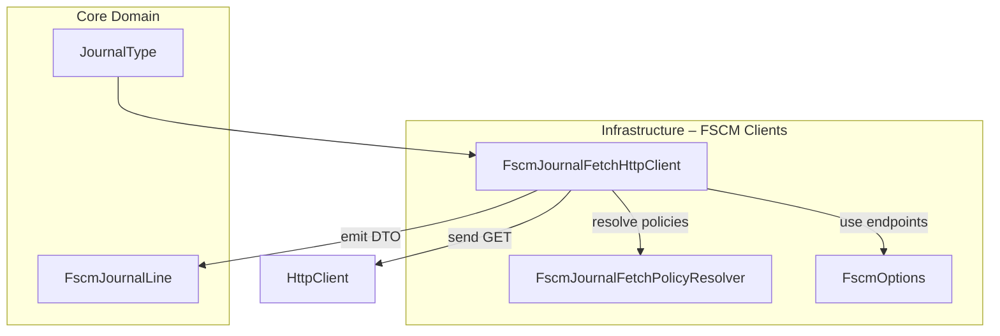

# Fscm Journal Fetch HTTP Client Feature Documentation

## Overview

The **FscmJournalFetchHttpClient** is a data-access component that retrieves journal history from the FSCM OData service for one or more work orders. It implements batching, error handling, and fallback logic to ensure reliable retrieval of Item, Expense, and Hour journal lines. These lines are normalized into the `FscmJournalLine` DTO for downstream delta calculations, reversal planning, and payload enrichment .

By abstracting the OData details and chunking work‐order GUID filters, this client:

- Avoids URL-length and parsing limits via configurable chunk sizes.
- Retries with a simplified `$select` when environments omit optional fields.
- Propagates correlation IDs for traceability.
- Classifies HTTP failures into fail-fast, transient (retryable), and non-transient (return empty).

This component sits in the **Infrastructure** layer of the Orchestrator, feeding normalized history into delta and posting workflows.

## Architecture Overview



## Component Structure

### 1. Data Access Layer

#### **FscmJournalFetchHttpClient** (`src/Rpc.AIS.Accrual.Orchestrator.Infrastructure/Adapters/Fscm/Clients/FscmJournalFetchHttpClient.cs`)

- **Purpose**

Implements `IFscmJournalFetchClient` to fetch and normalize FSCM journal lines by batching work‐order GUIDs and calling OData endpoints .

- **Dependencies**- `HttpClient` – performs HTTP GET against `{BaseUrl}/data/{EntitySet}`
- `FscmOptions` – holds base URL and chunk size (`JournalHistoryOrFilterChunkSize`)
- `FscmJournalFetchPolicyResolver` – selects `$select` and mapping rules per `JournalType`
- `ILogger<FscmJournalFetchHttpClient>` – logs start/end, errors, retries

- **Key Methods**

| Method | Description | Returns |
| --- | --- | --- |
| FetchByWorkOrdersAsync | Entry point matching interface; delegates to internal helper with fallback enabled | `Task<IReadOnlyList<FscmJournalLine>>` |
| FetchByWorkOrdersInternalAsync | Chunks GUIDs, builds URL filters, aggregates results | `Task<IReadOnlyList<FscmJournalLine>>` |
| FetchSingleUrlAsync | Executes one HTTP GET, handles status codes (401/403, 4xx, 5xx/429), retries fallback | `Task<IReadOnlyList<FscmJournalLine>>` |
| ResolveBaseUrlOrThrow | Validates and returns configured BaseUrl | `string` |
| ParseODataValueArrayToJournalLines | Parses JSON `value` array into `FscmJournalLine` instances | `List<FscmJournalLine>` |
| LooksLikeMissingSelectFieldError | Detects OData missing‐field error in response body | `bool` |
| ReplaceSelect | Substitutes `$select` parameter in OData URL | `string` |
| Chunk | Splits a list of GUIDs into chunks | `IEnumerable<List<Guid>>` |


**Error Handling Patterns**

- **401/403**: Fail-fast by throwing `UnauthorizedAccessException`.
- **429/5xx**: Throw `HttpRequestException` to trigger durable retry.
- **Other 4xx**: Log warning and return empty list; if missing‐field error, retry once with fallback `$select`.

## Data Models

### FscmJournalLine

Normalized representation of a single journal entry fetched from FSCM OData .

| Property | Type | Description |
| --- | --- | --- |
| JournalType | `JournalType` | Enum: Item, Expense, Hour |
| WorkOrderId | `Guid` | Work order GUID |
| WorkOrderLineId | `Guid` | Work order line GUID |
| SubProjectId | `string?` | Target SubProject ID |
| Quantity | `decimal` | Quantity or hours |
| CalculatedUnitPrice | `decimal?` | Unit price |
| ExtendedAmount | `decimal?` | Line amount |
| Department | `string?` | Dimension: Department |
| ProductLine | `string?` | Dimension: ProductLine |
| Warehouse | `string?` | Warehouse identifier |
| LineProperty | `string?` | Custom line property |
| TransactionDate | `DateTime?` | Posting/Project date |
| DataAreaId | `string?` | Legal entity |
| SourceJournalNumber | `string?` | FSCM Journal number |
| PayloadSnapshot | `FscmReversalPayloadSnapshot?` | Snapshot for reversal payload mapping |


### FscmReversalPayloadSnapshot

Snapshot of fields needed to build reversal payload lines .

| Property | Type | Description |
| --- | --- | --- |
| WorkOrderLineId | `Guid` | Line GUID |
| Currency | `string?` | Currency code |
| DimensionDisplayValue | `string?` | Combined dimension key |
| FsaUnitPrice | `decimal?` | FSA unit price |
| ItemId | `string?` | Item identifier |
| ProjectCategory | `string?` | Project category |
| JournalLineDescription | `string?` | FSCM line description |
| LineProperty | `string?` | Custom property |
| Quantity | `decimal` | Snapshot quantity |
| RpcDiscountAmount | `decimal?` | Discount amount |
| RpcDiscountPercent | `decimal?` | Discount percent |
| RpcMarkupPercent | `decimal?` | Markup percent |
| RpcOverallDiscountAmount | `decimal?` | Overall discount amount |
| RpcOverallDiscountPercent | `decimal?` | Overall discount percent |
| RpcSurchargeAmount | `decimal?` | Surcharge amount |
| RpcSurchargePercent | `decimal?` | Surcharge percent |
| UnitId | `string?` | Unit of measure |
| Warehouse | `string?` | Warehouse snapshot |
| Site | `string?` | Site snapshot |
| ... | ... | Other reversal‐specific fields |


## API Integration

### GET Fetch FSCM Journal Lines

```api
{
    "title": "Fetch FSCM Journal Lines",
    "description": "Retrieves journal lines for given work orders via OData",
    "method": "GET",
    "baseUrl": "<FscmOptions.BaseUrl>",
    "endpoint": "/data/{EntitySet}",
    "headers": [
        {
            "key": "Accept",
            "value": "application/json",
            "required": true
        },
        {
            "key": "x-run-id",
            "value": "<RunContext.RunId>",
            "required": false
        },
        {
            "key": "x-correlation-id",
            "value": "<RunContext.CorrelationId>",
            "required": false
        }
    ],
    "queryParams": [
        {
            "key": "cross-company",
            "value": "true",
            "required": true
        },
        {
            "key": "$filter",
            "value": "RPCWorkOrderGuid eq {guid} or ...",
            "required": true
        },
        {
            "key": "$select",
            "value": "{policy.Select}",
            "required": true
        }
    ],
    "pathParams": [],
    "bodyType": "none",
    "requestBody": "",
    "formData": [],
    "rawBody": "",
    "responses": {
        "200": {
            "description": "Success: returns JSON with 'value' array of journal lines",
            "body": "{\n  \"value\": [ { /* FscmJournalLine JSON */ } ]\n}"
        },
        "401": {
            "description": "Unauthorized",
            "body": ""
        },
        "403": {
            "description": "Forbidden",
            "body": ""
        },
        "429": {
            "description": "Too Many Requests",
            "body": ""
        },
        "500": {
            "description": "Server error",
            "body": ""
        }
    }
}
```

## Key Classes Reference

| Class | Location | Responsibility |
| --- | --- | --- |
| FscmJournalFetchHttpClient | `Infrastructure/Adapters/Fscm/Clients/FscmJournalFetchHttpClient.cs` | Fetches & normalizes FSCM journal lines |
| IFscmJournalFetchClient | `Core/Abstractions/IFscmJournalFetchClient.cs` | Interface for journal-fetch implementations |
| FscmJournalFetchPolicyResolver | `Infrastructure/Adapters/Fscm/Clients/FscmJournalPolicies/FscmJournalFetchPolicyResolver.cs` | Resolves per‐type mapping & `$select` rules |
| FscmJournalLine | `Core/Domain/FscmJournalLine.cs` | DTO representing a normalized journal line |
| FscmReversalPayloadSnapshot | `Core/Domain/FscmReversalPayloadSnapshot.cs` | Snapshot for building reversal payloads |
| FscmOptions | `Infrastructure/Options/FscmOptions.cs` | Holds endpoint URLs and chunk-size configuration |


## Caching & Configuration

- **Chunk Size**: Controlled via `FscmOptions.JournalHistoryOrFilterChunkSize` (default 25).
- **Fallback Select**: Policies may specify `SelectFallback` to retry when primary `$select` fails.
- **Base URL**: Must configure `Endpoints:BaseUrl` in `FscmOptions`; missing value throws at runtime .

## Error Handling

- **Unauthorized (401/403)**: Logs error, throws `UnauthorizedAccessException`.
- **Transient (429 or ≥500)**: Logs warning, throws `HttpRequestException` for retry.
- **Non-transient 4xx**: Logs warning, returns empty result; retries once with fallback `$select` if missing-field error detected.

*End of documentation*