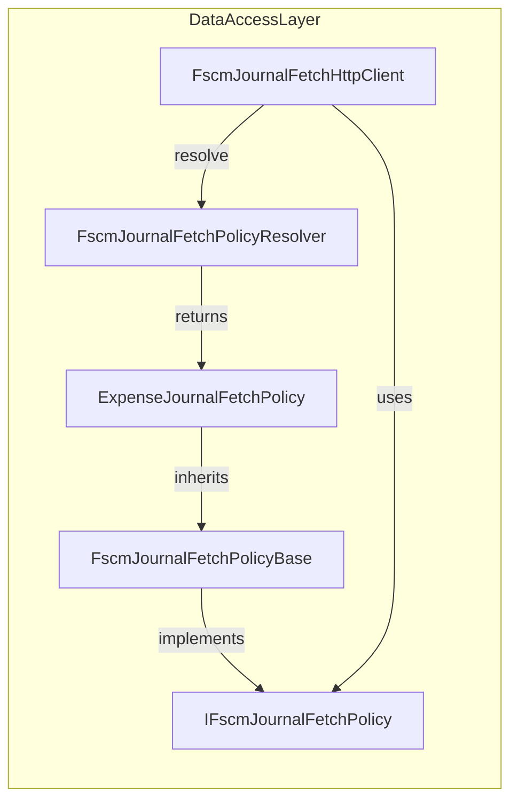

# Expense Journal Fetch Policy Feature Documentation

## Overview

The **ExpenseJournalFetchPolicy** defines how expense journal lines are retrieved from the FSCM OData service. It specifies the OData entity set, the list of fields to select, and the logic to extract quantity and unit price from each JSON row. By encapsulating journal‐type metadata and mapping rules, it ensures consistent handling of expense data across different FSCM environments.

This policy plugs into the **FscmJournalFetchHttpClient** via the **FscmJournalFetchPolicyResolver**, eliminating hard‐coded switches on journal types. When the client fetches expense lines, it uses this policy to build the OData request and to normalize the response into domain DTOs (`FscmJournalLine`).

## Architecture Overview



## Component Structure

### Data Access Layer

#### ExpenseJournalFetchPolicy (`src/Rpc.AIS.Accrual.Orchestrator.Infrastructure/Adapters/Fscm/Clients/FscmJournalPolicies/ExpenseJournalFetchPolicy.cs`)

- **Purpose:**

Encapsulates FSCM OData metadata and mapping rules for **Expense** journal lines, used by the fetch client.

- **Key Properties:**

| Property | Type | Description |
| --- | --- | --- |
| `JournalType` | `JournalType` | Always returns `JournalType.Expense`. |
| `EntitySet` | `string` | OData entity set: `"ExpenseJournalLines"`. |
| `Select` | `string` | Comma-separated list of fields to include in the OData query. |
| `SelectFallback` | `string` | Fallback `$select` removing known-problematic fields. |


- **Key Methods:**

| Method | Signature | Description |
| --- | --- | --- |
| `GetQuantity` | `decimal GetQuantity(JsonElement row)` | Reads `Quantity` or `Qty`, returns `0m` if missing. |
| `GetUnitPrice` | `decimal? GetUnitPrice(JsonElement row)` | Normalizes unit price using `ProjectSalesPrice`, `SalesPrice`, and optional `Amount`. |
| `NearlyEqual` | `bool NearlyEqual(decimal a, decimal b)` (private) | Compares two decimals within `0.0001m` tolerance. |


#### FscmJournalFetchPolicyBase (`src/Rpc.AIS.Accrual.Orchestrator.Infrastructure/Adapters/Fscm/Clients/FscmJournalPolicies/FscmJournalFetchPolicyBase.cs`)

- **Purpose:**

Provides common helpers and default implementations for all journal fetch policies.

- **Notable Members:**

- **Abstract Properties:** `JournalType`, `EntitySet`, `Select`
- **Virtual Property:** `SelectFallback` (defaults to `Select`)
- **Helpers:**

```csharp
    protected static decimal? TryGetDecimal(JsonElement obj, string propName)
```

Attempts to read a numeric or string JSON property as `decimal?`.

#### IFscmJournalFetchPolicy (`src/Rpc.AIS.Accrual.Orchestrator.Infrastructure/Adapters/Fscm/Clients/FscmJournalPolicies/IFscmJournalFetchPolicy.cs`)

- **Purpose:**

Defines the contract for journal-type‐specific metadata and mapping rules.

- **Members:**

```csharp
  public interface IFscmJournalFetchPolicy
  {
      JournalType JournalType { get; }
      string EntitySet { get; }
      string Select { get; }
      decimal GetQuantity(JsonElement row);
      decimal? GetUnitPrice(JsonElement row);
  }
```

## Select Expressions

### Default `$select`

```csharp
public override string Select => string.Join(",",
    WorkOrderIdField,                  // "RPCWorkOrderGuid"
    WorkOrderLineIdField,              // "RPCWorkOrderLineGuid"
    "ProjectCategoryId",
    "ProjectCategory",
    "Quantity",
    "ProjectSalesPrice",
    "RPCFSASurchargeAmt",
    "RPCFSADiscountPrct",
    "RPCFSAOverallDiscPrct",
    "RPCFSAOverallDiscAmt",
    "RPCFSATaxabilityType",
    "RPCFSAUnitPrice",
    "RPCFSASurchargePrct",
    "RPCFSACustProdDesc",
    "ItemId",
    "RPCOperationDate",
    "RPCFSAIsPrintable",
    "RPCFSADiscountAmt",
    "RPCFSAMarkupPrct",
    "RPCFSAMarkupAmt",
    "RPCFSAMarkupAmt",                 // duplicate to illustrate idempotence
    "RPCFSADiscountAmt",               // duplicate
    "ProjectLinePropertyId",
    "DimensionDisplayValue",
    "ProjectDate",
    "ProjectUnitID",
    "StorageWarehouseId",
    "StorageSiteId"
);
```

### Fallback `$select`

When certain fields aren’t present in FSxM metadata, these are removed:

```csharp
public override string SelectFallback =>
    Select
      .Replace(",ProjectCategory", string.Empty)
      .Replace(",StorageWarehouseId", string.Empty)
      .Replace(",StorageSiteId", string.Empty)
      .Replace(",RPCFSAMarkupAmt", string.Empty);
```

```card
{
    "title": "Fallback Logic",
    "content": "SelectFallback drops known-missing fields to recover from metadata differences."
}
```

## Quantity Extraction Logic

- **Fields Checked:**- `"Quantity"`
- `"Qty"`

- **Fallback:** Returns `0m` if neither field is present.

## Unit Price Normalization

1. Read `ProjectSalesPrice` (or `"SalesPrice"`).
2. If absent, return `null`.
3. Read optional `"Amount"`.
4. If `quantity ≠ 0` and `amount` exists:- If `salesPrice ≈ amount`, return `amount / quantity`.
- If `amount ≈ quantity × salesPrice`, return `salesPrice`.
- If `amount / quantity ≈ salesPrice`, return `salesPrice`.
5. Otherwise, return `salesPrice`.

## Class Diagram

```mermaid
classDiagram
    IFscmJournalFetchPolicy <|.. FscmJournalFetchPolicyBase
    FscmJournalFetchPolicyBase <|-- ExpenseJournalFetchPolicy

    class IFscmJournalFetchPolicy {
        <<interface>>
        +JournalType JournalType {get;}
        +string EntitySet {get;}
        +string Select {get;}
        +decimal GetQuantity(JsonElement row)
        +decimal? GetUnitPrice(JsonElement row)
    }

    class FscmJournalFetchPolicyBase {
        <<abstract>>
        +JournalType JournalType {get;}
        +string EntitySet {get;}
        +string Select {get;}
        +virtual string SelectFallback {get;}
        +abstract decimal GetQuantity(JsonElement row)
        +abstract decimal? GetUnitPrice(JsonElement row)
        #static decimal? TryGetDecimal(JsonElement obj, string propName)
    }

    class ExpenseJournalFetchPolicy {
        +override JournalType JournalType
        +override string EntitySet
        +override string Select
        +override string SelectFallback
        +override decimal GetQuantity(JsonElement row)
        +override decimal? GetUnitPrice(JsonElement row)
        -static bool NearlyEqual(decimal a, decimal b)
    }
```

## Integration Points

- **FscmJournalFetchPolicyResolver**

Registers and resolves the `ExpenseJournalFetchPolicy` based on `JournalType.Expense`.

- **FscmJournalFetchHttpClient**

Uses this policy to:

- Build the OData URL (`entitySet`, `$select`)
- Parse and map JSON rows into `FscmJournalLine` instances via `GetQuantity` and `GetUnitPrice`.

## Dependencies

- System.Text.Json (`JsonElement`)
- Rpc.AIS.Accrual.Orchestrator.Core.Domain (`JournalType`)
- Inheritance: `FscmJournalFetchPolicyBase`
- Interface: `IFscmJournalFetchPolicy`

## Testing Considerations

- **Select String Accuracy:** Verify `Select` and `SelectFallback` contain expected fields.
- **Quantity Extraction:** Test rows with `"Quantity"`, `"Qty"`, and missing values.
- **Unit Price Logic:** Cover edge cases where `Amount` equals total vs. unit price, and floating‐point tolerance (`0.0001m`).
- **Fallback Behavior:** Simulate missing‐field OData errors and ensure fallback `Select` recovers data.

## Key Classes Reference

| Class | Location | Responsibility |
| --- | --- | --- |
| ExpenseJournalFetchPolicy | src/Rpc.AIS.Accrual.Orchestrator.Infrastructure/Adapters/Fscm/Clients/FscmJournalPolicies/ExpenseJournalFetchPolicy.cs | Defines metadata and mapping for expense journal fetch operations |
| FscmJournalFetchPolicyBase | src/Rpc.AIS.Accrual.Orchestrator.Infrastructure/Adapters/Fscm/Clients/FscmJournalPolicies/FscmJournalFetchPolicyBase.cs | Common base with helpers for all journal fetch policies |
| IFscmJournalFetchPolicy | src/Rpc.AIS.Accrual.Orchestrator.Infrastructure/Adapters/Fscm/Clients/FscmJournalPolicies/IFscmJournalFetchPolicy.cs | Interface contract for journal fetch policy implementations |
