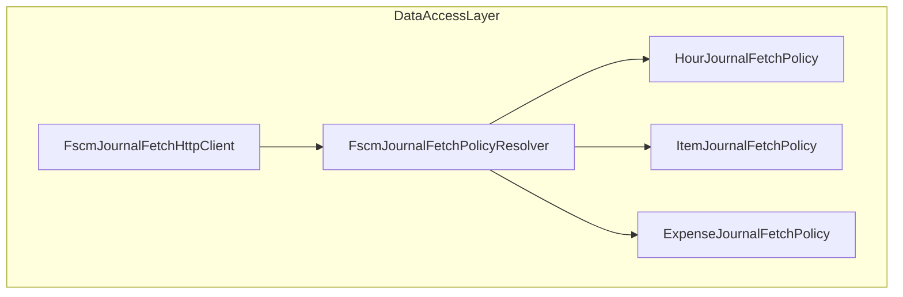

# FSCM Journal Fetch Policy Resolver Feature Documentation

## Overview

The **FscmJournalFetchPolicyResolver** centralizes the lookup of journal‐type specific fetch policies for FSCM OData requests. It maps each `JournalType` to an implementation of `IFscmJournalFetchPolicy`, ensuring:

- **Open‐Closed Principle (OCP):** New journal types can be introduced without modifying client code.
- **Registration safety:** Duplicate registrations for the same `JournalType` are detected at startup.
- **Deterministic resolution:** Missing policies yield immediate failures to prevent runtime surprises.

By abstracting policy resolution, downstream components like `FscmJournalFetchHttpClient` can request the correct metadata and mapping logic for **Hour**, **Item**, or **Expense** journals without using switch statements .

## Architecture Overview



## Component Structure

### Data Access Layer

#### **FscmJournalFetchPolicyResolver** (`src/Rpc.AIS.Accrual.Orchestrator.Infrastructure/Adapters/Fscm/Clients/FscmJournalPolicies/FscmJournalFetchPolicyResolver.cs`)

- **Purpose:**

Resolves and validates the registration of `IFscmJournalFetchPolicy` implementations by `JournalType`.

- **Constructor**

```csharp
  public FscmJournalFetchPolicyResolver(IEnumerable<IFscmJournalFetchPolicy> policies)
```

- Validates `policies` is non-null.
- Builds a dictionary keyed by each policy’s `JournalType`.
- Throws `InvalidOperationException` on duplicate registrations .

- **Resolve Method**

```csharp
  public IFscmJournalFetchPolicy Resolve(JournalType journalType)
```

- Returns the policy matching `journalType`.
- Throws `KeyNotFoundException` if no policy is registered .

- **Dependencies:**- `System`
- `System.Collections.Generic`
- `Rpc.AIS.Accrual.Orchestrator.Core.Domain` (for `JournalType`)
- `IFscmJournalFetchPolicy` (interface defining policy contracts)

## Key Classes Reference

| Class | Location | Responsibility |
| --- | --- | --- |
| FscmJournalFetchPolicyResolver | `.../FscmJournalFetchPolicyResolver.cs` | Resolves `IFscmJournalFetchPolicy` by `JournalType` |
| IFscmJournalFetchPolicy | `.../IFscmJournalFetchPolicy.cs` | Defines metadata and mapping rules for OData journal fetch |
| FscmJournalFetchPolicyBase | `.../FscmJournalFetchPolicyBase.cs` | Base helpers for JSON mapping and fallback select logic |
| HourJournalFetchPolicy | `.../HourJournalFetchPolicy.cs` | Policy for `JournalType.Hour` |
| ItemJournalFetchPolicy | `.../ItemJournalFetchPolicy.cs` | Policy for `JournalType.Item` |
| ExpenseJournalFetchPolicy | `.../ExpenseJournalFetchPolicy.cs` | Policy for `JournalType.Expense` |
| FscmJournalFetchHttpClient | `.../FscmJournalFetchHttpClient.cs` | HTTP client that uses policies to fetch and map FSCM journal lines |


## Error Handling

- **Duplicate Policy Registration**

The constructor throws:

```csharp
  throw new InvalidOperationException(
    $"Duplicate FSCM journal fetch policy registration for {p.JournalType}.");
```

when two policies share the same `JournalType` .

- **Missing Policy**

The `Resolve` method throws:

```csharp
  throw new KeyNotFoundException(
    $"No FSCM journal fetch policy registered for {journalType}.");
```

if no matching policy exists .

```card
{
    "title": "Registration Safety",
    "content": "The resolver enforces one-to-one mapping between JournalType and policy implementation."
}
```

## Dependencies

- **Core Domain:**

`Rpc.AIS.Accrual.Orchestrator.Core.Domain.JournalType`

- **Policy Interface:**

`Rpc.AIS.Accrual.Orchestrator.Infrastructure.Clients.FscmJournalPolicies.IFscmJournalFetchPolicy`

- **Concrete Policies:**

`HourJournalFetchPolicy`, `ItemJournalFetchPolicy`, `ExpenseJournalFetchPolicy`

## Integration Points

- **Dependency Injection (Startup):**

```csharp
  services.AddSingleton<IFscmJournalFetchPolicy, ItemJournalFetchPolicy>();
  services.AddSingleton<IFscmJournalFetchPolicy, ExpenseJournalFetchPolicy>();
  services.AddSingleton<IFscmJournalFetchPolicy, HourJournalFetchPolicy>();
  services.AddSingleton<FscmJournalFetchPolicyResolver>();
```

registers policies and the resolver .

- **Usage by HTTP Client:**

`FscmJournalFetchHttpClient` calls:

```csharp
  var policy = _policyResolver.Resolve(journalType);
```

to obtain the correct metadata (`EntitySet`, `$select`) and mapping logic for JSON rows .

## Caching Strategy

No caching is implemented at the resolver level; resolution occurs in-memory from a pre-built dictionary.

## Testing Considerations

- **Constructor Null Input:**

Passing `null` policies should throw `ArgumentNullException`.

- **Duplicate Policies:**

Registering two policies with the same `JournalType` should trigger `InvalidOperationException`.

- **Resolution Success/Failure:**- Valid `JournalType` returns correct policy instance.
- Unregistered `JournalType` throws `KeyNotFoundException`.